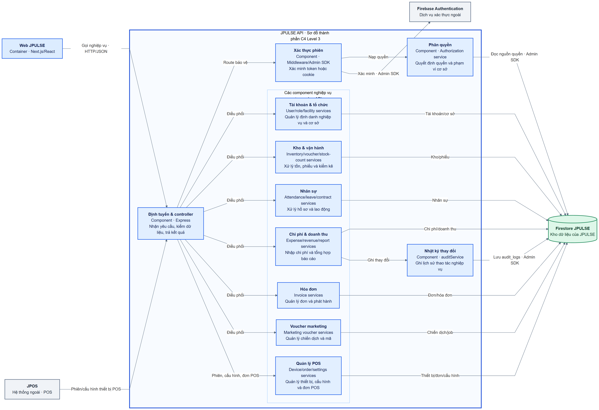
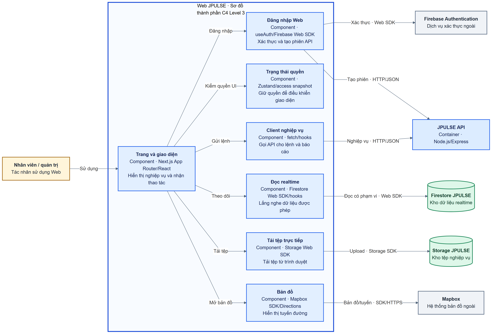
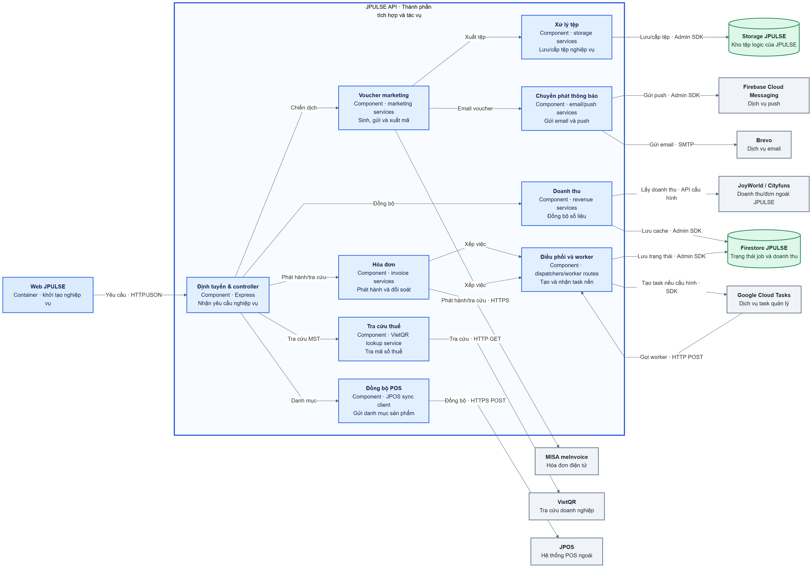

# JPULSE — C4 Level 3 Component Diagram

## Phạm vi và cách xác định ranh giới

[Container Diagram](./jpulse-container-diagram.md) đã xác định JPULSE có hai container ứng dụng là **Web JPULSE** và **JPULSE API**. C4 Level 3 phải phân rã **một container tại một thời điểm**. Vì vậy tài liệu có hình API lõi, hình Web và hình bổ trợ cho các thành phần tích hợp/tác vụ nằm **trong cùng JPULSE API**. Firestore và Storage là container dữ liệu logic của JPULSE nhưng nằm **ngoài đường bao Web/API** trong các hình Level 3; Firebase Authentication, JPOS và nhà cung cấp tích hợp là hệ thống/dịch vụ ngoài. Không có component nào trong hình được coi là dịch vụ triển khai độc lập.

Hình dùng Mermaid `flowchart` với ngữ nghĩa C4 Level 3 để kiểm soát bố cục và giữ nhãn đọc được: **đường bao xanh** là container đang phân rã; **hộp xanh nhạt** là component nội bộ; **hộp xanh dương** là container JPULSE khác; **trụ xanh lá** là kho dữ liệu/tệp; **hộp xám** là hệ thống ngoài; **hộp vàng** là tác nhân. Mũi tên chỉ chiều lời gọi/chủ động truy cập; phản hồi đi cùng kết nối. Một component nghiệp vụ có thể gồm nhiều file controller/service/repository liên quan về trách nhiệm; nhãn công nghệ trong hình nêu công nghệ chính, không có nghĩa các file đó được triển khai riêng.

## 1. Thành phần lõi của JPULSE API

[Mã Mermaid](./jpulse-component-api.mmd) · [SVG](./jpulse-component-api.svg) · [PNG](./jpulse-component-api.png)

`Định tuyến & controller` nhận các route Express, sau đó route bảo vệ dùng middleware xác thực và ngữ cảnh quyền. Các controller gọi service nghiệp vụ phù hợp. Firebase Authentication xác minh danh tính/token; **quyền và phạm vi cơ sở do JPULSE quyết định từ dữ liệu Firestore**. Các nhánh nghiệp vụ đọc/ghi Firestore bằng Firebase Admin SDK qua repository hoặc truy vấn tại service. Hình chỉ biểu diễn quan hệ trực tiếp quan trọng; không giả định mọi route đều đi qua cùng một service hay repository trung tâm.

| Component trong API | Trách nhiệm và căn cứ mã nguồn |
| --- | --- |
| Định tuyến & controller | Gắn route, nhận/kiểm dữ liệu, trả phản hồi: [điểm vào API](../../apps/be-wms/src/index.ts#L85), [expenseController](../../apps/be-wms/src/api/controllers/expenseController.ts#L54). |
| Xác thực phiên | Kiểm Bearer ID token hoặc cookie `__session`, kiểm tài khoản ACTIVE: [authMiddleware](../../apps/be-wms/src/api/middlewares/authMiddleware.ts#L20), [authRoutes](../../apps/be-wms/src/api/routes/authRoutes.ts#L24). |
| Phân quyền | Dựng/nạp access context, xét quyền theo cơ sở: [authMiddleware](../../apps/be-wms/src/api/middlewares/authMiddleware.ts#L87), [authorization](../../apps/be-wms/src/services/authorization/index.ts). |
| Tài khoản & tổ chức | User/role, tổ chức và cơ sở: [userRoutes](../../apps/be-wms/src/api/routes/userRoutes.ts), [organizationRoutes](../../apps/be-wms/src/api/routes/organizationRoutes.ts), [warehouseRoutes](../../apps/be-wms/src/api/routes/warehouseRoutes.ts). |
| Kho & vận hành | Tồn, phiếu nhập/xuất, điều chuyển, kiểm kê: [route mounts](../../apps/be-wms/src/index.ts#L96), [exportVoucherController](../../apps/be-wms/src/api/controllers/exportVoucherController.ts). |
| Nhân sự | Hồ sơ, chấm công, nghỉ phép, hợp đồng: [route mounts](../../apps/be-wms/src/index.ts#L113), [employeeProfileController](../../apps/be-wms/src/api/controllers/employeeProfileController.ts). |
| Chi phí & doanh thu | Nhập liệu chi phí, báo cáo và đồng bộ doanh thu: [expenseRoutes](../../apps/be-wms/src/api/routes/expenseRoutes.ts), [scopedExpenseService](../../apps/be-wms/src/services/scopedExpenseService.ts), [expenseDashboardService](../../apps/be-wms/src/services/expenseDashboardService.ts). |
| Hóa đơn | Quản lý đơn, phát hành, đối soát: [invoiceOrderRoutes](../../apps/be-wms/src/api/routes/invoiceOrderRoutes.ts), [invoiceIssueService](../../apps/be-wms/src/services/invoiceIssueService.ts). |
| Voucher marketing | Chiến dịch, mã và job: [marketingVoucherRoutes](../../apps/be-wms/src/api/routes/marketingVoucherRoutes.ts), [marketingVoucherCampaignService](../../apps/be-wms/src/services/marketingVoucherCampaignService.ts). |
| Quản lý POS | Phiên thiết bị, cấu hình quầy/màn hình và đơn POS: [posDeviceRoutes](../../apps/be-wms/src/api/routes/posDeviceRoutes.ts), [posDeviceService](../../apps/be-wms/src/services/posDeviceService.ts), [posOrderService](../../apps/be-wms/src/services/posOrderService.ts). |
| Nhật ký thay đổi | Ghi `audit_logs` cho biến động: [auditService](../../apps/be-wms/src/services/auditService.ts#L230), [expenseServiceSupport](../../apps/be-wms/src/services/expenseServiceSupport.ts#L60). Hình dùng chi phí làm ví dụ quan hệ gọi; các phân hệ khác cũng gọi audit theo nghiệp vụ. |

## 2. Thành phần của Web JPULSE

[Mã Mermaid](./jpulse-component-web.mmd) · [SVG](./jpulse-component-web.svg) · [PNG](./jpulse-component-web.png)

Web có **hai đường dữ liệu khác nhau**: lệnh nghiệp vụ qua `Client nghiệp vụ → JPULSE API`; một số dữ liệu realtime qua `Đọc realtime → Firestore` bằng Web SDK. Tải tệp trực tiếp đi qua Storage SDK trong các màn hình có dùng `uploadFile`; các luồng tệp ký URL qua API thuộc đường client nghiệp vụ và được giải thích ở [Container Diagram](./jpulse-container-diagram.md). Kiểm quyền hiển thị ở Zustand không thay thế kiểm quyền của API hay Firestore Rules.

| Component trong Web | Trách nhiệm và căn cứ mã nguồn |
| --- | --- |
| Trang và giao diện | App Router và component nhận thao tác: [các route](../../apps/fe-wms/src/app), [ExpenseEntryPage](../../apps/fe-wms/src/components/features/expenses/ExpenseEntryPage.tsx). |
| Đăng nhập Web | Gọi Firebase Web SDK rồi API tạo phiên: [useAuth](../../apps/fe-wms/src/hooks/useAuth.ts#L52). |
| Trạng thái quyền | Giữ tài khoản/quyền cho UI: [useUserStore](../../apps/fe-wms/src/stores/useUserStore.ts), [useAuth](../../apps/fe-wms/src/hooks/useAuth.ts#L103). |
| Client nghiệp vụ | Gửi lệnh và lấy báo cáo qua HTTP API: [expense API](../../apps/fe-wms/src/hooks/useExpenseApi.ts#L14), [invoice API](../../apps/fe-wms/src/api/invoiceApi.ts). |
| Đọc realtime | Tạo query có phạm vi và dùng listener: [scopedFirestore](../../apps/fe-wms/src/lib/scopedFirestore.ts#L22), [useNotifications](../../apps/fe-wms/src/hooks/useNotifications.ts#L114), [useRevenueSync](../../apps/fe-wms/src/hooks/useRevenueSync.ts#L102). |
| Tải tệp trực tiếp | Kiểm tệp và upload bằng Storage SDK: [uploadFile](../../apps/fe-wms/src/lib/uploadFile.ts#L87), [CreateVoucherTab](../../apps/fe-wms/src/components/features/import-vouchers/CreateVoucherTab.tsx#L450). |
| Bản đồ | Hiển thị bản đồ và lấy tuyến từ Mapbox: [TransferRouteMap](../../apps/fe-wms/src/components/features/transfers/TransferRouteMap.tsx#L82). |

## 3. Thành phần tích hợp và tác vụ của JPULSE API

[Mã Mermaid](./jpulse-component-api-integrations.mmd) · [SVG](./jpulse-component-api-integrations.svg) · [PNG](./jpulse-component-api-integrations.png)

Đây là **góc nhìn bổ trợ của cùng container JPULSE API**, không phải container thứ ba. Nó chỉ cho thấy adapter/tác vụ nào thật sự gọi nhà cung cấp nào. Cloud Tasks chỉ được dùng khi cấu hình dispatcher phù hợp; worker chạy trong API. Firestore chứa trạng thái job và cache doanh thu, Storage chứa tệp đầu ra. VietQR được gọi từ controller yêu cầu hóa đơn công khai; hình không gán lời gọi đó cho service phát hành MISA.

| Component tích hợp trong API | Trách nhiệm và căn cứ mã nguồn |
| --- | --- |
| Hóa đơn | Gọi client MISA và xếp việc phát hành: [invoiceIssueService](../../apps/be-wms/src/services/invoiceIssueService.ts#L35), [meInvoiceClient](../../apps/be-wms/src/services/meInvoiceClient.ts). |
| Doanh thu | Gọi JoyWorld/OpenAPI, lưu `revenue_sync`: [revenueSyncService](../../apps/be-wms/src/services/revenueSyncService.ts#L217). |
| Tra cứu thuế | Tra mã số thuế qua VietQR: [controller](../../apps/be-wms/src/api/controllers/customerInvoiceRequestController.ts#L13), [lookup service](../../apps/be-wms/src/services/vietQrTaxLookupService.ts). |
| Voucher marketing | Gửi email, xếp job, xuất tệp: [email service](../../apps/be-wms/src/services/marketingVoucherEmailService.ts#L16), [export service](../../apps/be-wms/src/services/marketingVoucherExportService.ts#L13). |
| Đồng bộ POS | Yêu cầu JPOS đồng bộ danh mục: [posProductVisibilityService](../../apps/be-wms/src/services/posProductVisibilityService.ts#L10), [jposProductSyncClient](../../apps/be-wms/src/services/jposProductSyncClient.ts). |
| Chuyển phát thông báo | Gửi email qua Brevo, push qua FCM: [brevoEmailService](../../apps/be-wms/src/services/brevoEmailService.ts), [pushNotificationService](../../apps/be-wms/src/services/pushNotificationService.ts). |
| Điều phối và worker | Tạo Cloud Task và nhận callback worker khi cấu hình: [invoiceTaskDispatcher](../../apps/be-wms/src/services/invoiceTaskDispatcher.ts#L80), [marketingVoucherTaskDispatcher](../../apps/be-wms/src/services/marketingVoucherTaskDispatcher.ts#L166). |
| Xử lý tệp | Dùng Storage để lưu/cấp tệp: [marketingVoucherExportStorageService](../../apps/be-wms/src/services/marketingVoucherExportStorageService.ts), [employeeContractDocumentStorageService](../../apps/be-wms/src/services/employeeContractDocumentStorageService.ts). |

## Các quan hệ chính và bằng chứng

| Quan hệ | Ý nghĩa | Bằng chứng |
| --- | --- | --- |
| Web → API routes/controllers → service nghiệp vụ | Web gửi lệnh qua HTTP; Express route/controller chuyển đến service tương ứng. | [API mounts](../../apps/be-wms/src/index.ts#L85), [expenseController](../../apps/be-wms/src/api/controllers/expenseController.ts#L8), [Web expense API](../../apps/fe-wms/src/hooks/useExpenseApi.ts#L14). |
| JPOS → API thiết bị POS | Thiết bị POS kích hoạt, gửi heartbeat và nhận cấu hình qua route riêng; đây không phải luồng đăng nhập người dùng JPOS. | [POS client](../../../POS/src/lib/services/deviceEnrollmentService.ts#L122), [posDeviceRoutes](../../apps/be-wms/src/api/routes/posDeviceRoutes.ts#L89). |
| Route bảo vệ → xác thực phiên → ngữ cảnh quyền | Token/cookie được Firebase Admin SDK xác minh; JPULSE nạp tài khoản/quyền từ nguồn dữ liệu riêng. | [authMiddleware](../../apps/be-wms/src/api/middlewares/authMiddleware.ts#L20), [authorization source](../../apps/be-wms/src/repositories/authorizationSourceRepository.ts). |
| Service nghiệp vụ → Firestore | Đọc/ghi dữ liệu, trực tiếp hoặc qua repository; không có database riêng cho từng nhóm component. | [expenseService](../../apps/be-wms/src/services/expenseService.ts#L131), [expenseRepository](../../apps/be-wms/src/repositories/expenseRepository.ts#L22), [revenueSyncService](../../apps/be-wms/src/services/revenueSyncService.ts#L217). |
| Web đăng nhập → Firebase Auth và JPULSE API | Firebase xác thực credential; API tạo phiên và trả thông tin JPULSE. | [useAuth](../../apps/fe-wms/src/hooks/useAuth.ts#L56), [authRoutes](../../apps/be-wms/src/api/routes/authRoutes.ts#L24). |
| Web realtime → Firestore | Listener Web SDK truy cập trực tiếp các collection được phép. | [scopedFirestore](../../apps/fe-wms/src/lib/scopedFirestore.ts#L55), [useNotifications](../../apps/fe-wms/src/hooks/useNotifications.ts#L114). |
| Web upload → Storage | Các màn hình dùng Storage SDK trực tiếp; quyền truy cập client phụ thuộc Storage policy. | [uploadFile](../../apps/fe-wms/src/lib/uploadFile.ts#L87), [CreateVoucherTab](../../apps/fe-wms/src/components/features/import-vouchers/CreateVoucherTab.tsx#L450). |
| API invoice → MISA; API revenue → JoyWorld; API tax → VietQR | Tích hợp hóa đơn, doanh thu và tra cứu thuế theo adapter cụ thể. | [invoiceIssueService](../../apps/be-wms/src/services/invoiceIssueService.ts#L39), [revenueSyncService](../../apps/be-wms/src/services/revenueSyncService.ts#L49), [customerInvoiceRequestController](../../apps/be-wms/src/api/controllers/customerInvoiceRequestController.ts#L13). |
| API marketing → Brevo và Storage | Email voucher qua Brevo; file xuất qua Storage service. | [marketingVoucherEmailService](../../apps/be-wms/src/services/marketingVoucherEmailService.ts#L16), [marketingVoucherExportService](../../apps/be-wms/src/services/marketingVoucherExportService.ts#L13). |
| API dispatcher ↔ Cloud Tasks | Tạo task và nhận callback worker nếu đã cấu hình. | [invoiceTaskDispatcher](../../apps/be-wms/src/services/invoiceTaskDispatcher.ts#L80), [marketingVoucherTaskDispatcher](../../apps/be-wms/src/services/marketingVoucherTaskDispatcher.ts#L166). |

## Điểm chưa chắc chắn và giới hạn mô hình

1. [Container Diagram](./jpulse-container-diagram.md) có quan hệ **JPOS yêu cầu JPULSE xác thực**, nhưng [SD-01 hiện trạng](./jpulse-sequence-diagrams.md) phát hiện JPOS dùng luồng Firebase/JPOS Functions riêng. Hình API lõi chỉ ghi **thiết bị JPOS gọi API phiên/cấu hình** đã thấy ở [POS client](../../../POS/src/lib/services/deviceEnrollmentService.ts#L122), không tự vẽ endpoint xác thực người dùng chưa xác minh.
2. Storage Rules/bucket policy production chưa thấy trong repository; sơ đồ Web chỉ phản ánh lời gọi Storage SDK trong mã, không khẳng định chính sách cấp quyền production.
3. Các component “Kho & vận hành”, “Nhân sự”, “Hóa đơn” và các nhóm khác là **nhóm trách nhiệm logic trong cùng API**, không phải một class, một package duy nhất hay một đơn vị triển khai riêng. Bảng mã nguồn là điểm bắt đầu để đi sâu; các SD theo nghiệp vụ mô tả lời gọi cụ thể.
4. Dispatcher Cloud Tasks, phát hành MISA, kết nối ngoài và Mapbox phụ thuộc cấu hình môi trường. Hình thể hiện đường mã đã có, không khẳng định tất cả tích hợp đang chạy ở production.
5. Một số service truy vấn Firestore trực tiếp, số khác qua repository; vì vậy hình không thêm “tầng repository chung” giả tạo giữa mọi service và Firestore.
