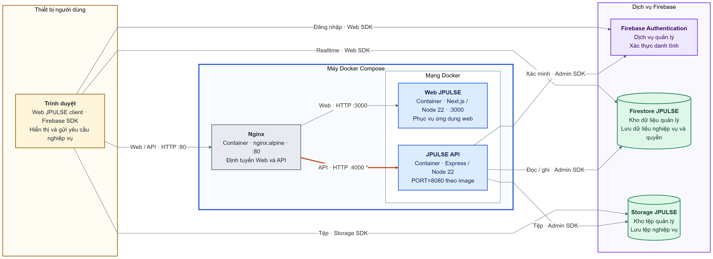
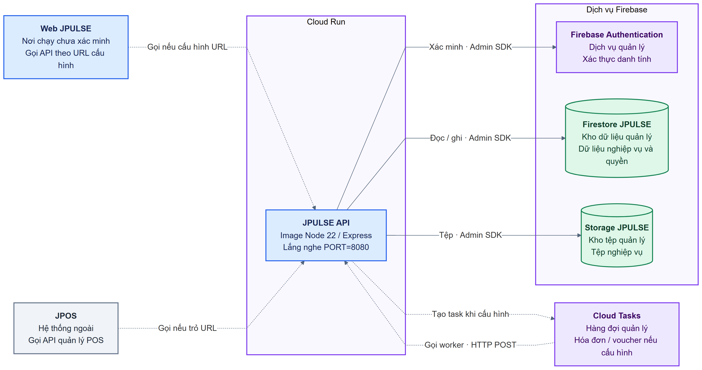

# JPULSE — C4 Deployment Diagram

## Ranh giới và mức độ xác nhận

Hình mô tả **nơi chạy các container của JPULSE** và các dịch vụ dữ liệu/xác thực mà chúng dùng. [Container Diagram](./jpulse-container-diagram.md) xác định Web JPULSE, JPULSE API, Firestore JPULSE và Storage JPULSE là các container logic; Firebase Authentication là dịch vụ ngoài. Ở mức triển khai, Firestore và Storage vẫn là tài nguyên logic của JPULSE nhưng **Google vận hành**; chúng không chạy trong máy Docker hay trong image API. Firebase Authentication cũng do Google vận hành. Mã nguồn hiện không chứng minh một topology production đang hoạt động, nên hai hình dưới đây diễn tả **hai cấu hình có trong repository**, không gộp chúng thành một môi trường.

Chú giải: **vàng** là thiết bị/chương trình của người dùng; **xanh dương** là ứng dụng JPULSE; **xám** là reverse proxy hoặc hệ thống ngoài; **xanh lá** là kho dữ liệu/tệp; **tím** là dịch vụ quản lý. Đường bao biểu diễn môi trường/nút triển khai; đường **đứt** chỉ tích hợp phụ thuộc cấu hình. Mũi tên biểu diễn bên chủ động gọi; phản hồi dùng cùng kết nối. Dấu `*` ở hình Compose chỉ sai khác cổng cần xử lý. Web SDK chạy trong trình duyệt sau khi tải ứng dụng từ Web JPULSE; hình không coi trình duyệt là một backend độc lập.

## 1. Topology Docker Compose được khai báo

[Mã Mermaid](./jpulse-deployment-compose.mmd) · [SVG để chèn tài liệu](./jpulse-deployment-compose.svg) · [PNG](./jpulse-deployment-compose.png)

Hình này bám theo [`docker-compose.yml`](../../docker-compose.yml) và [`nginx.conf`](../../nginx/nginx.conf). Compose khai báo một Nginx và hai ứng dụng trên mạng `wms-network`. Nginx nghe HTTP cổng 80, định tuyến `app.wms.localhost` đến Web cổng 3000 và `api.wms.localhost` đến API cổng 4000. Compose còn công bố trực tiếp cổng 3000 và 4000 từ host; hình ưu tiên đường truy cập qua Nginx, không hàm ý các cổng đó bị chặn. Không có TLS, DNS công khai, load balancer hoặc nhiều máy được xác nhận trong cấu hình này.

| Nút/instance | Trách nhiệm triển khai | Bằng chứng |
| --- | --- | --- |
| Trình duyệt người dùng | Nhận Web JPULSE; chạy Firebase Web SDK và gọi API theo URL frontend. | [Firebase Web SDK](../../apps/fe-wms/src/lib/firebase.ts#L95), [API URL trong Web](../../apps/fe-wms/src/hooks/useAuth.ts#L21), [Storage SDK upload](../../apps/fe-wms/src/lib/uploadFile.ts#L111). |
| Máy Docker Compose, `wms-network` | Chứa Nginx, Web và API; mạng Docker `bridge` nối ba service. **Đây là cấu hình một host**, chưa phải bằng chứng máy production đang chạy. | [docker-compose.yml](../../docker-compose.yml#L1), [network](../../docker-compose.yml#L61). |
| Nginx | Reverse proxy HTTP theo tên host đến Web/API. | [nginx.conf](../../nginx/nginx.conf#L23). |
| Web JPULSE | Image Next.js standalone trên Node 22, mặc định cổng 3000. | [Dockerfile Web](../../apps/fe-wms/Dockerfile#L91), [Next config](../../apps/fe-wms/next.config.ts#L35), [Compose Web](../../docker-compose.yml#L31). |
| JPULSE API | Image Express trên Node 22; Dockerfile đặt `PORT=8080`; chương trình ưu tiên `PORT` khi nghe. | [Dockerfile API](../../apps/be-wms/Dockerfile#L57), [API listen](../../apps/be-wms/src/index.ts#L57), [Compose API](../../docker-compose.yml#L16). |
| Firebase Authentication | Dịch vụ quản lý xác thực danh tính/token; nằm ngoài máy Docker. | [Firebase Web](../../apps/fe-wms/src/lib/firebase.ts), [Firebase Admin](../../apps/be-wms/src/config/firebase.ts#L74). |
| Firestore JPULSE | Kho dữ liệu nghiệp vụ và quyền do Google vận hành, được client và API truy cập theo cơ chế khác nhau. | [Firebase Web](../../apps/fe-wms/src/lib/firebase.ts#L100), [Firebase Admin](../../apps/be-wms/src/config/firebase.ts#L94), [Container Diagram](./jpulse-container-diagram.md). |
| Storage JPULSE | Kho tệp do Google vận hành; một số upload từ trình duyệt, API cũng dùng Admin SDK. | [Web upload](../../apps/fe-wms/src/lib/uploadFile.ts#L111), [Firebase Admin](../../apps/be-wms/src/config/firebase.ts#L96). |

| Kết nối | Ý nghĩa | Bằng chứng/giới hạn |
| --- | --- | --- |
| Trình duyệt → Nginx → Web | Tải giao diện qua HTTP cổng 80 rồi Nginx proxy đến cổng 3000. | [nginx.conf](../../nginx/nginx.conf#L23), [Compose](../../docker-compose.yml#L2). |
| Trình duyệt → Nginx → API | Web client gọi URL API; Nginx được cấu hình proxy cổng 4000. **Đường này có sai khác cổng với image API**, xem bảng dưới. | [API URL](../../apps/fe-wms/src/hooks/useAuth.ts#L21), [nginx.conf](../../nginx/nginx.conf#L33), [Dockerfile API](../../apps/be-wms/Dockerfile#L57). |
| Trình duyệt → Firebase Authentication/Firestore/Storage | Web SDK đăng nhập, truy cập dữ liệu realtime và tải tệp trong các luồng có dùng SDK; đi trực tiếp từ trình duyệt, không qua Nginx/API. Quyền client phụ thuộc Firebase Authentication và Rules. | [useAuth](../../apps/fe-wms/src/hooks/useAuth.ts), [Firestore client](../../apps/fe-wms/src/lib/scopedFirestore.ts), [uploadFile](../../apps/fe-wms/src/lib/uploadFile.ts). |
| API → Firebase Authentication/Firestore/Storage | Admin SDK xác minh danh tính và truy cập dữ liệu/tệp nghiệp vụ. Vai trò và quyền nghiệp vụ do JPULSE quyết định từ Firestore. | [Firebase Admin](../../apps/be-wms/src/config/firebase.ts#L74), [authMiddleware](../../apps/be-wms/src/api/middlewares/authMiddleware.ts#L20). |

## 2. Đường triển khai Cloud Run dành riêng cho API

[Mã Mermaid](./jpulse-deployment-cloud-run.mmd) · [SVG để chèn tài liệu](./jpulse-deployment-cloud-run.svg) · [PNG](./jpulse-deployment-cloud-run.png)

[`cloudbuild.yaml`](../../cloudbuild.yaml) build/push **image API** đến Artifact Registry; script trong [`package.json`](../../package.json#L89) gọi `gcloud run deploy be-wms` cho project `jw-system-f2104`, vùng `asia-southeast1`. API image nghe cổng 8080, khớp mặc định Cloud Run trong Dockerfile. Đây là **đường triển khai được khai báo**, chưa có bằng chứng trong repo rằng service Cloud Run đang chạy hoặc Web JPULSE được deploy ở đâu. Project Firebase thực tế được chọn từ credential/cấu hình của từng môi trường, không suy ra chỉ từ project Cloud Run.

| Nút/quan hệ | Ý nghĩa | Bằng chứng/giới hạn |
| --- | --- | --- |
| Cloud Run → JPULSE API | Triển khai image backend `be-wms`; Dockerfile đặt `PORT=8080`. | [package.json](../../package.json#L89), [Dockerfile API](../../apps/be-wms/Dockerfile#L57), [cloudbuild.yaml](../../cloudbuild.yaml#L1). |
| Web JPULSE → API | Client gọi API bằng `NEXT_PUBLIC_API_URL`; vị trí chạy Web trong đường Cloud Run **chưa được xác nhận**. | [Web API URL](../../apps/fe-wms/src/hooks/useAuth.ts#L21), [workflow production](../../.github/workflows/deploy-prod.yml#L1). |
| JPOS → API | JPOS gọi API quản lý phiên/cấu hình thiết bị POS; vị trí chạy JPOS không thuộc repository này. Hình không khẳng định endpoint xác thực người dùng JPOS. | [POS routes](../../apps/be-wms/src/api/routes/posDeviceRoutes.ts), [Component Diagram](./jpulse-component-diagrams.md). |
| API → Firebase Authentication/Firestore/Storage | Admin SDK truy cập Firebase project/bucket theo service account và biến môi trường. | [Firebase Admin](../../apps/be-wms/src/config/firebase.ts#L74), [chọn Firebase target](../../apps/be-wms/src/config/firebase.ts#L109). |
| API → Cloud Tasks → API | Nếu đủ biến môi trường, API tạo task hóa đơn/voucher; Cloud Tasks gọi HTTP POST về worker URL được cấu hình. Cùng image/API xử lý worker, không có worker deployment riêng được chứng minh. | [invoice dispatcher](../../apps/be-wms/src/services/invoiceTaskDispatcher.ts#L68), [voucher dispatcher](../../apps/be-wms/src/services/marketingVoucherTaskDispatcher.ts#L147), [env mẫu](../../.env.example#L34). |

Cloud Scheduler **không được vẽ như một instance đang chạy**: repository chỉ có [script tạo/cập nhật các job HTTP cho nhân sự](../../infra/gcp/deploy-hr-schedulers.ps1#L76), chưa thấy bước chạy script này trong workflow. Tương tự, các dịch vụ MISA, Brevo, VietQR, JPOS và Mapbox là tích hợp logic ở [Container Diagram](./jpulse-container-diagram.md); repo không mô tả nơi chúng triển khai nên không đặt chúng vào các nút hạ tầng của JPULSE.

## Điểm cần xử lý/xác minh trước khi dùng làm sơ đồ production thực tế

| Mức độ | Phát hiện | Tác động và câu hỏi cần xác nhận |
| --- | --- | --- |
| **Sai khác cấu hình** | [Dockerfile API](../../apps/be-wms/Dockerfile#L57) đặt `PORT=8080`, mã [ưu tiên `PORT`](../../apps/be-wms/src/index.ts#L57), nhưng [Compose đặt `BE_WMS_PORT=4000` và map `4000:4000`](../../docker-compose.yml#L16), còn [Nginx proxy `be-wms:4000`](../../nginx/nginx.conf#L38). | Theo các file được commit, API trong Compose nghe 8080 trừ khi `.env.local` bí mật ghi đè `PORT`; cần thống nhất cổng trước khi coi topology Compose hoạt động. |
| **Khoảng trống CI/CD test** | [Deploy Test](../../.github/workflows/deploy-test.yml#L82) chỉ chép Compose/Nginx sang server rồi `docker compose pull` và `up -d`; [Compose](../../docker-compose.yml#L16) dùng `build:` mà không có `image:` cho Web/API. | Chưa chứng minh server nhận image GHCR đã build; cần xác nhận cấu hình và nội dung thực tế trên server test. |
| **Chưa xác nhận production** | [Production CI](../../.github/workflows/deploy-prod.yml#L1) build/push hai image nhưng không có job deploy; [lệnh Cloud Run](../../package.json#L89) chỉ áp dụng API. | Cần xác nhận Web/API production đang ở Compose, Cloud Run hay hạ tầng khác, cùng DNS, TLS, ingress và phiên bản image. |
| **Dịch vụ nền theo cấu hình** | Cloud Tasks dùng khi đủ biến môi trường; [invoice dispatcher](../../apps/be-wms/src/services/invoiceTaskDispatcher.ts#L68) có fallback. Script [Cloud Scheduler](../../infra/gcp/deploy-hr-schedulers.ps1#L76) không có bằng chứng được chạy. | Cần xác nhận queue/job nào đã được provision ở từng môi trường và worker URL trỏ về deployment nào. |
| **Firebase target** | Backend dùng credential mặc định và có khả năng chọn target test/prod ở local theo [cấu hình Firebase](../../apps/be-wms/src/config/firebase.ts#L109). | Cần xác nhận project, bucket và Rules thực tế tương ứng với từng deployment; hình chỉ ghi tài nguyên logic JPULSE. |
| **Credential lúc khởi động** | API [yêu cầu `FIREBASE_SERVICE_ACCOUNT_BASE64`](../../apps/be-wms/src/config/firebase.ts#L45), trong khi [lệnh Cloud Run](../../package.json#L90) chỉ cập nhật biến bucket. | Cần xác nhận service Cloud Run đã được cấp credential cần thiết từ cấu hình/secret ngoài repository trước khi coi đường triển khai này vận hành được. |

**Nguồn chỉnh sửa** là hai file Mermaid trên; hai SVG/PNG đã được render và kiểm tra trực quan. Hình dùng Mermaid `flowchart` với nút triển khai và container theo ngữ nghĩa C4 Deployment để giữ bố cục/nhãn ổn định. Không có deployment hiện hành nào được xác minh bằng quyền truy cập hạ tầng trực tiếp.
