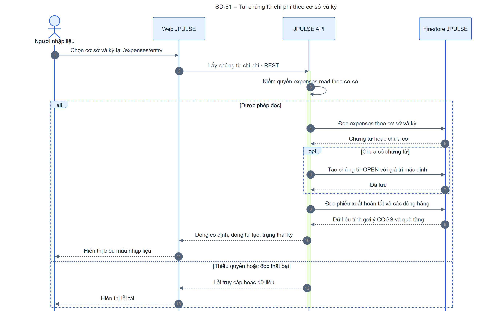
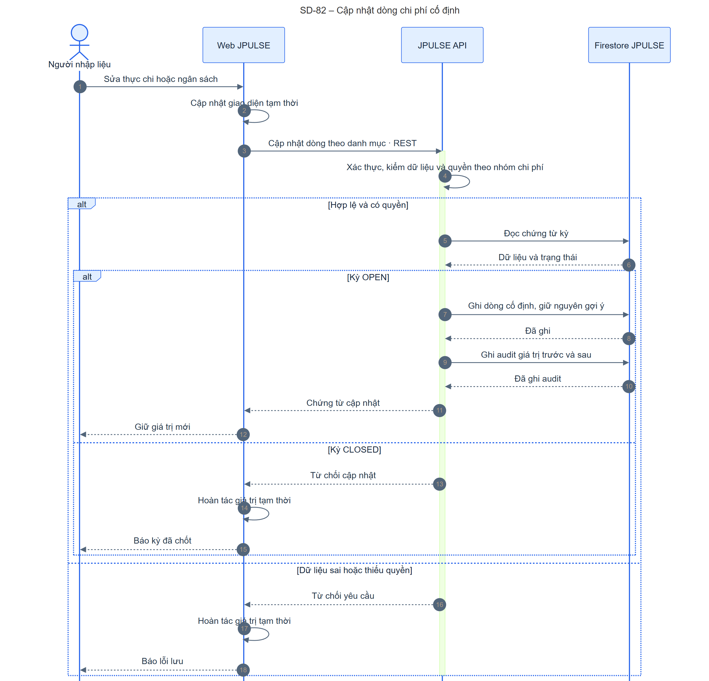
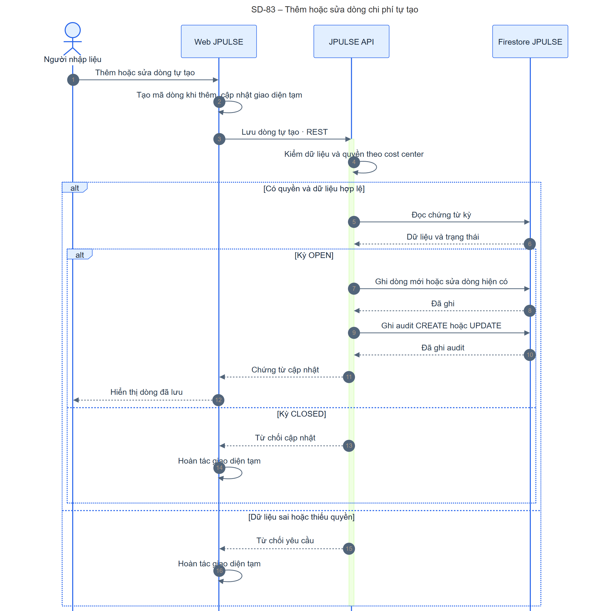
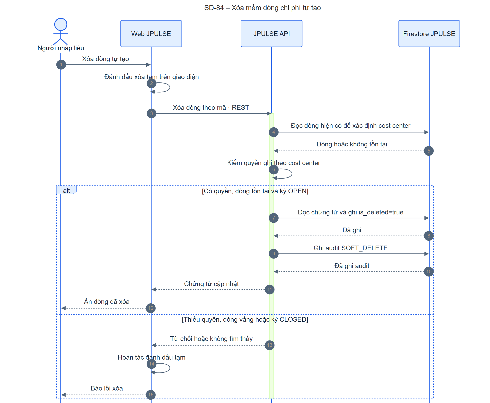
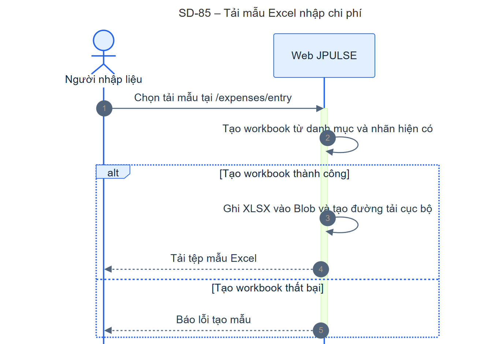
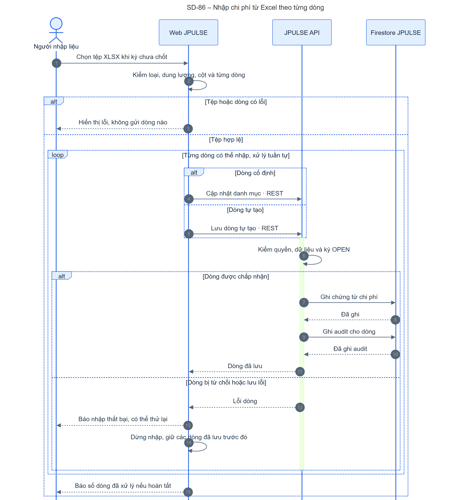
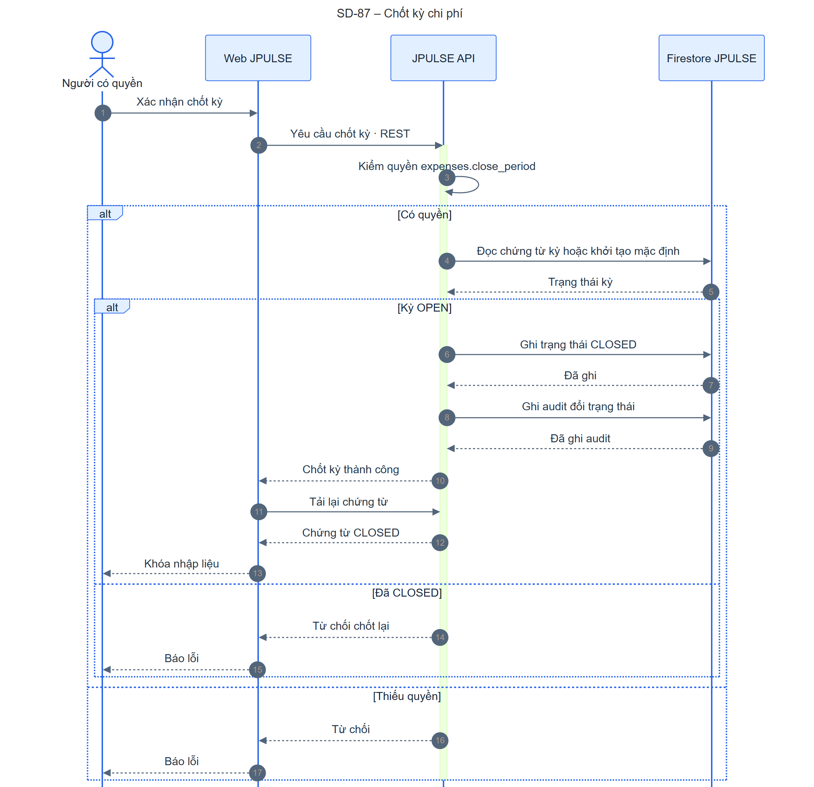
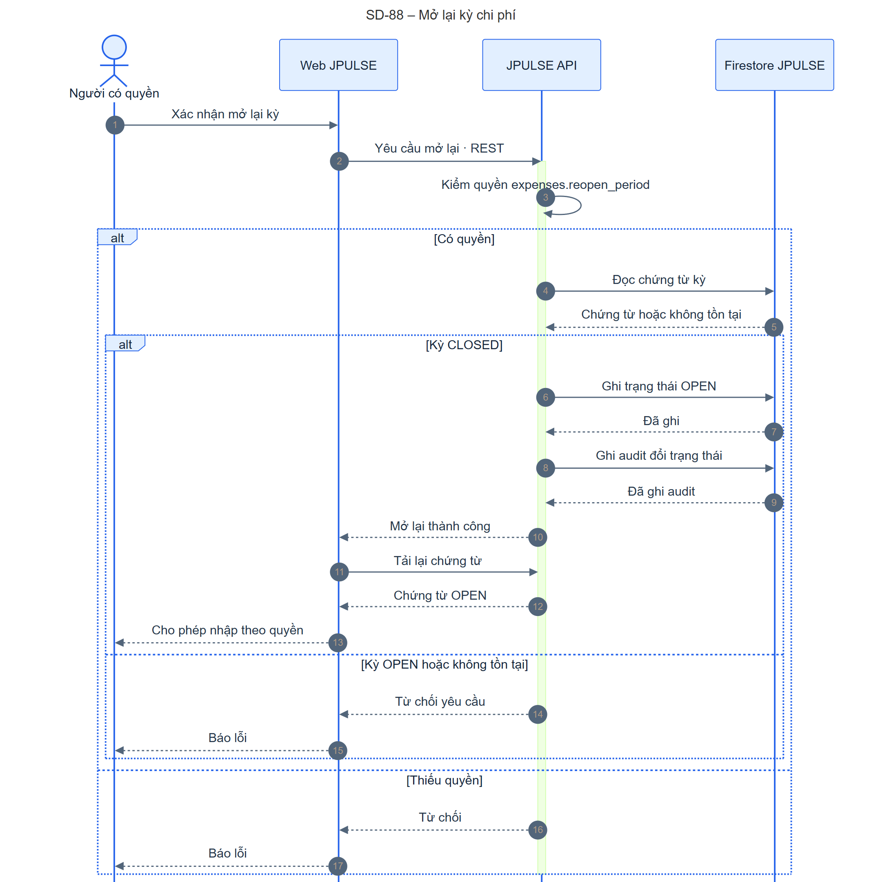
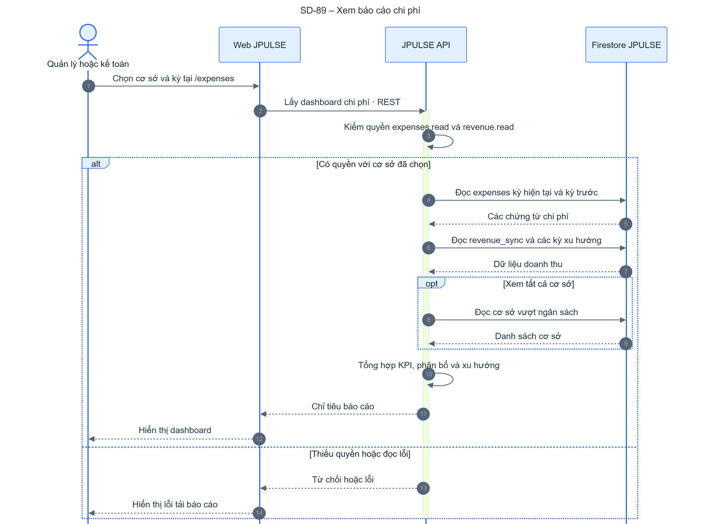
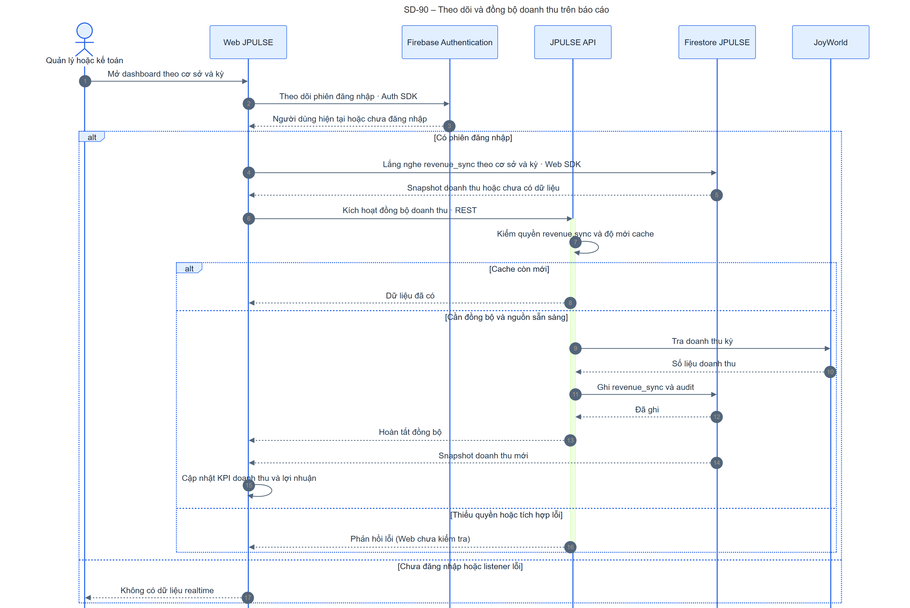

# JPULSE — Sequence Diagram nghiệp vụ chi phí

Phạm vi: `/expenses` (báo cáo) và `/expenses/entry` (nhập liệu). Bộ này nối tiếp [danh mục SD chung](./jpulse-sequence-diagrams.md) từ SD-81 đến SD-90. Sơ đồ mô tả mã nguồn hiện tại; SRS-JPULSE, mục **Ghi nhận và báo cáo chi phí** và nhóm use case **Nhập liệu và báo cáo chi phí**, là nguồn đối chiếu nghiệp vụ. Các participant là Người dùng, Web JPULSE, JPULSE API, Firestore JPULSE và hệ thống bên ngoài thực sự tham gia. Service và repository là xử lý nội bộ API, được diễn tả bằng lời gọi tự thân thay vì lifeline/container mới.

## Danh sách luồng và điểm bắt đầu

| SD | Luồng và điểm bắt đầu | Kết quả thành công | Nhánh ảnh hưởng thiết kế | Bằng chứng mã nguồn |
| --- | --- | --- | --- | --- |
| 81 | Chọn cơ sở, kỳ ở `/expenses/entry`. | Chứng từ, dòng chi phí và trạng thái kỳ được hiển thị; chứng từ vắng được khởi tạo. | Thiếu quyền/đọc lỗi; phép tính gợi ý thất bại thì trang vẫn tải. | [hook](../../apps/fe-wms/src/hooks/useExpenses.ts#L59), [service](../../apps/be-wms/src/services/expenseService.ts#L42), [phép tính](../../apps/be-wms/src/services/expenseCalculationService.ts#L28). |
| 82 | Sửa thực chi hoặc ngân sách dòng cố định. | Ghi chứng từ và audit, giữ giá trị mới ở Web. | Dữ liệu sai, thiếu quyền, kỳ CLOSED; Web hoàn tác cập nhật tạm. | [UI](../../apps/fe-wms/src/components/features/expenses/ExpenseDataEntry.tsx#L69), [hook](../../apps/fe-wms/src/hooks/useExpenses.ts#L88), [service](../../apps/be-wms/src/services/expenseService.ts#L131). |
| 83 | Thêm hoặc sửa dòng chi phí tự tạo. | Ghi dòng và audit CREATE/UPDATE. | Thiếu quyền theo cost center, dữ liệu sai, kỳ CLOSED; Web hoàn tác. | [UI](../../apps/fe-wms/src/components/features/expenses/ExpenseDataEntry.tsx#L292), [scope](../../apps/be-wms/src/services/scopedExpenseService.ts#L93), [service](../../apps/be-wms/src/services/expenseService.ts#L178). |
| 84 | Xóa dòng tự tạo. | `is_deleted=true`, audit SOFT_DELETE. | Không có dòng, thiếu quyền hoặc kỳ CLOSED; Web hoàn tác. | [UI](../../apps/fe-wms/src/components/features/expenses/ExpenseDataEntry.tsx#L170), [scope](../../apps/be-wms/src/services/scopedExpenseService.ts#L122), [service](../../apps/be-wms/src/services/expenseService.ts#L231). |
| 85 | Bấm tải mẫu Excel. | Web tạo và tải workbook XLSX cục bộ. | Lỗi tạo workbook. | [panel](../../apps/fe-wms/src/components/features/expenses/ExpenseExcelImportPanel.tsx#L215), [template](../../apps/fe-wms/src/utils/expenseExcelTemplate.ts#L17). |
| 86 | Chọn tệp XLSX để nhập. | Từng dòng hợp lệ được ghi qua API tương ứng và audit. | Lỗi cấu trúc chặn toàn bộ trước khi gửi; lỗi một dòng dừng lần nhập sau khi các dòng trước đã lưu. | [panel](../../apps/fe-wms/src/components/features/expenses/ExpenseExcelImportPanel.tsx#L69), [parser](../../apps/fe-wms/src/utils/expenseExcelImport.ts#L71), [routes](../../apps/be-wms/src/api/routes/expenseRoutes.ts#L28). |
| 87 | Xác nhận chốt kỳ. | Kỳ CLOSED, audit, Web tải lại và khóa nhập. | Thiếu quyền hoặc đã CLOSED. | [UI](../../apps/fe-wms/src/components/features/expenses/ExpenseEntryPage.tsx#L144), [scope](../../apps/be-wms/src/services/scopedExpenseService.ts#L157), [service](../../apps/be-wms/src/services/expensePeriodService.ts#L14). |
| 88 | Xác nhận mở lại kỳ. | Kỳ OPEN, audit, Web tải lại. | Thiếu quyền, kỳ vắng hoặc đã OPEN. | [UI](../../apps/fe-wms/src/components/features/expenses/ExpenseEntryPage.tsx#L158), [scope](../../apps/be-wms/src/services/scopedExpenseService.ts#L168), [service](../../apps/be-wms/src/services/expensePeriodService.ts#L50). |
| 89 | Chọn cơ sở, kỳ ở `/expenses`. | API tổng hợp KPI và xu hướng từ chi phí/doanh thu. | Thiếu quyền `expenses.read` hoặc `revenue.read`; dữ liệu Firestore lỗi. | [hook](../../apps/fe-wms/src/hooks/useExpenseDashboardMetrics.ts#L82), [scope](../../apps/be-wms/src/services/scopedExpenseService.ts#L55), [dashboard service](../../apps/be-wms/src/services/expenseDashboardService.ts#L237). |
| 90 | Mở dashboard, Web lắng nghe doanh thu. | Snapshot `revenue_sync` cập nhật KPI; API có thể đồng bộ từ JoyWorld nếu cache cũ. | Không đăng nhập/listener lỗi; thiếu quyền `revenue.sync`; nguồn doanh thu lỗi. | [hook](../../apps/fe-wms/src/hooks/useRevenueSync.ts#L48), [controller](../../apps/be-wms/src/api/controllers/revenueSyncController.ts#L56), [service](../../apps/be-wms/src/services/revenueSyncService.ts#L217). |

Các SD-82–84 và SD-87–88 đều ghi chứng từ **trước** khi ghi audit; hai thao tác này không cùng một transaction trong mã được khảo sát. SD-86 gọi lặp lại SD-82/83 theo từng dòng, không có API import lô riêng. SD-89 là phần tổng hợp qua API; SD-90 là đường realtime và tích hợp doanh thu chạy đồng thời khi mở dashboard.

## Hình và mã nguồn chỉnh sửa được

### SD-81 – Tải chứng từ chi phí theo cơ sở và kỳ

[Mermaid](./sequence/sd-81-expense-entry-read.mmd) · [SVG](./sequence/sd-81-expense-entry-read.svg) · [PNG](./sequence/sd-81-expense-entry-read.png)

API kiểm quyền đọc, khởi tạo chứng từ OPEN khi chưa có và tính gợi ý từ phiếu xuất hoàn tất. Lỗi tính gợi ý bị bắt và không làm hỏng luồng tải; việc lưu gợi ý sau đó là tác vụ không chờ kết quả.

### SD-82 – Cập nhật dòng chi phí cố định

[Mermaid](./sequence/sd-82-expense-fixed-update.mmd) · [SVG](./sequence/sd-82-expense-fixed-update.svg) · [PNG](./sequence/sd-82-expense-fixed-update.png)

Web cập nhật tạm; API kiểm quyền theo danh mục, trạng thái OPEN, ghi chứng từ và audit. Nếu API từ chối, Web phục hồi dữ liệu cũ.

### SD-83 – Thêm hoặc sửa dòng chi phí tự tạo

[Mermaid](./sequence/sd-83-expense-custom-save.mmd) · [SVG](./sequence/sd-83-expense-custom-save.svg) · [PNG](./sequence/sd-83-expense-custom-save.png)

Web tạo mã dòng khi thêm; API dùng quyền ghi theo cost center, kiểm kỳ rồi lưu và audit. API dùng cùng thao tác PUT cho tạo và sửa.

### SD-84 – Xóa mềm dòng chi phí tự tạo

[Mermaid](./sequence/sd-84-expense-custom-delete.mmd) · [SVG](./sequence/sd-84-expense-custom-delete.svg) · [PNG](./sequence/sd-84-expense-custom-delete.png)

API đọc dòng hiện có để xác định quyền theo cost center, rồi đánh dấu xóa và ghi audit. Nếu thất bại, trạng thái xóa tạm ở Web được hoàn tác.

### SD-85 – Tải mẫu Excel nhập chi phí

[Mermaid](./sequence/sd-85-expense-template-download.mmd) · [SVG](./sequence/sd-85-expense-template-download.svg) · [PNG](./sequence/sd-85-expense-template-download.png)

Mẫu được dựng ngay ở Web bằng ExcelJS và tải qua Blob trình duyệt. API, Firestore và Storage không tham gia thao tác này.

### SD-86 – Nhập chi phí từ Excel theo từng dòng

[Mermaid](./sequence/sd-86-expense-excel-import.mmd) · [SVG](./sequence/sd-86-expense-excel-import.svg) · [PNG](./sequence/sd-86-expense-excel-import.png)

Web parse/kiểm XLSX trước. Nếu có dòng lỗi, Web chặn toàn bộ lần nhập. Khi hợp lệ, Web gửi lần lượt từng dòng đến API cập nhật dòng cố định hoặc dòng tự tạo; lỗi ở một lời gọi dừng vòng lặp và các dòng trước đã ghi vẫn tồn tại.

### SD-87 – Chốt kỳ chi phí

[Mermaid](./sequence/sd-87-expense-period-close.mmd) · [SVG](./sequence/sd-87-expense-period-close.svg) · [PNG](./sequence/sd-87-expense-period-close.png)

API kiểm quyền `expenses.close_period`, chuyển OPEN → CLOSED và audit. Mã hiện tại còn cho chốt một kỳ chưa có chứng từ bằng cách tạo mặc định rồi ghi CLOSED.

### SD-88 – Mở lại kỳ chi phí

[Mermaid](./sequence/sd-88-expense-period-reopen.mmd) · [SVG](./sequence/sd-88-expense-period-reopen.svg) · [PNG](./sequence/sd-88-expense-period-reopen.png)

API kiểm quyền `expenses.reopen_period`, chỉ chuyển CLOSED → OPEN khi chứng từ tồn tại, rồi audit. Web tải lại trạng thái sau khi API thành công.

### SD-89 – Xem báo cáo chi phí

[Mermaid](./sequence/sd-89-expense-dashboard.mmd) · [SVG](./sequence/sd-89-expense-dashboard.svg) · [PNG](./sequence/sd-89-expense-dashboard.png)

API đọc chứng từ chi phí và `revenue_sync` theo kỳ hiện tại, kỳ trước và chuỗi xu hướng. Với chế độ tất cả cơ sở, API còn trả danh sách cơ sở vượt ngân sách. Dashboard Web có luồng doanh thu realtime riêng ở SD-90.

### SD-90 – Theo dõi và đồng bộ doanh thu trên báo cáo

[Mermaid](./sequence/sd-90-expense-revenue-sync.mmd) · [SVG](./sequence/sd-90-expense-revenue-sync.svg) · [PNG](./sequence/sd-90-expense-revenue-sync.png)

Web đợi phiên Firebase Authentication, đăng ký listener Firestore trực tiếp, rồi sau snapshot đầu tiên gọi API đồng bộ. API kiểm quyền và độ mới cache; nếu cần thì lấy doanh thu JoyWorld, ghi `revenue_sync` và audit. Snapshot mới cập nhật doanh thu/lợi nhuận trên Web.

## Đối chiếu và điểm cần xác minh

| Vấn đề | Quan sát từ mã hiện tại | Ảnh hưởng / cần xác minh |
| --- | --- | --- |
| Chỉ tiêu dashboard | [Web](../../apps/fe-wms/src/hooks/useExpenseDashboardMetrics.ts#L50) khai báo `costCenterStats`, `topExpenses`, `revenueExpenseMonthly`; [API](../../apps/be-wms/src/services/expenseDashboardService.ts#L22) hiện chỉ trả KPI, trend, `costCenterBreakdown`, `overBudgetStores`. | Một số ô/biểu đồ có thể trống; xác nhận yêu cầu hoặc bổ sung API. SD-89 chỉ vẽ dữ liệu API thực trả. |
| Dòng tự tạo trong báo cáo | [Service tổng hợp](../../apps/be-wms/src/services/expenseDashboardService.ts#L84) cộng `items` theo `ExpenseCategory`, chưa cộng `custom_items`; chế độ ALL của [chứng từ](../../apps/be-wms/src/services/expenseService.ts#L84) cũng chỉ cộng dòng cố định. | Xác nhận liệu báo cáo tổng chi phí và ngân sách phải bao gồm dòng tự tạo. |
| Nhập Excel không nguyên tử | [Panel](../../apps/fe-wms/src/components/features/expenses/ExpenseExcelImportPanel.tsx#L83) `await` từng dòng; không có batch import/rollback tổng thể. | Lỗi ở giữa để lại các dòng đã lưu; thao tác thử lại có thể gửi lại các dòng trước. Cần quyết định mong muốn về tính nguyên tử và retry. |
| Chứng từ và audit ghi riêng | [Service](../../apps/be-wms/src/services/expenseService.ts#L153), [kỳ](../../apps/be-wms/src/services/expensePeriodService.ts#L36) `upsert` rồi gọi audit. | Nếu audit lỗi sau khi chứng từ đã ghi, Web nhận lỗi dù dữ liệu đã đổi. Cần xác nhận mức bảo đảm truy vết. |
| Gợi ý chi phí | [Service](../../apps/be-wms/src/services/expenseService.ts#L58) tính từ phiếu xuất, lỗi được bỏ qua; upsert gợi ý không chờ. | SRS yêu cầu nhập liệu nhưng chưa quy định rõ tính nhất quán/gắn nhãn thời điểm gợi ý; cần chốt nếu dùng cho đối soát. |
| Doanh thu realtime | [Hook](../../apps/fe-wms/src/hooks/useRevenueSync.ts#L64) gọi sync API sau snapshot đầu tiên nhưng không kiểm `response.ok`; [API](../../apps/be-wms/src/api/controllers/revenueSyncController.ts#L56) đòi quyền `revenue.sync`, riêng dashboard đòi `revenue.read`. | Người xem báo cáo thiếu quyền sync vẫn xem dashboard nhưng đồng bộ có thể thất bại âm thầm. Chốt phân quyền và cách báo lỗi. |
| Quy tắc Firestore cho listener | [Hook](../../apps/fe-wms/src/hooks/useRevenueSync.ts#L103) đọc `revenue_sync` trực tiếp. | Cần xác nhận rules cho người dùng chỉ được đọc doanh thu trong phạm vi cơ sở cho phép; không suy đoán từ việc API đã kiểm quyền. |

**Đối chiếu Container Diagram:** SD-81–84, 86–89 đi theo Web → JPULSE API → Firestore. SD-85 chỉ chạy trong Web. SD-90 bổ sung đúng đường Web → Firestore trực tiếp (Web SDK), đường Web → API để kích hoạt đồng bộ và API → JoyWorld. Firebase Authentication chỉ xác định phiên cho listener; JPULSE API vẫn quyết định quyền nghiệp vụ. Không có Storage trong các luồng chi phí đã khảo sát.
