# UML Sequence Diagrams – tổ chức, cơ sở và cấu trúc kho JPULSE

Tài liệu này tiếp nối [bộ SD JPULSE](./jpulse-sequence-diagrams.md) và [SD chứng từ/tồn kho](./jpulse-warehouse-sequence-diagrams.md). Phạm vi gồm quản lý tổ chức, cơ sở (`Warehouse` trong mã), vị trí, ô kệ, gán sản phẩm, tổng quan tồn, quầy giải thưởng, xuất Excel và định mức tồn. [SRS-JPULSE](../../SRS-JPULSE.docx) nêu nhóm nghiệp vụ **Tổ chức cơ sở vị trí và ô kệ** ở mục 4.1.4/4.2.3, các use case quản lý cấu trúc cơ sở, xem chi tiết cơ sở, xem tồn theo vị trí và dashboard tồn. Khi SRS ở mức mục tiêu, SD lấy thứ tự thực thi từ mã hiện tại.

**Quy ước:** mũi tên liền là lời gọi, mũi tên đứt là phản hồi; `alt` là nhánh loại trừ, `opt` là bước có điều kiện, `par` là các hook đăng ký độc lập. Tất cả API ở nhóm này chạy qua `requireAuth`; Firebase xác minh phiên, JPULSE API áp dụng quyền/phạm vi từ dữ liệu JPULSE. Tiền kiểm chung đó được lược khỏi từng hình để giữ cỡ chữ đọc được. Web đọc dữ liệu trực tiếp bằng Firestore Web SDK theo [Security Rules](../../firestore.rules#L127), có API dự phòng khi listener lỗi; Web ghi cấu trúc và định mức qua JPULSE API. Ảnh tổ chức/cơ sở được Web tải trực tiếp lên Storage nếu chọn ảnh mới. Các tên lifeline khớp [Container Diagram](./jpulse-container-diagram.md).

## Danh mục và điểm nối

| SD | Điểm bắt đầu → thành công | Ngoại lệ chính | Bằng chứng triển khai |
| --- | --- | --- | --- |
| 18 – Danh sách tổ chức/cơ sở | Mở danh sách → nhận dữ liệu realtime. | Không có phiên Firebase hoặc listener lỗi → API dự phòng. | [useOrganizations](../../apps/fe-wms/src/hooks/useOrganizations.ts#L68), [useWarehouses](../../apps/fe-wms/src/hooks/useWarehouses.ts#L42). |
| 19 – Tạo tổ chức | Quản trị nhập thông tin → tổ chức mới và audit. | Thiếu quyền, mã trùng, ảnh tải lỗi. | [route](../../apps/be-wms/src/api/routes/organizationRoutes.ts#L29), [service](../../apps/be-wms/src/services/organizationService.ts#L35), [form](../../apps/fe-wms/src/components/organizations/OrganizationFormModal.tsx#L61). |
| 20 – Sửa tổ chức | Quản trị lưu thay đổi → dữ liệu và audit mới. | Không có tổ chức, mã mới trùng, thiếu quyền. | [route](../../apps/be-wms/src/api/routes/organizationRoutes.ts#L30), [service](../../apps/be-wms/src/services/organizationService.ts#L74). |
| 21 – Xóa tổ chức | Quản trị xác nhận → tổ chức bị xóa mềm. | Còn cơ sở đang sử dụng. | [route](../../apps/be-wms/src/api/routes/organizationRoutes.ts#L31), [service](../../apps/be-wms/src/services/organizationService.ts#L108). |
| 22 – Tạo cơ sở | Quản trị lưu → cơ sở, audit và quyền được tính lại. | Tổ chức sai, mã trùng, ảnh lỗi. | [route](../../apps/be-wms/src/api/routes/warehouseRoutes.ts#L32), [service](../../apps/be-wms/src/services/warehouseService.ts#L80), [form](../../apps/fe-wms/src/components/warehouses/WarehouseFormModal.tsx#L112). |
| 23 – Sửa cơ sở | Người có `warehouses.write` lưu → cơ sở và quyền cập nhật. | Sai phạm vi, tổ chức mới sai, mã trùng. | [route](../../apps/be-wms/src/api/routes/warehouseRoutes.ts#L33), [service](../../apps/be-wms/src/services/warehouseService.ts#L163). |
| 24 – Xóa cơ sở | Người có quyền xác nhận → xóa mềm và tính lại quyền. | Còn vị trí `ACTIVE` hoặc tồn dương. | [route](../../apps/be-wms/src/api/routes/warehouseRoutes.ts#L38), [service](../../apps/be-wms/src/services/warehouseService.ts#L208). |
| 25 – Tạo vị trí | Nhân viên nhập → vị trí mới và audit. | Thiếu `locations.write`, cần `locations.quarantine`, mã trùng. | [route](../../apps/be-wms/src/api/routes/locationRoutes.ts#L26), [service](../../apps/be-wms/src/services/locationService.ts#L67). |
| 26 – Sửa vị trí | Nhân viên lưu → vị trí và audit mới. | Sai quyền cơ sở nguồn/đích, quyền cách ly, mã trùng. | [route](../../apps/be-wms/src/api/routes/locationRoutes.ts#L31), [service](../../apps/be-wms/src/services/locationService.ts#L121). |
| 27 – Xóa vị trí | Nhân viên xác nhận → xóa mềm. | Vị trí còn tồn dương. | [route](../../apps/be-wms/src/api/routes/locationRoutes.ts#L36), [service](../../apps/be-wms/src/services/locationService.ts#L177). |
| 28 – Tạo ô kệ | Nhân viên chọn vị trí → ô kệ mới. | Quan hệ cơ sở/vị trí sai, mã trùng. | [route](../../apps/be-wms/src/api/routes/locationSlotRoutes.ts#L34), [service](../../apps/be-wms/src/services/locationSlotService.ts#L70). |
| 29 – Sửa ô kệ | Nhân viên lưu → ô kệ và audit mới. | Thiếu quyền, mã trùng trong vị trí. | [route](../../apps/be-wms/src/api/routes/locationSlotRoutes.ts#L39), [service](../../apps/be-wms/src/services/locationSlotService.ts#L118). |
| 30 – Xóa ô kệ | Nhân viên xác nhận → xóa mềm. | Ô kệ đang có sản phẩm được gán. | [route](../../apps/be-wms/src/api/routes/locationSlotRoutes.ts#L44), [service](../../apps/be-wms/src/services/locationSlotService.ts#L164). |
| 31 – Gán/chuyển sản phẩm | Chọn sản phẩm và ô kệ → tạo hoặc chuyển gán. | Sai quyền hoặc quan hệ cơ sở/vị trí. | [route](../../apps/be-wms/src/api/routes/locationSlotRoutes.ts#L49), [service](../../apps/be-wms/src/services/locationSlotProductService.ts#L59). |
| 32 – Bỏ gán sản phẩm | Chọn bỏ gán → gán bị xóa mềm. | Không có gán hoặc thiếu quyền. | [route](../../apps/be-wms/src/api/routes/locationSlotRoutes.ts#L54), [service](../../apps/be-wms/src/services/locationSlotProductService.ts#L125). |
| 33 – Tổng quan tồn/quầy | Mở chi tiết cơ sở → KPI, tồn theo vị trí/ô kệ. | Listener lỗi → API dự phòng; không đủ dữ liệu → màn hình thiếu phần tương ứng. | [trang cơ sở](<../../apps/fe-wms/src/app/(dashboard)/warehouses/[id]/page.tsx#L93>), [tổng hợp ô kệ](../../apps/fe-wms/src/utils/slotInventory.ts#L40), [quầy giải thưởng](../../apps/fe-wms/src/components/warehouses/LocationCardGrid.tsx#L985). |
| 34 – Xuất dữ liệu kho | Chọn loại/bộ lọc → tải XLSX tại Web. | Thiếu quyền/dữ liệu; audit thất bại hiện không chặn tải. | [cấu hình xuất](<../../apps/fe-wms/src/app/(dashboard)/warehouses/[id]/page.tsx#L228>), [exportToExcel](../../apps/fe-wms/src/utils/exportExcel.ts#L284), [audit API](../../apps/be-wms/src/api/controllers/auditLogController.ts#L61). |
| 35 – Thiết lập định mức | Nhập mức tối thiểu → tạo/cập nhật chính sách tồn. | Thiếu `inventory.write`, cơ sở/vị trí/ô kệ không khớp. | [UI](../../apps/fe-wms/src/components/warehouses/LocationCardGrid.tsx#L1040), [service](../../apps/be-wms/src/services/stockPolicyService.ts#L90). |

## Các hình và mã nguồn có thể chỉnh sửa

### SD-18 – Xem danh sách tổ chức và cơ sở

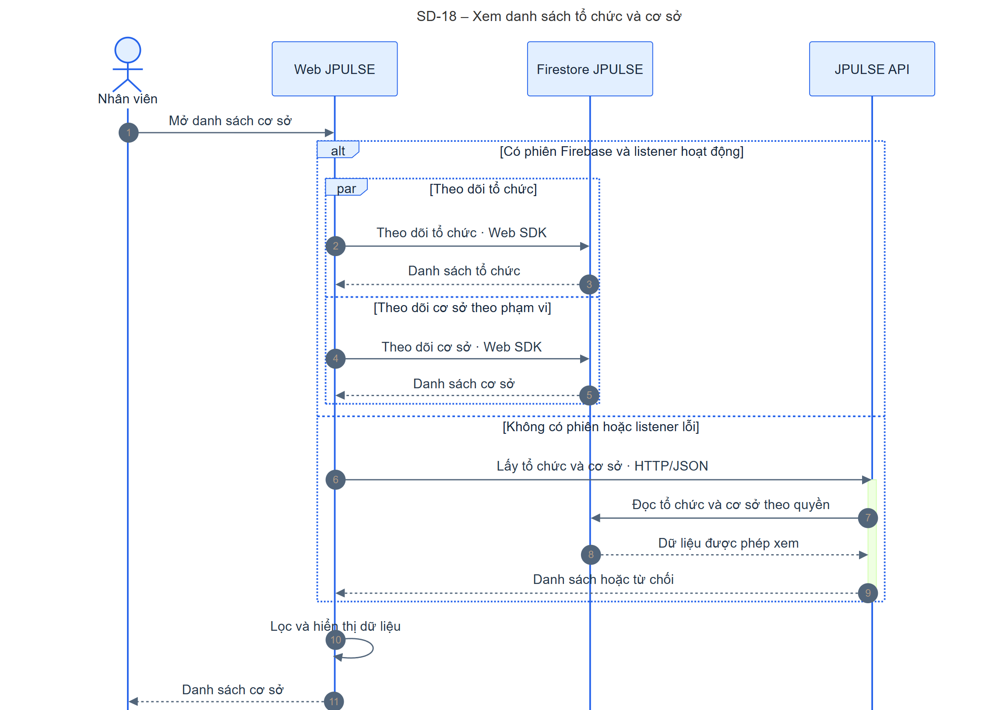

[Mermaid](./sequence/sd-18-facility-list.mmd) · [SVG](./sequence/sd-18-facility-list.svg) · [PNG](./sequence/sd-18-facility-list.png)

### SD-19 – Tạo tổ chức

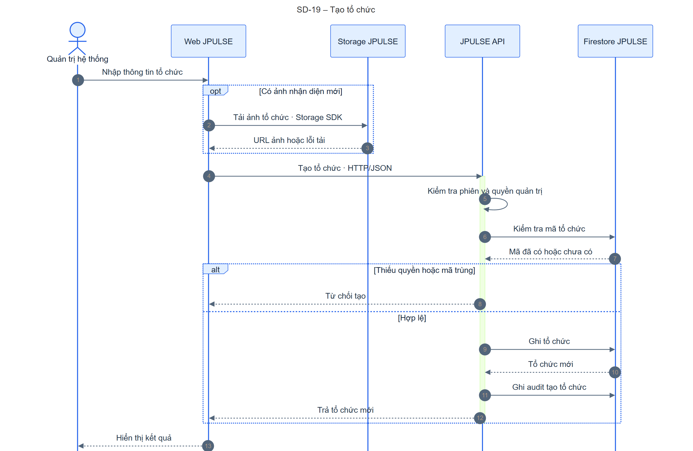

[Mermaid](./sequence/sd-19-organization-create.mmd) · [SVG](./sequence/sd-19-organization-create.svg) · [PNG](./sequence/sd-19-organization-create.png)

### SD-20 – Sửa tổ chức

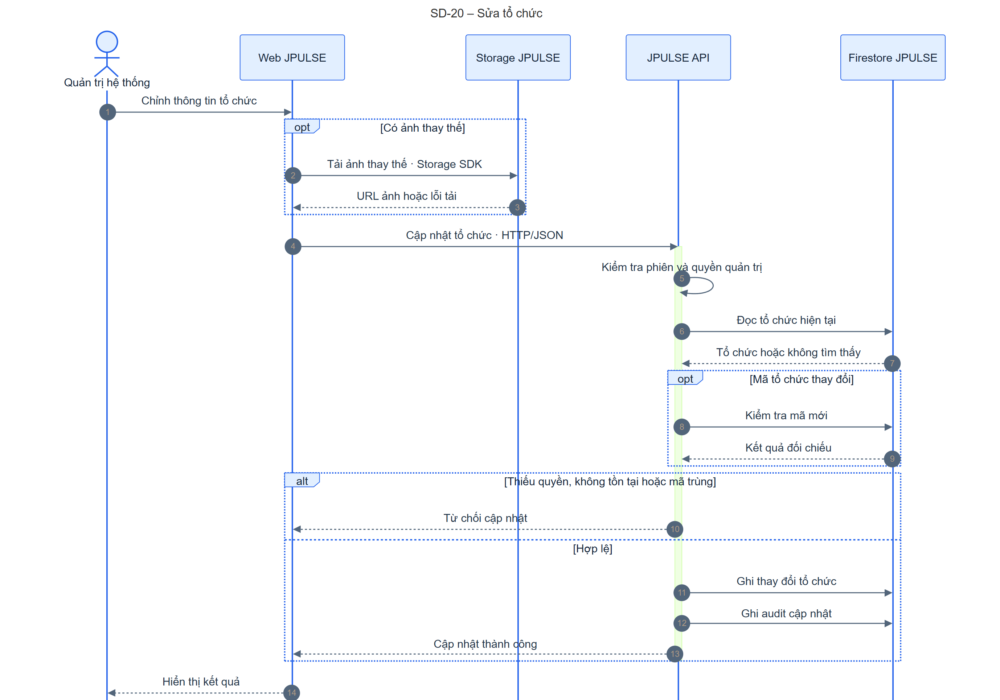

[Mermaid](./sequence/sd-20-organization-update.mmd) · [SVG](./sequence/sd-20-organization-update.svg) · [PNG](./sequence/sd-20-organization-update.png)

### SD-21 – Xóa mềm tổ chức

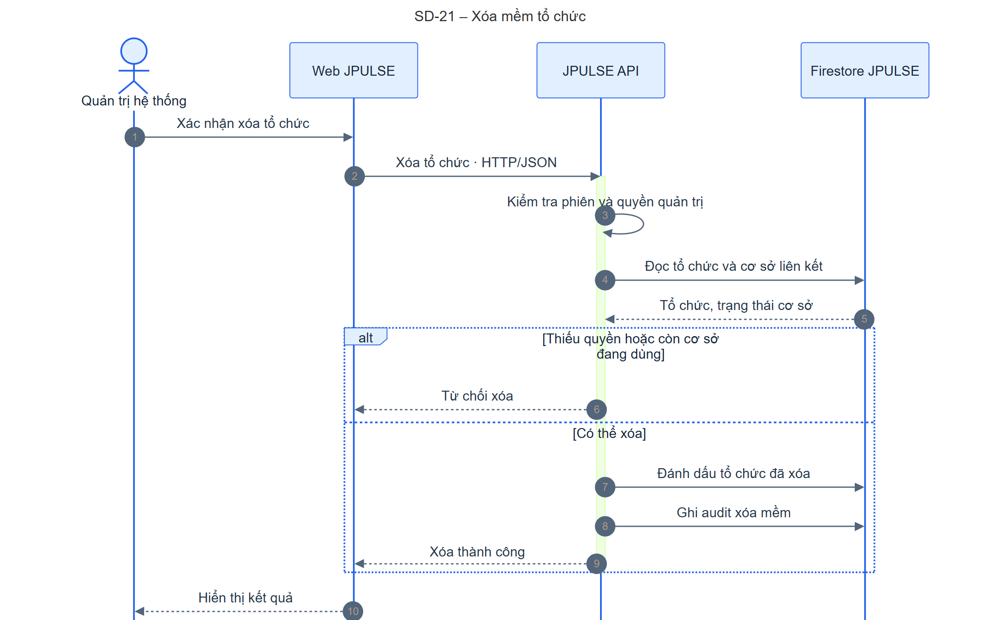

[Mermaid](./sequence/sd-21-organization-delete.mmd) · [SVG](./sequence/sd-21-organization-delete.svg) · [PNG](./sequence/sd-21-organization-delete.png)

### SD-22 – Tạo cơ sở kho

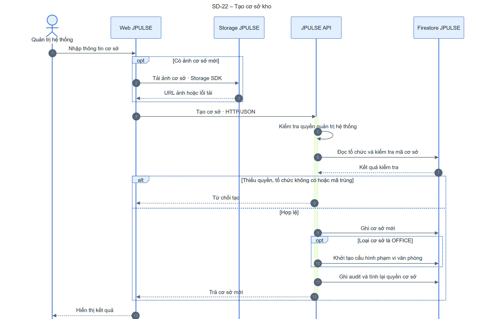

[Mermaid](./sequence/sd-22-warehouse-create.mmd) · [SVG](./sequence/sd-22-warehouse-create.svg) · [PNG](./sequence/sd-22-warehouse-create.png)

### SD-23 – Sửa cơ sở kho

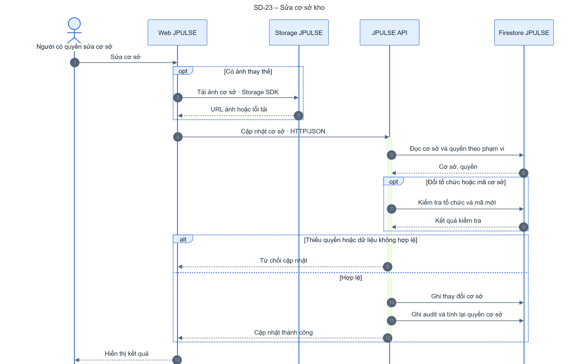

[Mermaid](./sequence/sd-23-warehouse-update.mmd) · [SVG](./sequence/sd-23-warehouse-update.svg) · [PNG](./sequence/sd-23-warehouse-update.png)

### SD-24 – Xóa mềm cơ sở kho

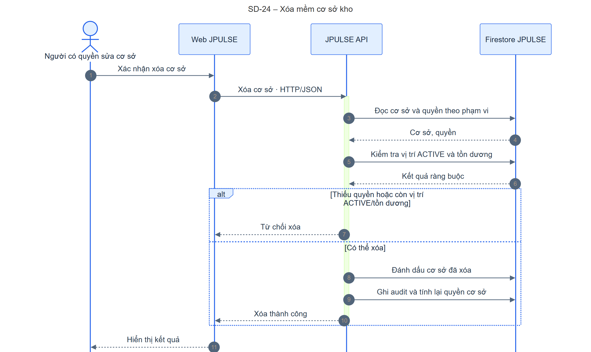

[Mermaid](./sequence/sd-24-warehouse-delete.mmd) · [SVG](./sequence/sd-24-warehouse-delete.svg) · [PNG](./sequence/sd-24-warehouse-delete.png)

### SD-25 – Tạo vị trí trong cơ sở

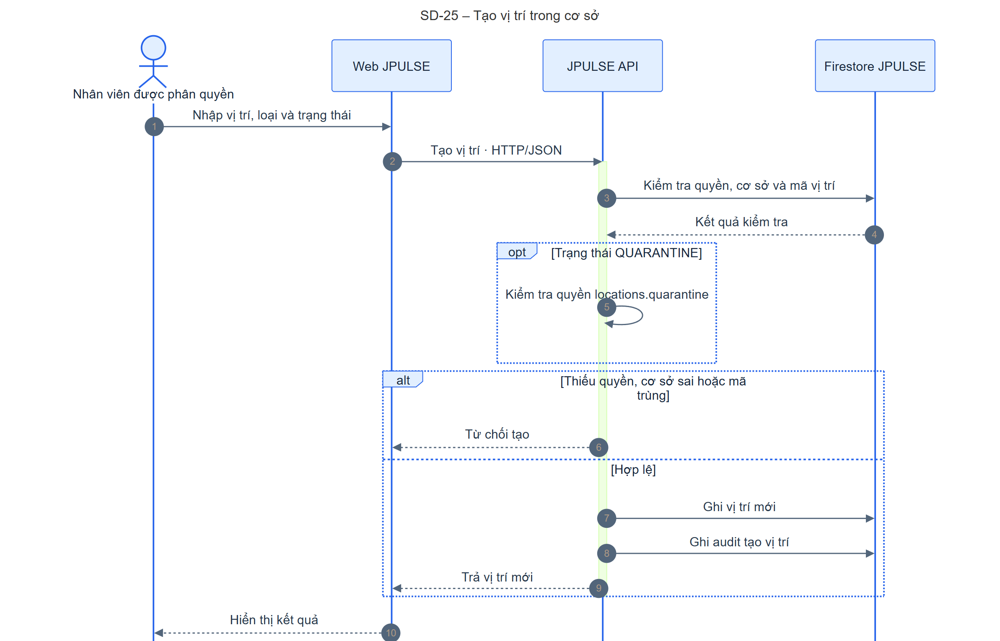

[Mermaid](./sequence/sd-25-location-create.mmd) · [SVG](./sequence/sd-25-location-create.svg) · [PNG](./sequence/sd-25-location-create.png)

### SD-26 – Sửa vị trí trong cơ sở

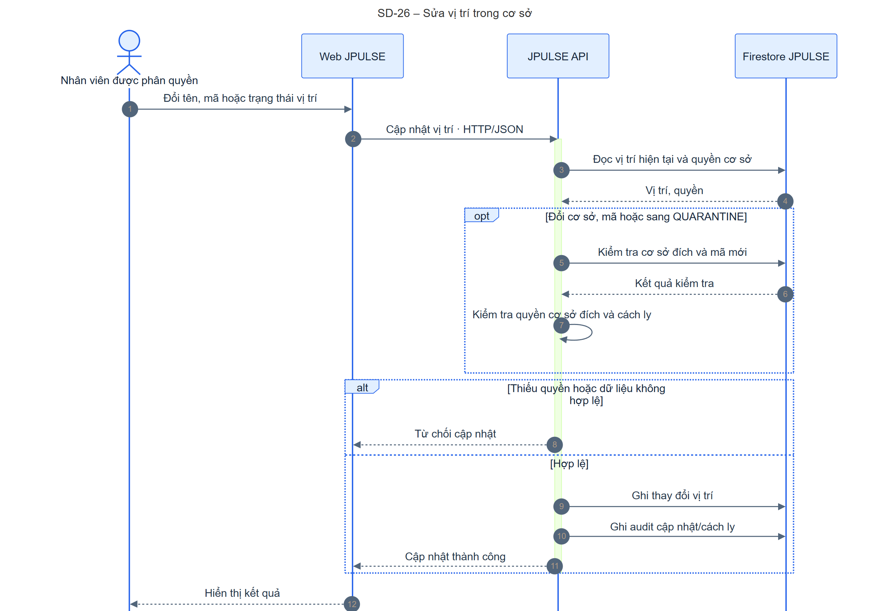

[Mermaid](./sequence/sd-26-location-update.mmd) · [SVG](./sequence/sd-26-location-update.svg) · [PNG](./sequence/sd-26-location-update.png)

### SD-27 – Xóa mềm vị trí

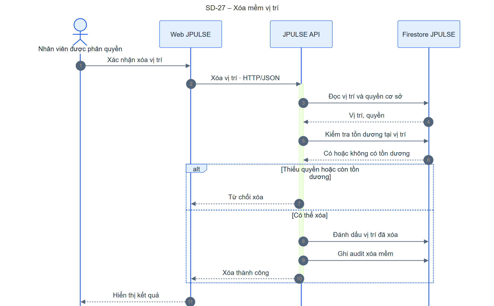

[Mermaid](./sequence/sd-27-location-delete.mmd) · [SVG](./sequence/sd-27-location-delete.svg) · [PNG](./sequence/sd-27-location-delete.png)

### SD-28 – Tạo ô kệ trong vị trí

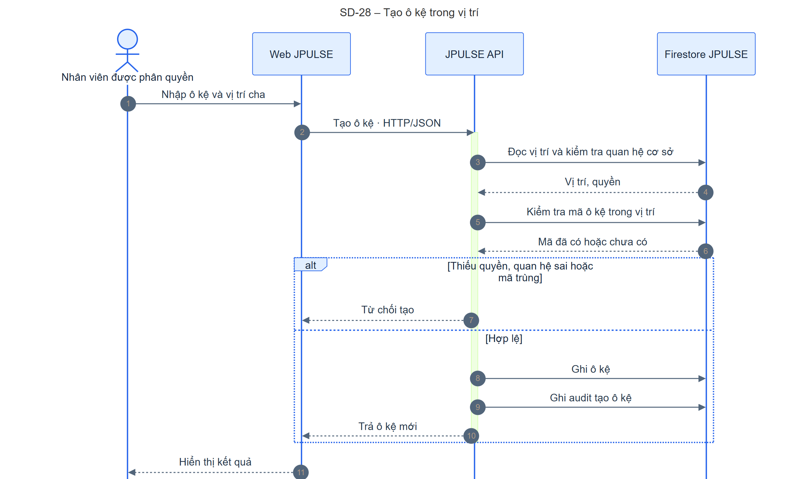

[Mermaid](./sequence/sd-28-slot-create.mmd) · [SVG](./sequence/sd-28-slot-create.svg) · [PNG](./sequence/sd-28-slot-create.png)

### SD-29 – Sửa ô kệ

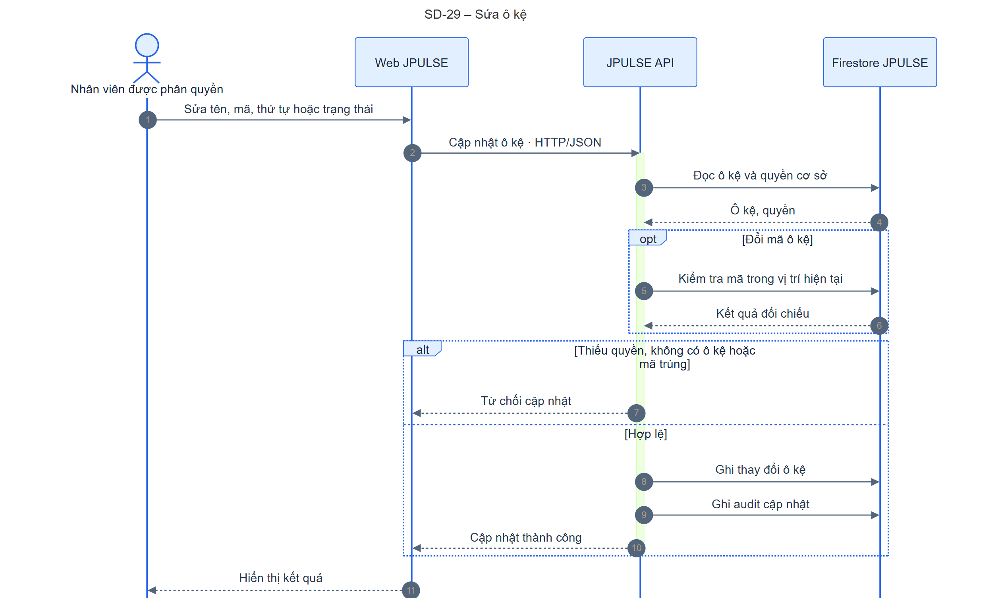

[Mermaid](./sequence/sd-29-slot-update.mmd) · [SVG](./sequence/sd-29-slot-update.svg) · [PNG](./sequence/sd-29-slot-update.png)

### SD-30 – Xóa mềm ô kệ

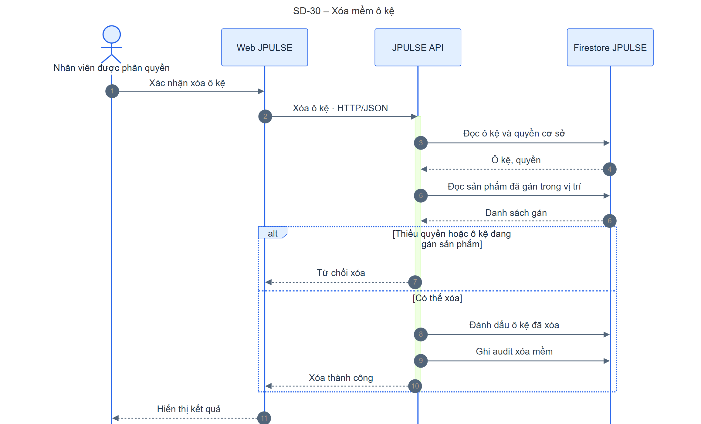

[Mermaid](./sequence/sd-30-slot-delete.mmd) · [SVG](./sequence/sd-30-slot-delete.svg) · [PNG](./sequence/sd-30-slot-delete.png)

### SD-31 – Gán hoặc chuyển sản phẩm vào ô kệ

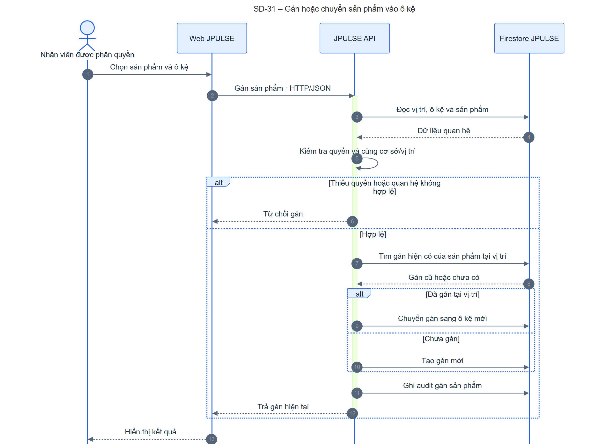

[Mermaid](./sequence/sd-31-slot-product-upsert.mmd) · [SVG](./sequence/sd-31-slot-product-upsert.svg) · [PNG](./sequence/sd-31-slot-product-upsert.png)

### SD-32 – Bỏ gán sản phẩm khỏi ô kệ

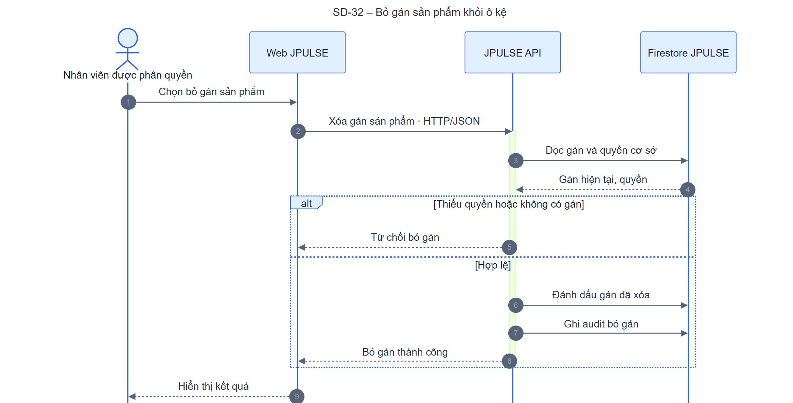

[Mermaid](./sequence/sd-32-slot-product-delete.mmd) · [SVG](./sequence/sd-32-slot-product-delete.svg) · [PNG](./sequence/sd-32-slot-product-delete.png)

### SD-33 – Xem tổng quan tồn kho và quầy giải thưởng

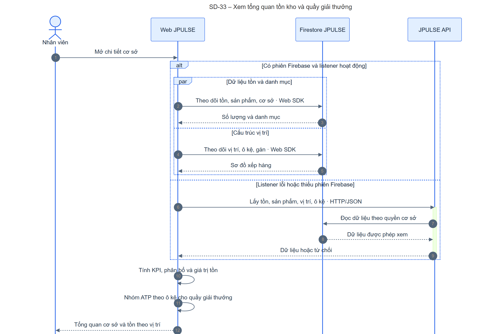

[Mermaid](./sequence/sd-33-warehouse-overview.mmd) · [SVG](./sequence/sd-33-warehouse-overview.svg) · [PNG](./sequence/sd-33-warehouse-overview.png)

### SD-34 – Xuất dữ liệu kho ra Excel

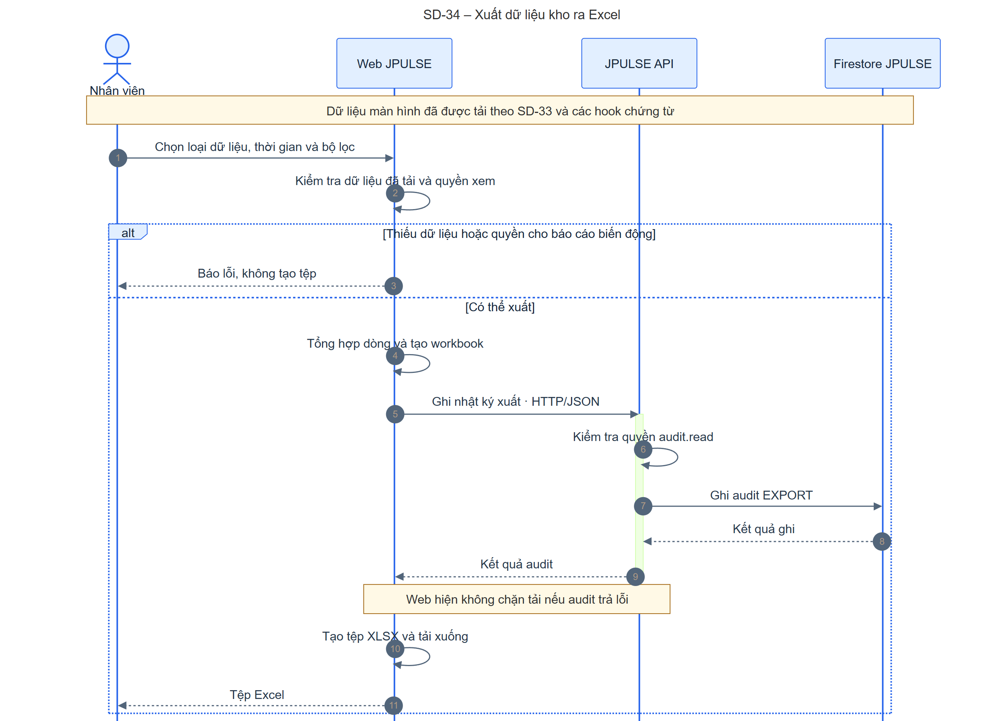

[Mermaid](./sequence/sd-34-warehouse-export.mmd) · [SVG](./sequence/sd-34-warehouse-export.svg) · [PNG](./sequence/sd-34-warehouse-export.png)

### SD-35 – Thiết lập định mức tồn cho sản phẩm

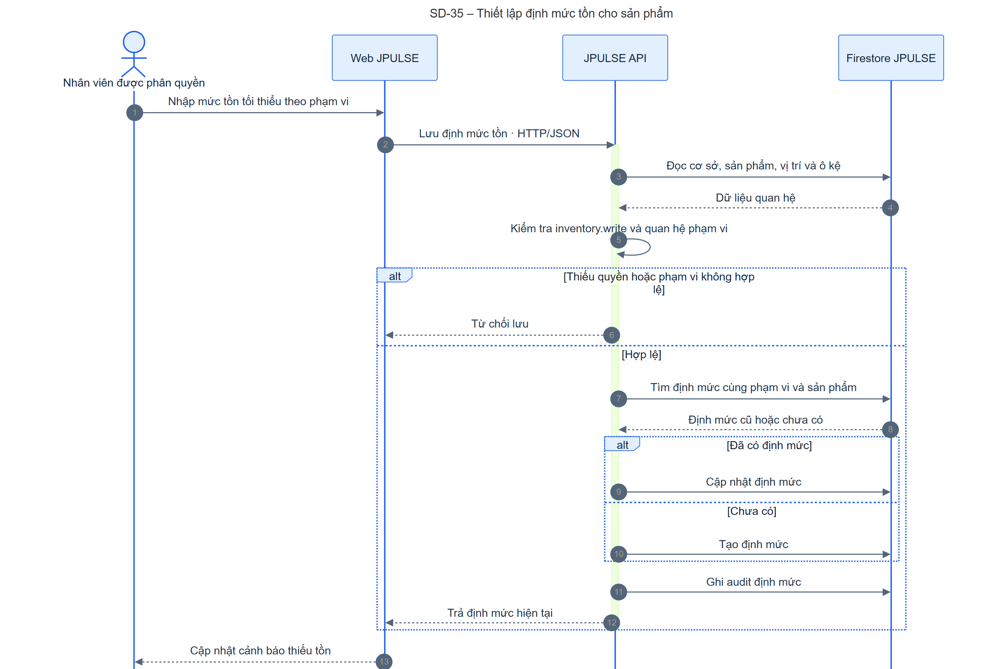

[Mermaid](./sequence/sd-35-stock-policy-upsert.mmd) · [SVG](./sequence/sd-35-stock-policy-upsert.svg) · [PNG](./sequence/sd-35-stock-policy-upsert.png)

## Đối chiếu và điểm cần xác minh

| Vấn đề | Hiện trạng mã nguồn | Tác động / câu hỏi |
| --- | --- | --- |
| “Giải thưởng” trong màn hình cơ sở | `PrizeOverviewPanel` lấy `SlotInventoryGroup`, hiện tên ô kệ, SKU và ATP; không có thao tác tạo/sửa một danh mục giải thưởng ở nhóm route kho. | Có nghiệp vụ quản lý giải thưởng độc lập ngoài kho hay “giải thưởng” chỉ là tên trình bày của quầy/ô kệ? SD-33 mô tả đúng UI hiện có. |
| Audit xuất Excel | Web gọi `POST /api/audit-logs/export`, nhưng [route](../../apps/be-wms/src/api/routes/auditLogRoutes.ts#L14) yêu cầu `audit.read`. `exportToExcel` không kiểm tra `response.ok` và tiếp tục tải tệp. | Có yêu cầu bắt buộc audit thành công trước khi xuất? Quyền xuất dữ liệu có nên tách khỏi `audit.read`? |
| Ghi dữ liệu và audit | Các service ghi tổ chức, cơ sở, vị trí, ô kệ rồi ghi audit ở lời gọi riêng; cơ sở còn tính lại quyền sau đó. | Nếu audit/tính lại quyền lỗi sau khi dữ liệu đã ghi, Web có thể thấy lỗi dù thay đổi đã lưu. Cần chính sách phục hồi hoặc giao dịch nếu yêu cầu tính nguyên tử. |
| Ảnh tải lên trước khi lưu | Web tải ảnh tổ chức/cơ sở trực tiếp lên Storage rồi mới gọi API; nếu API từ chối, ảnh đã tải có thể không gắn đối tượng. | Cần xác định vòng đời/tác vụ dọn ảnh dư và xác nhận Storage Rules production. |
| Xóa cấu trúc | Xóa tổ chức chặn cơ sở còn hoạt động; xóa cơ sở chặn vị trí `ACTIVE` và tồn dương; xóa vị trí chặn tồn dương; xóa ô kệ chặn gán sản phẩm. | Cần xác nhận thêm ràng buộc đối với ô kệ/gán còn tồn khi xóa vị trí, vì service hiện chỉ kiểm tra tồn dương. |
| Cơ sở `OFFICE` | Tạo `OFFICE` khởi tạo cấu hình phạm vi, còn màn hình chi tiết đi nhánh `OfficeFacilityDetail`; export kho không đăng ký cho `OFFICE`. | SD-33/34 áp dụng cho cơ sở kho không phải `OFFICE`; nghiệp vụ Office Scope cần SD riêng. |
| Dữ liệu đọc trực tiếp và dự phòng | Các hook mở listener Firestore và gọi API khi thiếu phiên Firebase/lỗi. | Nếu quyền đổi trong phiên, cần kiểm thử sự nhất quán giữa Security Rules, materialized access và API. |
| Quyền xem tổ chức | [Firestore Rules](../../firestore.rules#L127) cho mọi tài khoản đã đăng nhập đọc `organizations`; [API route](../../apps/be-wms/src/api/routes/organizationRoutes.ts#L19) yêu cầu `organizations.read`. | Cần xác nhận danh bạ tổ chức có chủ ý được xem rộng hơn API hay phải thu hẹp Rules. |
| Quyền điều khiển trên UI và API | [Trang chi tiết cơ sở](<../../apps/fe-wms/src/app/(dashboard)/warehouses/[id]/page.tsx#L74>) dùng `locations.write` để bật cả sửa cơ sở và điều khiển định mức; [warehouseService](../../apps/be-wms/src/services/warehouseService.ts#L163) yêu cầu `warehouses.write`, [stockPolicyService](../../apps/be-wms/src/services/stockPolicyService.ts#L90) yêu cầu `inventory.write`. | Có thể hiện nút nhưng API từ chối, hoặc ẩn nút dù người dùng có quyền API. Cần thống nhất phép kiểm tra UI theo từng thao tác. |

## Kiểm tra phù hợp kiến trúc

Mọi luồng ghi tổ chức/cơ sở/vị trí/ô kệ/gán/định mức là **Web → JPULSE API → Firestore**. Đọc danh sách và tổng quan theo luồng **Web → Firestore**, chuyển sang **Web → JPULSE API → Firestore** khi hook dùng API dự phòng. Ảnh tổ chức/cơ sở theo luồng **Web → Storage**. Excel được dựng và tải tại Web; API chỉ nhận yêu cầu ghi audit. Không có participant nội bộ như controller/repository trên hình và không có luồng quản trị giải thưởng được suy đoán.
