# UML Sequence Diagrams – quản lý hóa đơn JPULSE

Tài liệu tiếp nối [bộ SD JPULSE](./jpulse-sequence-diagrams.md) và SD-04A–D về phát hành bất đồng bộ. Phạm vi là màn hình [`/invoice-management`](../../apps/fe-wms/src/components/invoices/InvoiceManagementPage.tsx#L268) cùng trang case liên kết từ đó. [SRS-JPULSE](../../SRS-JPULSE.docx), mục **3.1.3 Phát hành hóa đơn điện tử**, yêu cầu cấu hình cửa hàng, đồng bộ đơn nguồn, chuẩn bị, phát hành, sổ và đối soát. Các thông điệp dưới đây ưu tiên hành vi hiện tại ở Web, route, service và repository; tài liệu giai đoạn [2](../integrations/meinvoice/phase-2-adapter-calculation-preflight.md), [3](../integrations/meinvoice/phase-3-review-preview.md), [4](../integrations/meinvoice/phase-4-issue-jobs.md), [5](../integrations/meinvoice/phase-5-ledger-reconciliation.md) được dùng để đối chiếu.

**Quy ước:** lời gọi liền, phản hồi đứt; `alt`, `opt`, `loop` chỉ điều kiện/tùy chọn/lặp có trong code. “Firestore JPULSE” gồm dữ liệu đơn JPOS đã được lưu ở `pos_orders` và dữ liệu hóa đơn của JPULSE; JPOS không gửi yêu cầu trực tiếp trong các SD này. MISA meInvoice và JoyWorld nằm ngoài ranh giới JPULSE theo [Container Diagram](./jpulse-container-diagram.md). Quyền và phạm vi cửa hàng được API kiểm tra theo route; Web chỉ dùng Firestore trực tiếp ở các listener được ghi rõ trong SD-46 và SD-56.

## Chức năng và điểm nối

| SD | Điểm bắt đầu → kết quả thành công | Nhánh lỗi có ảnh hưởng thiết kế | Bằng chứng mã |
| --- | --- | --- | --- |
| 46 – Danh sách đơn | Kế toán chọn cửa hàng/ngày → đơn nguồn và trạng thái preflight. | Một API ngày lỗi làm lần tải thất bại; listener chỉ làm tín hiệu tải lại. | [Web](../../apps/fe-wms/src/components/invoices/InvoiceManagementPage.tsx#L310), [service](../../apps/be-wms/src/services/invoiceOrderSyncService.ts#L683). |
| 47 – Cập nhật dữ liệu | Bấm cập nhật → JPOS/JoyWorld được gom, lưu projection/draft và sync run. | JoyWorld lỗi sau bước ghi JPOS có thể để lại dữ liệu từng phần; run `FAILED`. | [Web](../../apps/fe-wms/src/components/invoices/InvoiceManagementPage.tsx#L419), [service](../../apps/be-wms/src/services/invoiceOrderSyncService.ts#L354). |
| 48 – Đối chiếu MISA | Chạy đối chiếu ngày → snapshot, kết quả ghép và case. | MISA hoặc ghi kết quả lỗi → reconciliation run `FAILED`. | [Web](../../apps/fe-wms/src/components/invoices/InvoiceReconciliationCasesPage.tsx#L303), [controller](../../apps/be-wms/src/api/controllers/invoiceOrderSyncController.ts#L114), [service](../../apps/be-wms/src/services/invoiceReconciliationService.ts#L142). |
| 49A – Lưu cấu hình | Mở cấu hình, chỉnh và lưu ở trạng thái tắt. | Thiếu trường, quyền hoặc cấu hình sai. | [Web](../../apps/fe-wms/src/components/invoices/InvoiceConfigurationPanel.tsx#L223), [route](../../apps/be-wms/src/api/routes/meInvoiceConfigRoutes.ts#L30). |
| 49B – Áp dụng cấu hình | Lưu tắt → xác minh tài khoản/mẫu MISA → lưu trạng thái bật yêu cầu. | Xác minh thất bại để lại bản cấu hình tắt đã lưu ở bước đầu. | [Web](../../apps/fe-wms/src/components/invoices/InvoiceConfigurationPanel.tsx#L349), [connection service](../../apps/be-wms/src/services/meInvoiceConnectionService.ts#L262). |
| 50 – Tạo/rebase draft | Chọn đơn → draft hiện hành hoặc revision mới khi cần. | Hash nguồn đổi, draft cần xem lại hoặc thiếu quyền. | [Web](../../apps/fe-wms/src/components/invoices/InvoiceDraftWorkflow.tsx#L240), [service](../../apps/be-wms/src/services/invoiceDocumentService.ts#L112). |
| 51 – Chỉnh draft | Sửa buyer/dòng → tự lưu revision và tính lại tiền ở API. | Revision/hash cũ hoặc dòng không hợp lệ → không ghi đè. | [Web](../../apps/fe-wms/src/components/invoices/InvoiceDraftWorkflow.tsx#L268), [service](../../apps/be-wms/src/services/invoiceDocumentService.ts#L544). |
| 52 – Xem trước | Chọn preview → API gọi MISA và trả URL có thời hạn. | Draft cũ, preflight không đạt hoặc MISA lỗi. | [Web](../../apps/fe-wms/src/components/invoices/InvoiceDraftWorkflow.tsx#L337), [service](../../apps/be-wms/src/services/invoicePreviewService.ts#L245). |
| 53 – Mapping hiển thị lô | Mở cấu hình lô → đọc/sửa tên sản phẩm và đơn vị. | Mapping lỗi hoặc thiếu quyền `invoices.bulk_issue`. | [hook](../../apps/fe-wms/src/hooks/useInvoiceBulkDisplayConfig.ts#L87), [service](../../apps/be-wms/src/services/invoiceBulkDisplayConfigService.ts#L110). |
| 54 – Kiểm tra lô | Chọn tập đơn → tổng tiền, item đủ điều kiện và bị loại. | Không có item đủ điều kiện hoặc dữ liệu thay đổi. | [Web](../../apps/fe-wms/src/components/invoices/bulk-issue/InvoiceBulkIssuePanel.tsx#L151), [service](../../apps/be-wms/src/services/invoiceBulkIssueService.ts#L205). |
| 55 – Gửi lô | Xác nhận OTP → bulk run, các issue job và job ID. | OTP, fingerprint hoặc khóa lặp không hợp lệ. | [Web](../../apps/fe-wms/src/components/invoices/bulk-issue/InvoiceBulkIssuePanel.tsx#L190), [service](../../apps/be-wms/src/services/invoiceBulkIssueService.ts#L214). |
| 56 – Theo dõi tiến độ | Mở tiến độ → Web nhận trạng thái item theo thời gian thực. | Listener lỗi → UI báo mất cập nhật realtime. | [hook](../../apps/fe-wms/src/hooks/useInvoiceBulkIssueProgress.ts#L19), [Rules](../../firestore.rules#L743). |
| 57 – Retry có kiểm tra | Chọn lỗi rõ ràng, nhập OTP → API kiểm tra MISA rồi xếp lại item hợp lệ. | Hết hạn, MISA không sẵn sàng, trùng hoặc trạng thái không chắc chắn. | [Web](../../apps/fe-wms/src/components/invoices/bulk-issue/InvoiceBulkIssuePanel.tsx#L228), [service](../../apps/be-wms/src/services/invoiceIssueService.ts#L735). |
| 58A – Sổ hóa đơn | Mở tab Đã phát hành → ledger và snapshot MISA đã lưu. | API đọc lỗi; không gọi MISA trực tiếp lúc xem sổ. | [Web](../../apps/fe-wms/src/components/invoices/InvoiceLedgerPanel.tsx#L91), [service](../../apps/be-wms/src/services/invoiceReconciliationService.ts#L229). |
| 58B – Danh sách case | Mở Lỗi/Đối chiếu → case trong ngày. | API đọc lỗi hoặc thiếu quyền. | [Web](../../apps/fe-wms/src/components/invoices/InvoiceLedgerPanel.tsx#L91), [service](../../apps/be-wms/src/services/invoiceReconciliationService.ts#L245). |
| 59 – Đóng case | Ghi chú xử lý → case `RESOLVED` và audit. | Thiếu quyền, case không tồn tại hoặc ghi chú không hợp lệ. | [Web](../../apps/fe-wms/src/components/invoices/InvoiceReconciliationCasesPage.tsx#L338), [service](../../apps/be-wms/src/services/invoiceReconciliationService.ts#L280). |
| 60A – Xem hóa đơn | Chọn xem → API lấy link MISA đã kiểm tra rồi Web mở trang. | Thiếu `TransactionID`, sai phạm vi hoặc MISA lỗi. | [Web](../../apps/fe-wms/src/components/invoices/InvoiceLedgerPanel.tsx#L146), [service](../../apps/be-wms/src/services/invoiceReconciliationService.ts#L341). |
| 60B – Tải hóa đơn | Chọn PDF/XML → API tải từ MISA, kiểm tra và trả tệp/URL. | Thiếu `TransactionID`, sai phạm vi, MISA lỗi hoặc tệp không hợp lệ. | [Web](../../apps/fe-wms/src/components/invoices/InvoiceLedgerPanel.tsx#L168), [service](../../apps/be-wms/src/services/invoiceReconciliationService.ts#L358). |

**Điểm nối với SD đã có:** SD-55 kết thúc khi bulk run/job được tiếp nhận. [SD-04A–D](./jpulse-sequence-diagrams.md#5-sd-04--phát-hành-hóa-đơn-điện-tử-bất-đồng-bộ) mô tả xếp hàng, worker gọi MISA, ghi kết quả và xác nhận kết quả chưa rõ. SD-56 xem trạng thái do worker cập nhật; SD-57 chỉ retry những item qua kiểm tra an toàn.

## Hình đã render và mã Mermaid

### SD-46 – Xem danh sách đơn cho hóa đơn

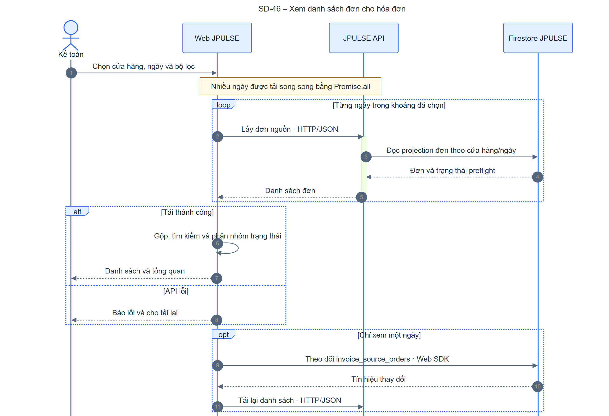

[Mermaid](./sequence/sd-46-invoice-list.mmd) · [SVG](./sequence/sd-46-invoice-list.svg) · [PNG](./sequence/sd-46-invoice-list.png)

### SD-47 – Cập nhật dữ liệu đơn nguồn

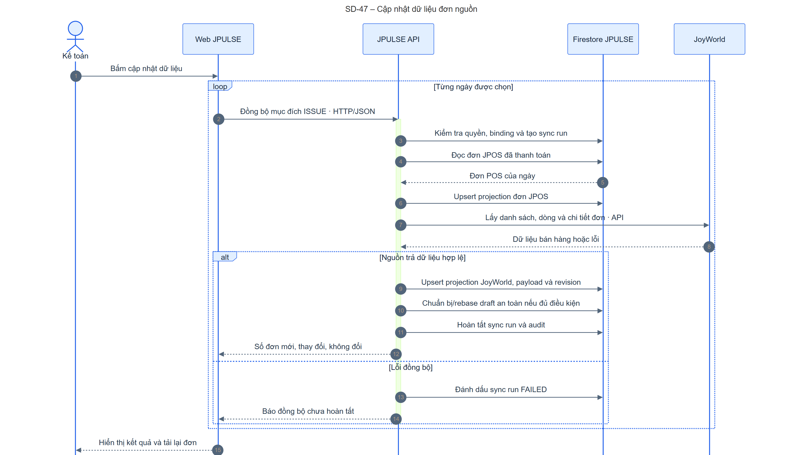

[Mermaid](./sequence/sd-47-invoice-sync.mmd) · [SVG](./sequence/sd-47-invoice-sync.svg) · [PNG](./sequence/sd-47-invoice-sync.png)

### SD-48 – Chạy đối chiếu ngày với MISA

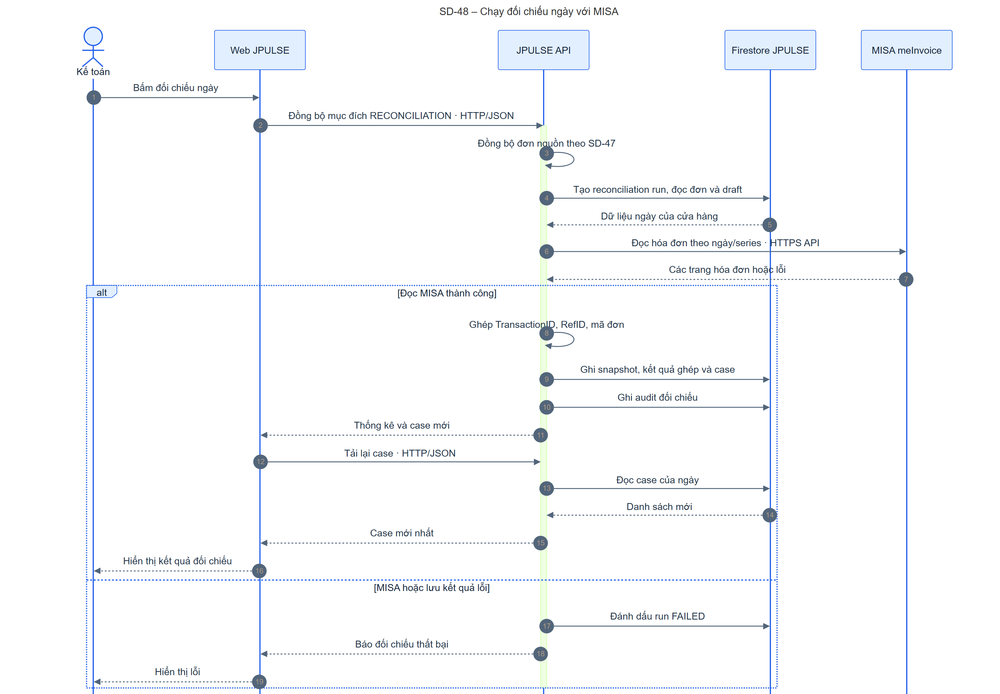

[Mermaid](./sequence/sd-48-invoice-reconcile-run.mmd) · [SVG](./sequence/sd-48-invoice-reconcile-run.svg) · [PNG](./sequence/sd-48-invoice-reconcile-run.png)

### SD-49A – Xem và lưu cấu hình hóa đơn cửa hàng

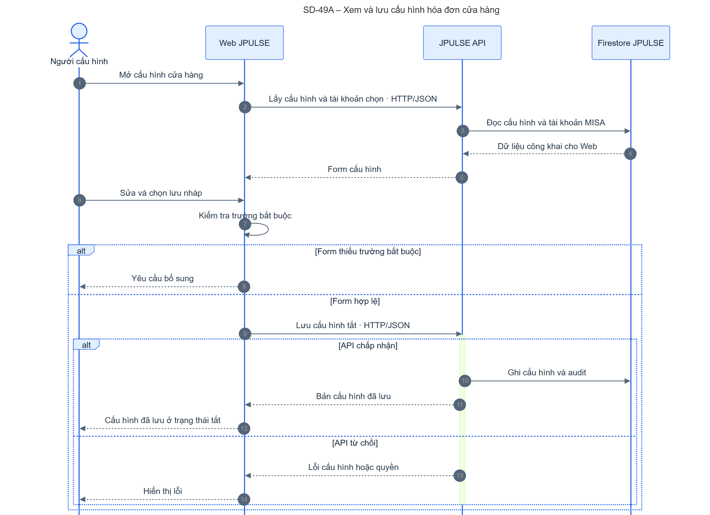

[Mermaid](./sequence/sd-49a-invoice-store-config-save.mmd) · [SVG](./sequence/sd-49a-invoice-store-config-save.svg) · [PNG](./sequence/sd-49a-invoice-store-config-save.png)

### SD-49B – Xác minh và áp dụng cấu hình hóa đơn

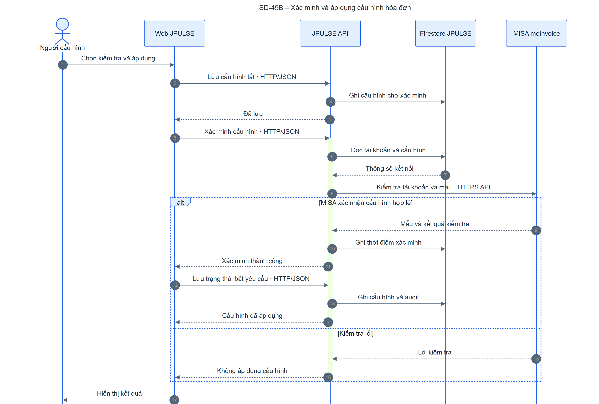

[Mermaid](./sequence/sd-49b-invoice-store-config-apply.mmd) · [SVG](./sequence/sd-49b-invoice-store-config-apply.svg) · [PNG](./sequence/sd-49b-invoice-store-config-apply.png)

### SD-50 – Tạo hoặc cập nhật bản nháp hóa đơn

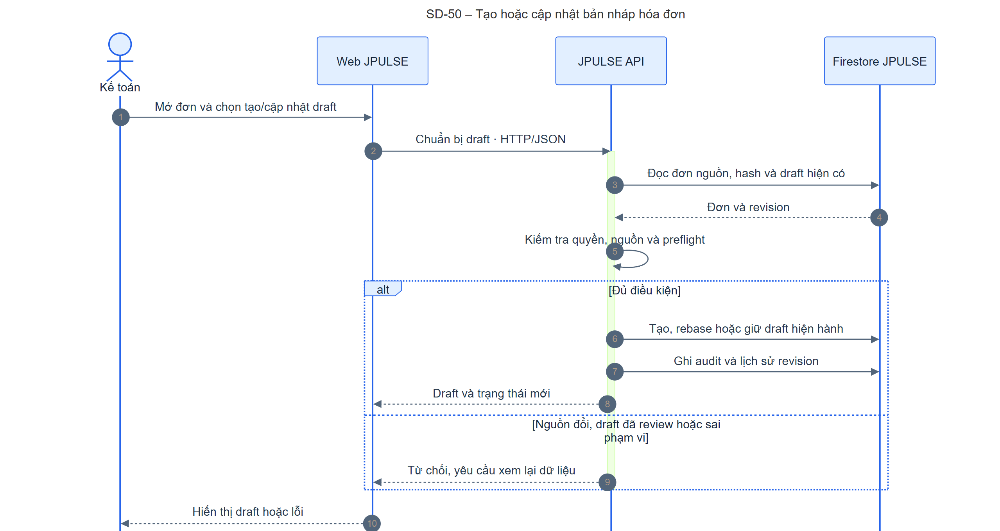

[Mermaid](./sequence/sd-50-invoice-draft-prepare.mmd) · [SVG](./sequence/sd-50-invoice-draft-prepare.svg) · [PNG](./sequence/sd-50-invoice-draft-prepare.png)

### SD-51 – Chỉnh thông tin bản nháp hóa đơn

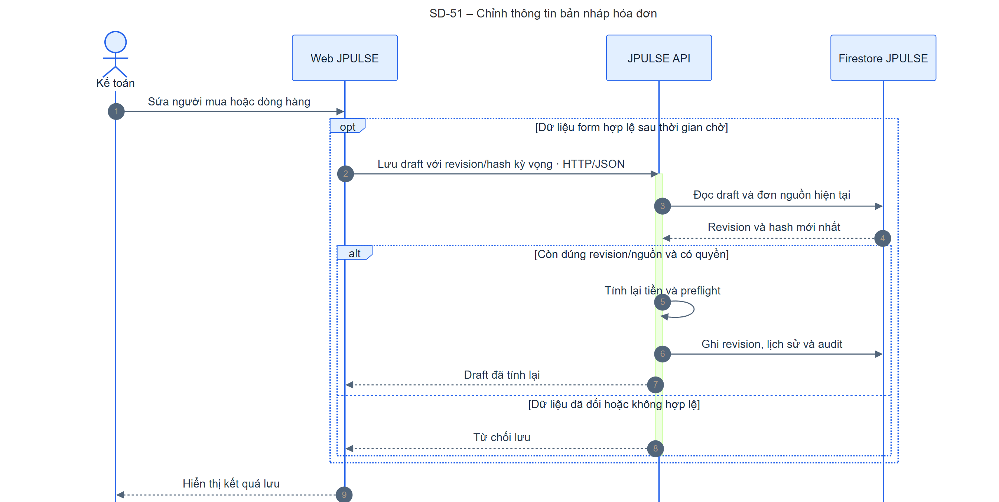

[Mermaid](./sequence/sd-51-invoice-draft-edit.mmd) · [SVG](./sequence/sd-51-invoice-draft-edit.svg) · [PNG](./sequence/sd-51-invoice-draft-edit.png)

### SD-52 – Xem trước bản nháp trên MISA

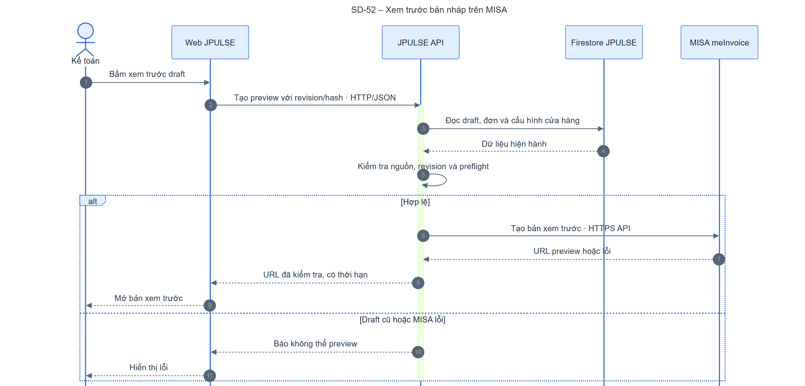

[Mermaid](./sequence/sd-52-invoice-preview.mmd) · [SVG](./sequence/sd-52-invoice-preview.svg) · [PNG](./sequence/sd-52-invoice-preview.png)

### SD-53 – Chỉnh tên và đơn vị khi phát hành hàng loạt

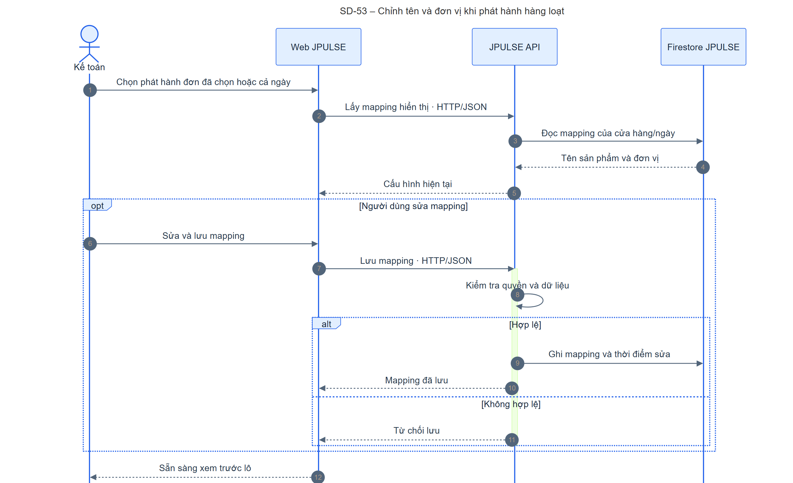

[Mermaid](./sequence/sd-53-invoice-bulk-display.mmd) · [SVG](./sequence/sd-53-invoice-bulk-display.svg) · [PNG](./sequence/sd-53-invoice-bulk-display.png)

### SD-54 – Kiểm tra lô hóa đơn trước phát hành

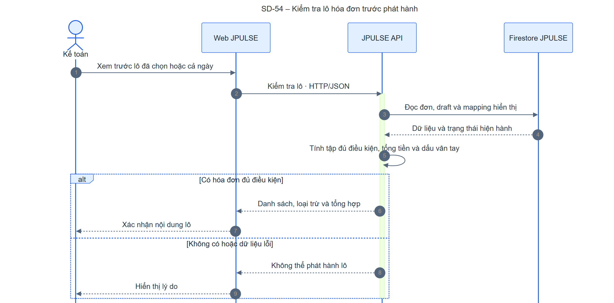

[Mermaid](./sequence/sd-54-invoice-bulk-preview.mmd) · [SVG](./sequence/sd-54-invoice-bulk-preview.svg) · [PNG](./sequence/sd-54-invoice-bulk-preview.png)

### SD-55 – Gửi lô hóa đơn để phát hành

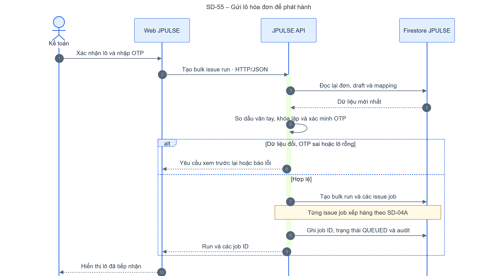

[Mermaid](./sequence/sd-55-invoice-bulk-issue.mmd) · [SVG](./sequence/sd-55-invoice-bulk-issue.svg) · [PNG](./sequence/sd-55-invoice-bulk-issue.png)

### SD-56 – Theo dõi tiến độ phát hành lô

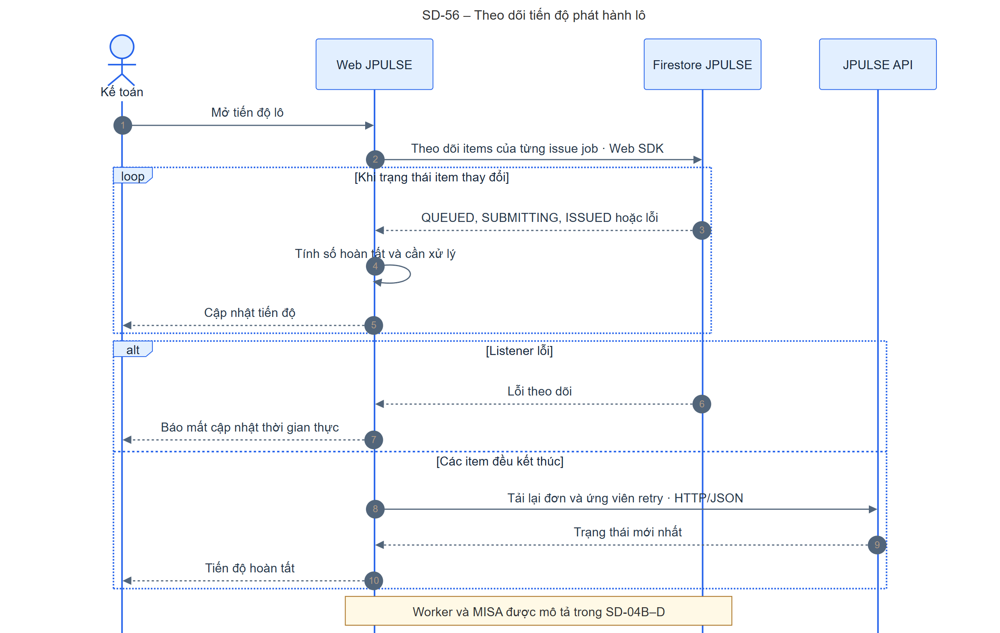

[Mermaid](./sequence/sd-56-invoice-bulk-progress.mmd) · [SVG](./sequence/sd-56-invoice-bulk-progress.svg) · [PNG](./sequence/sd-56-invoice-bulk-progress.png)

### SD-57 – Thử lại hóa đơn bị MISA từ chối rõ ràng

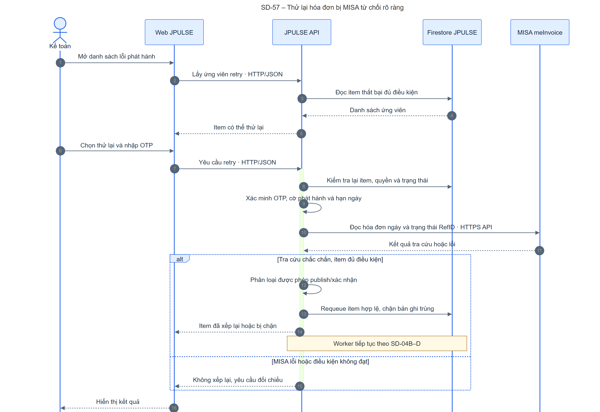

[Mermaid](./sequence/sd-57-invoice-retry.mmd) · [SVG](./sequence/sd-57-invoice-retry.svg) · [PNG](./sequence/sd-57-invoice-retry.png)

### SD-58A – Xem sổ hóa đơn đã phát hành

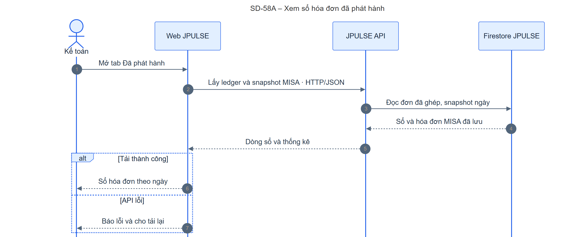

[Mermaid](./sequence/sd-58a-invoice-ledger.mmd) · [SVG](./sequence/sd-58a-invoice-ledger.svg) · [PNG](./sequence/sd-58a-invoice-ledger.png)

### SD-58B – Xem danh sách case đối chiếu

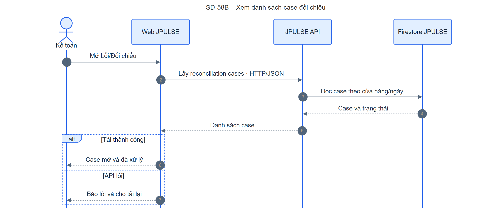

[Mermaid](./sequence/sd-58b-invoice-cases-list.mmd) · [SVG](./sequence/sd-58b-invoice-cases-list.svg) · [PNG](./sequence/sd-58b-invoice-cases-list.png)

### SD-59 – Đóng case đối chiếu hóa đơn

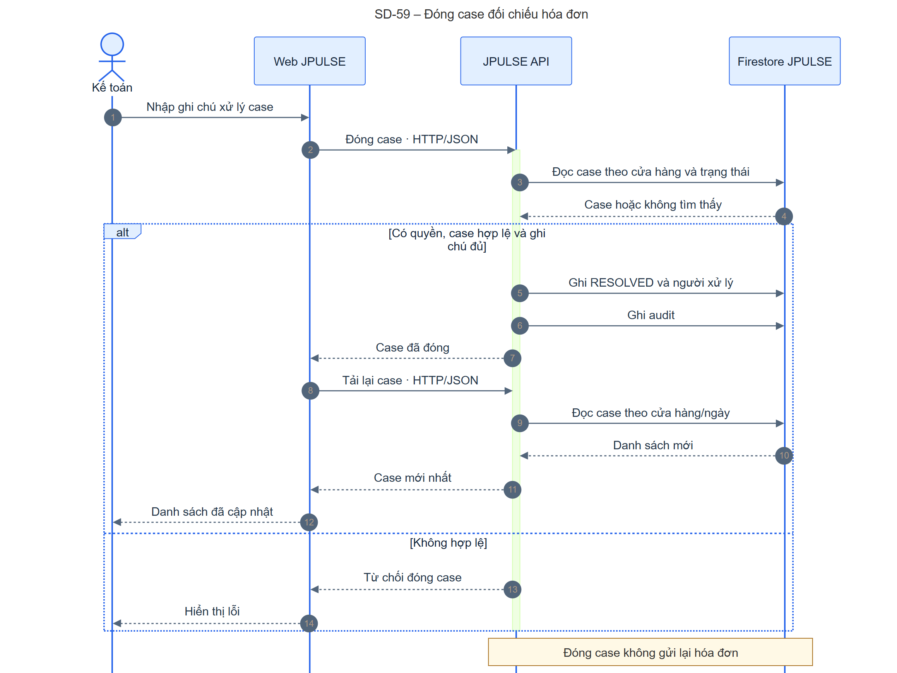

[Mermaid](./sequence/sd-59-invoice-case-resolve.mmd) · [SVG](./sequence/sd-59-invoice-case-resolve.svg) · [PNG](./sequence/sd-59-invoice-case-resolve.png)

### SD-60A – Xem hóa đơn đã phát hành

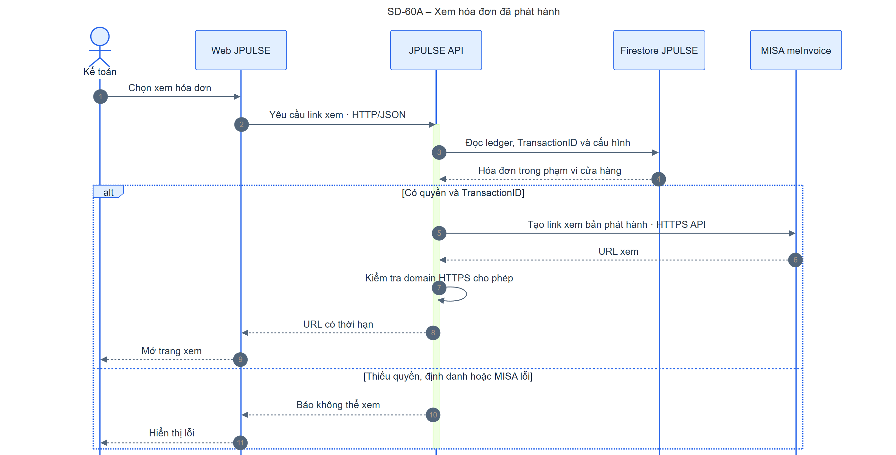

[Mermaid](./sequence/sd-60a-invoice-view.mmd) · [SVG](./sequence/sd-60a-invoice-view.svg) · [PNG](./sequence/sd-60a-invoice-view.png)

### SD-60B – Tải PDF hoặc XML hóa đơn

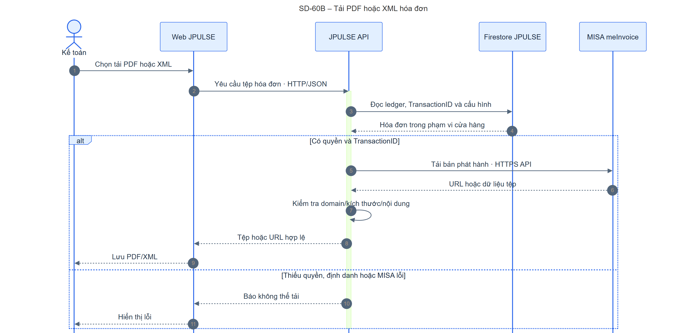

[Mermaid](./sequence/sd-60b-invoice-download.mmd) · [SVG](./sequence/sd-60b-invoice-download.svg) · [PNG](./sequence/sd-60b-invoice-download.png)

## Chênh lệch và điểm cần xác minh

| Điểm | Căn cứ và tác động |
| --- | --- |
| **Bước review draft trong tài liệu giai đoạn 3 chưa có trong route hiện tại.** | [Thiết kế phase 3](../integrations/meinvoice/phase-3-review-preview.md) mô tả `POST /documents/:id/review`; [route hiện tại](../../apps/be-wms/src/api/routes/invoiceOrderRoutes.ts#L151) chỉ có prepare/get/update/preview và [Web](../../apps/fe-wms/src/components/invoices/InvoiceDraftWorkflow.tsx#L240) không gọi review. Không vẽ một SD duyệt draft độc lập; cần chốt chức năng được bỏ hay chưa triển khai. |
| **Phát hành thật phụ thuộc vận hành.** | [Phase 5](../integrations/meinvoice/phase-5-ledger-reconciliation.md) ghi `MEINVOICE_ISSUE_ENABLED=false` mặc định; [issue service](../../apps/be-wms/src/services/invoiceIssueService.ts#L104) kiểm soát trước tạo job. SD-55 và SD-04 mô tả đường code khi đã bật; cần xác nhận UAT, tài khoản/series và worker production. |
| **Đồng bộ có thể để lại dữ liệu từng phần khi lỗi.** | [Sync service](../../apps/be-wms/src/services/invoiceOrderSyncService.ts#L354) ghi projection JPOS trước khi gọi JoyWorld và cập nhật run thất bại nếu bước sau lỗi. Người dùng cần xem run và đồng bộ lại an toàn theo định danh nguồn. |
| **Đối chiếu đi sau đồng bộ nhưng có trạng thái run riêng.** | [Controller](../../apps/be-wms/src/api/controllers/invoiceOrderSyncController.ts#L114) hoàn tất sync trước khi gọi `reconcileInvoiceDay`; MISA lỗi có thể khiến HTTP lỗi dù sync run đã hoàn tất. SD-47 và SD-48 tách hai trạng thái này. |
| **Áp dụng cấu hình gồm ba lệnh.** | [Web](../../apps/fe-wms/src/components/invoices/InvoiceConfigurationPanel.tsx#L349) lưu tắt, validate, rồi lưu trạng thái bật. Nếu bước 2/3 lỗi, bước lưu đầu vẫn tồn tại. |
| **Bulk rebase và tài khoản MISA quản trị không nằm trong UI này.** | [API client](../../apps/fe-wms/src/api/invoiceApi.ts#L491) có bulk rebase nhưng không thấy lời gọi ở `InvoiceManagementPage`; [route tài khoản MISA](../../apps/be-wms/src/api/routes/meInvoiceConfigRoutes.ts#L25) dành cho system admin, không phải `InvoiceConfigurationPanel`. Chưa vẽ thao tác Web không có. |
| **Cổng yêu cầu hóa đơn của khách là luồng riêng.** | [Trang công khai](../../apps/fe-wms/src/app/invoice-request/[token]/page.tsx) và [route](../../apps/be-wms/src/api/routes/customerInvoiceRequestRoutes.ts#L14) dùng token riêng, không bắt đầu từ `/invoice-management`; cần bộ SD riêng khi mở rộng phạm vi sang khách hàng/VietQR. |
| **Web đọc Firestore trực tiếp có giới hạn.** | [Listener đơn](../../apps/fe-wms/src/components/invoices/InvoiceManagementPage.tsx#L365) chỉ kích hoạt tải lại API cho một ngày; [listener tiến độ](../../apps/fe-wms/src/hooks/useInvoiceBulkIssueProgress.ts#L19) đọc item theo [Rules](../../firestore.rules#L743). Dữ liệu buyer/raw payload, credential và snapshot MISA chỉ đi qua API. |

## Đối chiếu trách nhiệm với Container Diagram

Các SD dùng lifeline Người dùng, Web JPULSE, JPULSE API, Firestore JPULSE, JoyWorld và MISA meInvoice theo đúng bên gửi/nhận. Web gọi API cho mọi lệnh ghi và đọc dữ liệu hóa đơn nhạy cảm; API kiểm tra quyền, tính tiền, gọi nhà cung cấp và ghi trạng thái. Firestore Web SDK chỉ tham gia hai listener nêu trên. Xác thực Firebase là tiền điều kiện của các API có `requireAuth`; các SD nghiệp vụ không lặp lại luồng đăng nhập. SD-04A–D giữ đường Cloud Tasks/worker riêng để mỗi hình vừa trang Word nằm ngang.
