# UML Sequence Diagrams – voucher marketing JPULSE

Phạm vi của bộ hình là trang [`/admin/vouchers`](../../apps/fe-wms/src/components/marketing-vouchers/MarketingVoucherWorkspace.tsx#L32): tổng quan, chiến dịch, mã và tác vụ. SRS-JPULSE mục **3.1.8 Quản lý chiến dịch voucher marketing** mô tả tạo chiến dịch, sinh mã, theo dõi, gia hạn, thu hồi, phân phối email, xuất Excel và phục hồi job. Các trình tự dưới đây ưu tiên hành vi của UI, API, service và repository hiện tại khi tài liệu mô tả ở mức khái quát.

**Quy ước:** mũi tên liền là lời gọi, mũi tên đứt là phản hồi; `alt`, `opt`, `loop`, `par` biểu diễn nhánh thực tế. Web đọc danh sách chiến dịch, mã, job và item job **trực tiếp qua Firestore Web SDK** theo [hook realtime](../../apps/fe-wms/src/hooks/useMarketingVoucherRealtime.ts#L48) và [Security Rules](../../firestore.rules#L504). Mọi thao tác ghi đi qua JPULSE API. Google Cloud Tasks là đường điều phối khi [đã cấu hình](../../apps/be-wms/src/services/marketingVoucherTaskDispatcher.ts#L31); môi trường khác có worker cục bộ hoặc scheduler fallback. Trong các SD, lifeline `JPULSE API` cũng xử lý endpoint worker; không có ứng dụng worker triển khai riêng được xác nhận. Lời gọi Brevo dùng **SMTP cổng 587**, không phải Brevo REST API.

## Danh sách SD và điểm bắt đầu/kết quả

| SD | Điểm bắt đầu → kết quả thành công | Nhánh ngoại lệ chính | Bằng chứng code |
| --- | --- | --- | --- |
| 61 – Tổng quan | Mở trang → campaign, job và KPI realtime. | Thiếu phiên/quyền hoặc listener lỗi. | [Workspace](../../apps/fe-wms/src/components/marketing-vouchers/MarketingVoucherWorkspace.tsx#L50), [realtime hook](../../apps/fe-wms/src/hooks/useMarketingVoucherRealtime.ts#L99). |
| 62 – Tạo chiến dịch | Nhập cấu hình → campaign `GENERATING` và job `QUEUED`. | Flag tắt, thiếu quyền, dữ liệu hoặc không gian mã sai. | [form](../../apps/fe-wms/src/components/marketing-vouchers/MarketingVoucherCampaignFormSheet.tsx#L98), [repository](../../apps/be-wms/src/repositories/marketingVoucherCampaignMutationRepository.ts#L53). |
| 63 – Sinh mã nền | Cloud Tasks gọi worker → chunk mã, bộ đếm và tiến độ. | Tạm dừng/kết thúc; lỗi → job `FAILED`. | [job service](../../apps/be-wms/src/services/marketingVoucherJobService.ts#L118), [worker](../../apps/be-wms/src/repositories/marketingVoucherGenerationWorkerRepository.ts#L109). |
| 64 – Sửa chiến dịch | Lưu thay đổi → campaign revision mới. | Revision cũ; đổi hạn sau khi đã có mã phải dùng gia hạn. | [form](../../apps/fe-wms/src/components/marketing-vouchers/MarketingVoucherCampaignFormSheet.tsx#L138), [repository](../../apps/be-wms/src/repositories/marketingVoucherCampaignMutationRepository.ts#L181). |
| 65 – Đổi màu | Chọn màu → `accent_color` mới. | Không được sửa hoặc revision cũ. | [sheet](../../apps/fe-wms/src/components/marketing-vouchers/MarketingVoucherAppearanceSheet.tsx#L45), [repository](../../apps/be-wms/src/repositories/marketingVoucherAppearanceRepository.ts#L27). |
| 66 – Trạng thái | Tạm dừng/kích hoạt → campaign và job liên quan đổi trạng thái. | Campaign kết thúc, sinh ban đầu lỗi hoặc revision cũ. | [sheet](../../apps/fe-wms/src/components/marketing-vouchers/MarketingVoucherCampaignActionSheet.tsx#L111), [repository](../../apps/be-wms/src/repositories/marketingVoucherCampaignStatusRepository.ts#L46). |
| 67 – Sinh thêm | Chọn số lượng → job `GENERATE_CODES` chế độ `APPEND`. | Campaign không `ACTIVE`, vượt sức chứa, job xung đột. | [sheet](../../apps/fe-wms/src/components/marketing-vouchers/MarketingVoucherCampaignActionSheet.tsx#L72), [repository](../../apps/be-wms/src/repositories/marketingVoucherJobMutationRepository.ts#L29). |
| 68 – Yêu cầu gia hạn | Chọn hạn mới → job `EXTEND_EXPIRY`. | Hạn không muộn hơn, campaign tạm dừng hoặc job xung đột. | [sheet](../../apps/fe-wms/src/components/marketing-vouchers/MarketingVoucherCampaignActionSheet.tsx#L88), [repository](../../apps/be-wms/src/repositories/marketingVoucherExtensionJobRepository.ts#L29). |
| 69 – Gia hạn nền | Worker quét mã → cập nhật hạn mã, rồi hạn campaign. | Job tạm dừng/hủy; lỗi → `FAILED`. | [worker](../../apps/be-wms/src/repositories/marketingVoucherExtensionWorkerRepository.ts#L58), [job service](../../apps/be-wms/src/services/marketingVoucherJobService.ts#L118). |
| 70 – Kết thúc | Chọn kết thúc → campaign `ENDED`, `is_deleted`, job hoạt động bị hủy. | Campaign không tồn tại hoặc revision cũ. | [sheet](../../apps/fe-wms/src/components/marketing-vouchers/MarketingVoucherCampaignActionSheet.tsx#L108), [repository](../../apps/be-wms/src/repositories/marketingVoucherCampaignStatusRepository.ts#L182). |
| 71 – Tra mã | Lọc/nhập mã → danh sách mã hoặc một mã realtime. | Rules từ chối hoặc query lỗi. | [Codes UI](../../apps/fe-wms/src/components/marketing-vouchers/MarketingVoucherCodes.tsx#L61), [hook](../../apps/fe-wms/src/hooks/useMarketingVoucherRealtime.ts#L191). |
| 72 – Thu hồi | Chọn mã và lý do → mã `REVOKED`, bộ đếm cập nhật. | Mã `USED`, campaign tạm dừng, đang xuất hoặc bộ đếm sai. | [sheet](../../apps/fe-wms/src/components/marketing-vouchers/MarketingVoucherRevokeSheet.tsx#L31), [repository](../../apps/be-wms/src/repositories/marketingVoucherRevokeRepository.ts#L54). |
| 73 – Yêu cầu email | Chọn người nhận/nội dung → email job và item. | Mã hết hạn/đã dùng, campaign tạm dừng hoặc đang gia hạn. | [sheet](../../apps/fe-wms/src/components/marketing-vouchers/MarketingVoucherEmailSheet.tsx#L78), [repository](../../apps/be-wms/src/repositories/marketingVoucherEmailJobRepository.ts#L48). |
| 74 – Gửi email nền | Worker claim item → Brevo gửi, lưu kết quả từng item. | Item lỗi; job `PARTIAL`/`FAILED`; campaign tạm dừng. | [email service](../../apps/be-wms/src/services/marketingVoucherEmailService.ts#L92), [worker repository](../../apps/be-wms/src/repositories/marketingVoucherEmailWorkerRepository.ts#L151). |
| 75 – Retry email | Bấm gửi lại các item lỗi đang hiển thị → item/job trở lại `QUEUED`. | Item không đủ điều kiện hoặc campaign tạm dừng. | [results sheet](../../apps/fe-wms/src/components/marketing-vouchers/MarketingVoucherEmailResultsSheet.tsx#L45), [repository](../../apps/be-wms/src/repositories/marketingVoucherEmailRetryRepository.ts#L28). |
| 76 – Yêu cầu xuất | Chọn chiến dịch in → job `EXPORT_EXCEL`. | Chỉ nhận campaign `PRINT`, `ACTIVE`, có mã và không có job xung đột. | [Campaigns UI](../../apps/fe-wms/src/components/marketing-vouchers/MarketingVoucherCampaigns.tsx#L68), [repository](../../apps/be-wms/src/repositories/marketingVoucherExportJobRepository.ts#L31). |
| 77 – Xuất nền | Worker tạo XLSX từng phần → XLSX/ZIP và manifest tại Storage. | Thiếu mã, Storage lỗi hoặc job/campaign đổi trạng thái. | [worker](../../apps/be-wms/src/repositories/marketingVoucherExportWorkerRepository.ts#L187), [storage service](../../apps/be-wms/src/services/marketingVoucherExportStorageService.ts#L43). |
| 78 – Tải xuất | Bấm tải → API cấp URL có thời hạn, Web tải từ Storage. | Job chưa hoàn thành hoặc thiếu đầu ra. | [Jobs UI](../../apps/fe-wms/src/components/marketing-vouchers/MarketingVoucherJobs.tsx#L95), [service](../../apps/be-wms/src/services/marketingVoucherExportService.ts#L46). |
| 79 – Theo dõi job | Mở tab job → tiến độ và kết quả email realtime. | Listener hoặc quyền đọc lỗi. | [Jobs UI](../../apps/fe-wms/src/components/marketing-vouchers/MarketingVoucherJobs.tsx#L46), [hook](../../apps/fe-wms/src/hooks/useMarketingVoucherRealtime.ts#L123). |
| 80 – Tiếp tục job | Chọn job lỗi/tạm dừng → `QUEUED`, xử lý từ trạng thái đã lưu. | Job đã kết thúc, campaign tạm dừng, revision cũ. | [Jobs UI](../../apps/fe-wms/src/components/marketing-vouchers/MarketingVoucherJobs.tsx#L82), [repository](../../apps/be-wms/src/repositories/marketingVoucherResumeJobRepository.ts#L25). |

SD-62/67 nối SD-63; SD-68 nối SD-69; SD-73/75 nối SD-74; SD-76 nối SD-77 rồi SD-78. SD-79 quan sát trạng thái từ các worker, còn SD-80 tiếp tục job được phép. Mỗi hình kết thúc tại một kết quả nghiệp vụ hoặc một chunk nền để vừa trang Word nằm ngang.

## Mã Mermaid và hình đã render

### SD-61 – Xem tổng quan voucher marketing

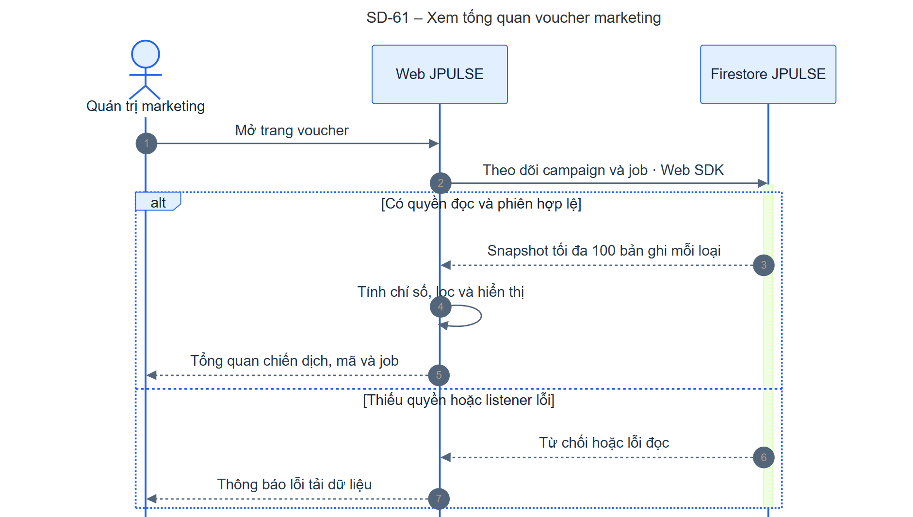

[Mermaid](./sequence/sd-61-voucher-overview.mmd) · [SVG](./sequence/sd-61-voucher-overview.svg) · [PNG](./sequence/sd-61-voucher-overview.png)

### SD-62 – Tạo chiến dịch và job sinh mã

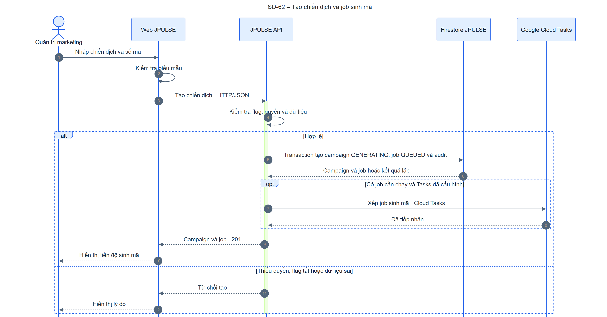

[Mermaid](./sequence/sd-62-voucher-campaign-create.mmd) · [SVG](./sequence/sd-62-voucher-campaign-create.svg) · [PNG](./sequence/sd-62-voucher-campaign-create.png)

### SD-63 – Worker sinh mã voucher

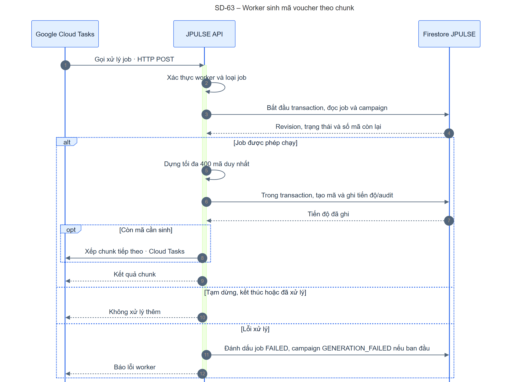

[Mermaid](./sequence/sd-63-voucher-code-worker.mmd) · [SVG](./sequence/sd-63-voucher-code-worker.svg) · [PNG](./sequence/sd-63-voucher-code-worker.png)

### SD-64 – Sửa thông tin chiến dịch

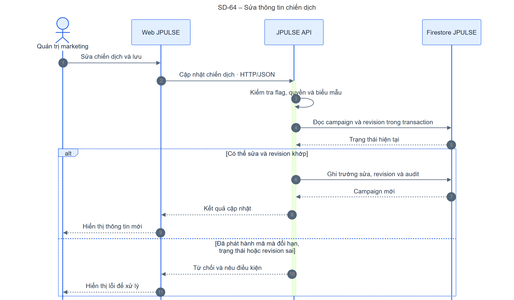

[Mermaid](./sequence/sd-64-voucher-campaign-update.mmd) · [SVG](./sequence/sd-64-voucher-campaign-update.svg) · [PNG](./sequence/sd-64-voucher-campaign-update.png)

### SD-65 – Đổi màu hiển thị chiến dịch

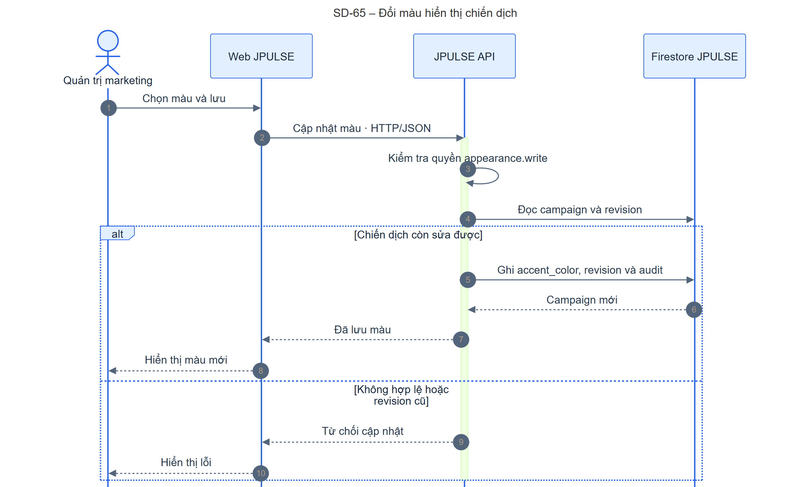

[Mermaid](./sequence/sd-65-voucher-appearance.mmd) · [SVG](./sequence/sd-65-voucher-appearance.svg) · [PNG](./sequence/sd-65-voucher-appearance.png)

### SD-66 – Tạm dừng hoặc kích hoạt chiến dịch

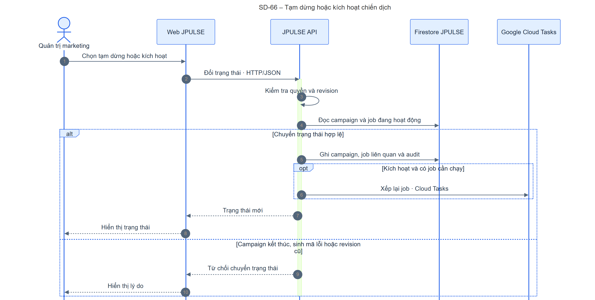

[Mermaid](./sequence/sd-66-voucher-status.mmd) · [SVG](./sequence/sd-66-voucher-status.svg) · [PNG](./sequence/sd-66-voucher-status.png)

### SD-67 – Yêu cầu sinh thêm mã

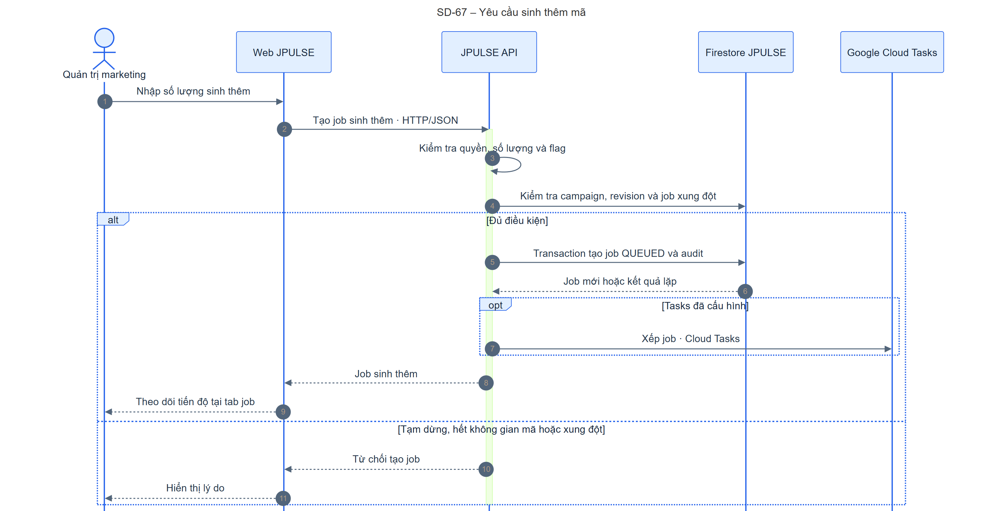

[Mermaid](./sequence/sd-67-voucher-generate-more.mmd) · [SVG](./sequence/sd-67-voucher-generate-more.svg) · [PNG](./sequence/sd-67-voucher-generate-more.png)

### SD-68 – Yêu cầu gia hạn chiến dịch

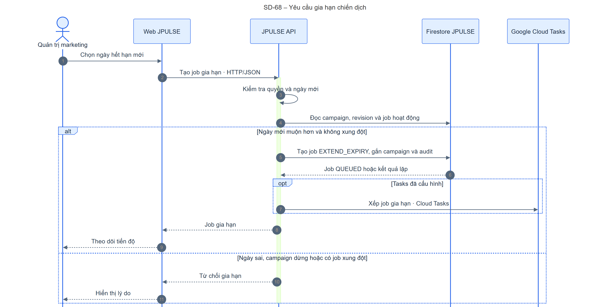

[Mermaid](./sequence/sd-68-voucher-extension-request.mmd) · [SVG](./sequence/sd-68-voucher-extension-request.svg) · [PNG](./sequence/sd-68-voucher-extension-request.png)

### SD-69 – Worker gia hạn mã theo chunk

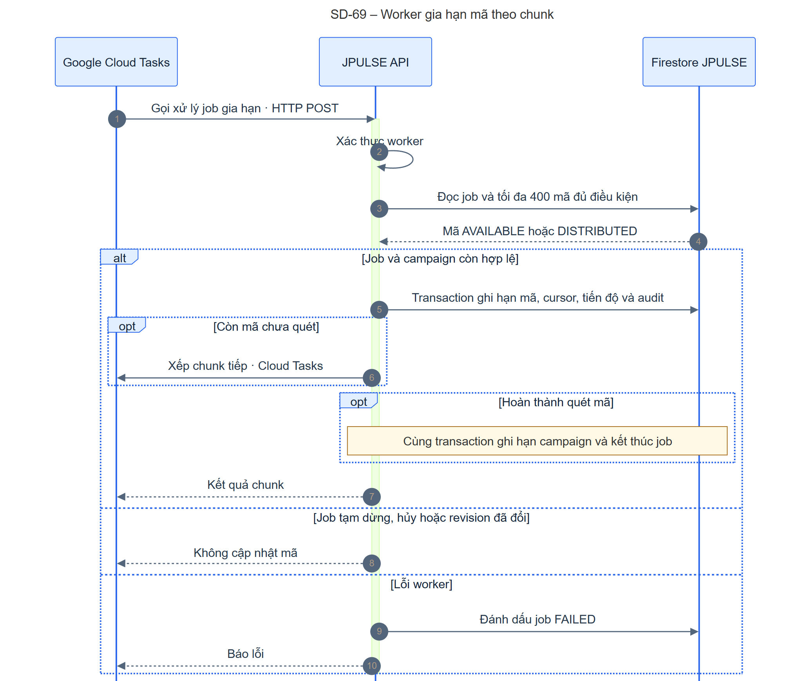

[Mermaid](./sequence/sd-69-voucher-extension-worker.mmd) · [SVG](./sequence/sd-69-voucher-extension-worker.svg) · [PNG](./sequence/sd-69-voucher-extension-worker.png)

### SD-70 – Kết thúc và xóa mềm chiến dịch

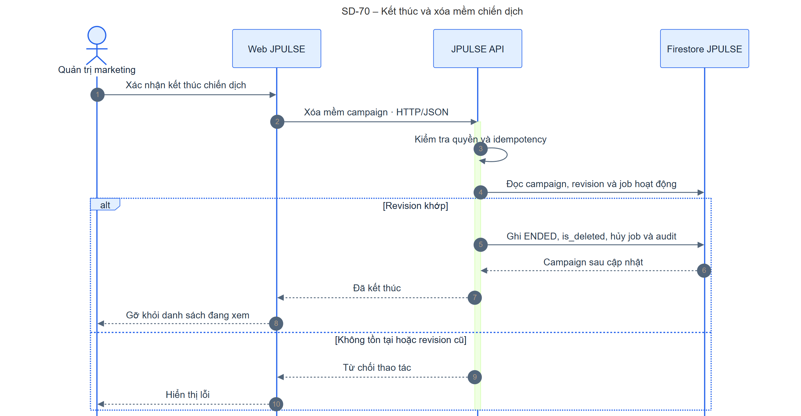

[Mermaid](./sequence/sd-70-voucher-campaign-end.mmd) · [SVG](./sequence/sd-70-voucher-campaign-end.svg) · [PNG](./sequence/sd-70-voucher-campaign-end.png)

### SD-71 – Tra cứu mã voucher

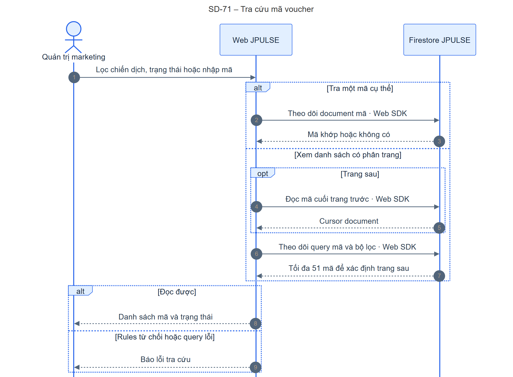

[Mermaid](./sequence/sd-71-voucher-code-list.mmd) · [SVG](./sequence/sd-71-voucher-code-list.svg) · [PNG](./sequence/sd-71-voucher-code-list.png)

### SD-72 – Thu hồi mã voucher

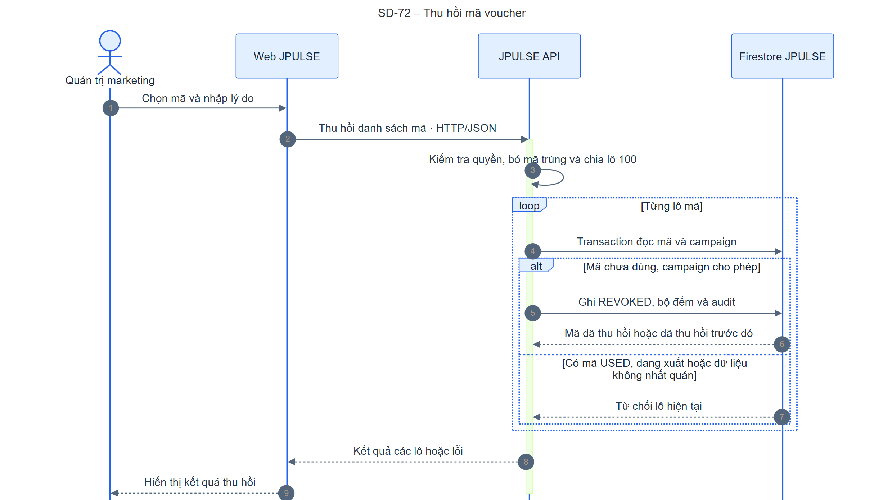

[Mermaid](./sequence/sd-72-voucher-code-revoke.mmd) · [SVG](./sequence/sd-72-voucher-code-revoke.svg) · [PNG](./sequence/sd-72-voucher-code-revoke.png)

### SD-73 – Tạo job gửi voucher qua email

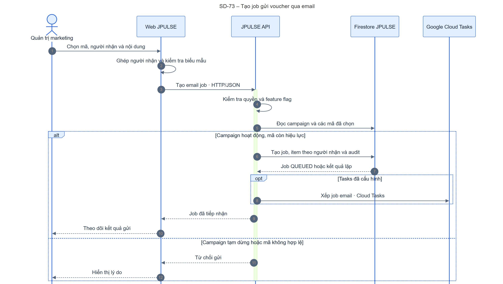

[Mermaid](./sequence/sd-73-voucher-email-request.mmd) · [SVG](./sequence/sd-73-voucher-email-request.svg) · [PNG](./sequence/sd-73-voucher-email-request.png)

### SD-74 – Worker gửi email theo item

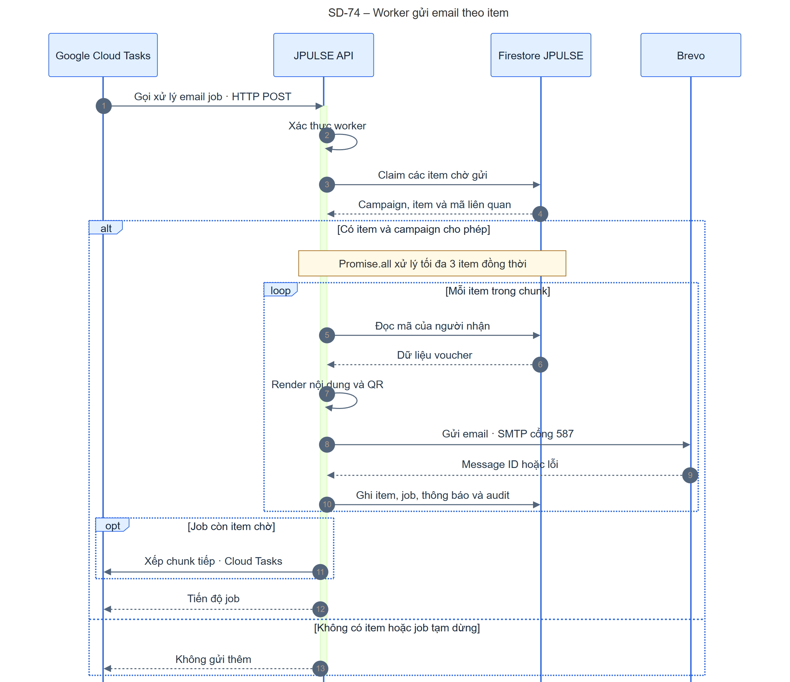

[Mermaid](./sequence/sd-74-voucher-email-worker.mmd) · [SVG](./sequence/sd-74-voucher-email-worker.svg) · [PNG](./sequence/sd-74-voucher-email-worker.png)

### SD-75 – Gửi lại các email lỗi đang hiển thị

[Mermaid](./sequence/sd-75-voucher-email-retry.mmd) · [SVG](./sequence/sd-75-voucher-email-retry.svg) · [PNG](./sequence/sd-75-voucher-email-retry.png)

### SD-76 – Tạo job xuất Excel voucher

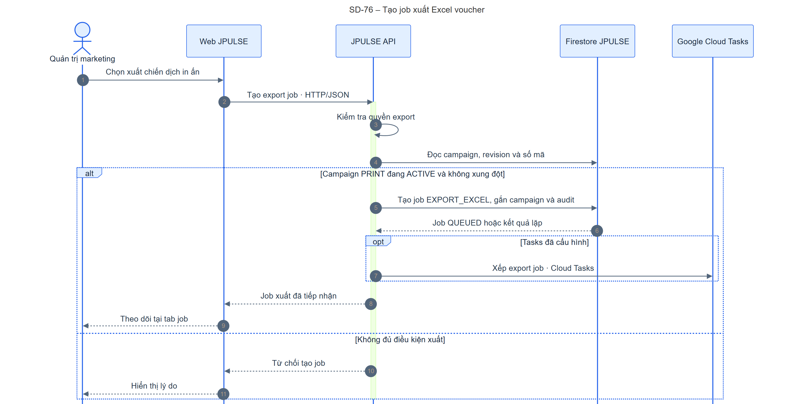

[Mermaid](./sequence/sd-76-voucher-export-request.mmd) · [SVG](./sequence/sd-76-voucher-export-request.svg) · [PNG](./sequence/sd-76-voucher-export-request.png)

### SD-77 – Worker tạo tệp xuất voucher

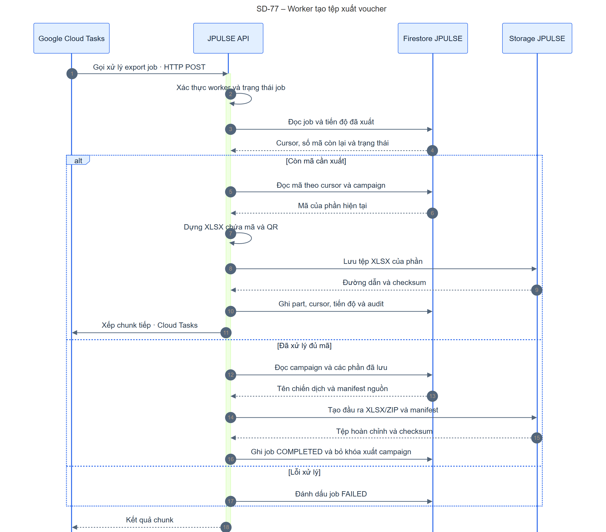

[Mermaid](./sequence/sd-77-voucher-export-worker.mmd) · [SVG](./sequence/sd-77-voucher-export-worker.svg) · [PNG](./sequence/sd-77-voucher-export-worker.png)

### SD-78 – Tải tệp xuất voucher

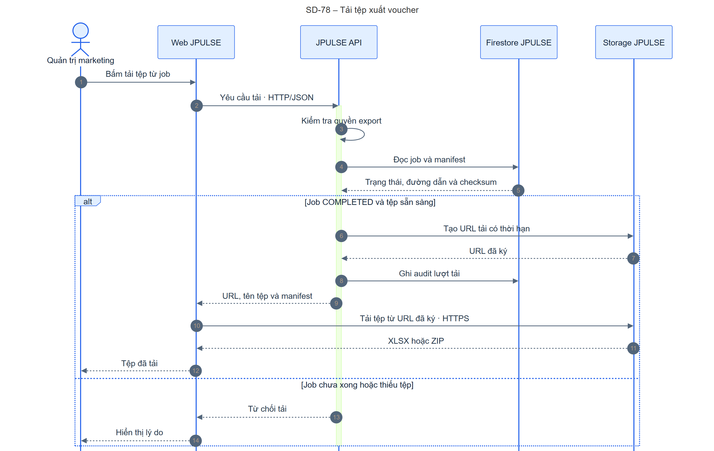

[Mermaid](./sequence/sd-78-voucher-export-download.mmd) · [SVG](./sequence/sd-78-voucher-export-download.svg) · [PNG](./sequence/sd-78-voucher-export-download.png)

### SD-79 – Theo dõi job và kết quả email

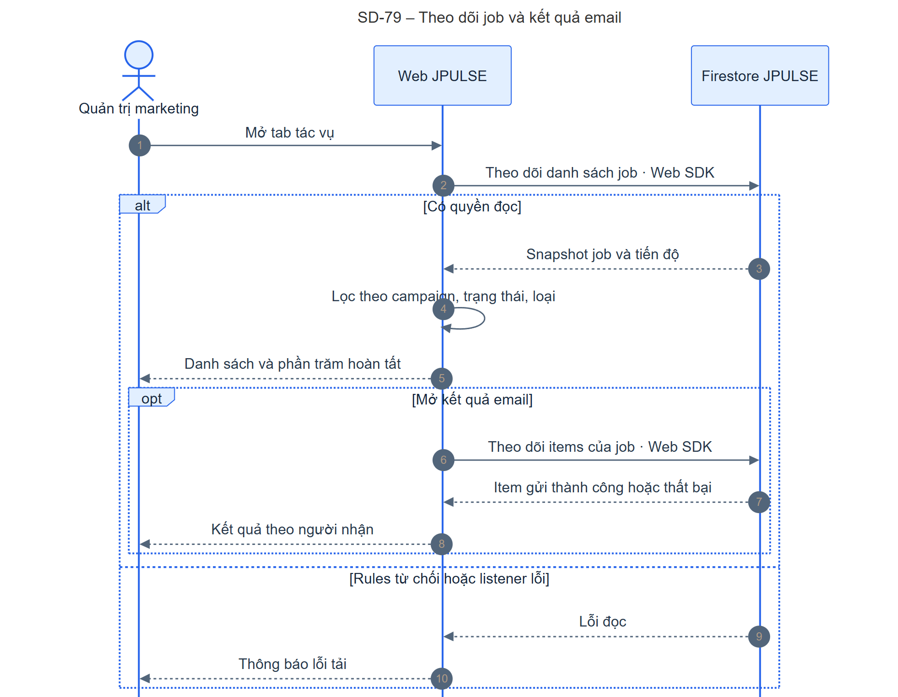

[Mermaid](./sequence/sd-79-voucher-job-monitor.mmd) · [SVG](./sequence/sd-79-voucher-job-monitor.svg) · [PNG](./sequence/sd-79-voucher-job-monitor.png)

### SD-80 – Tiếp tục job voucher

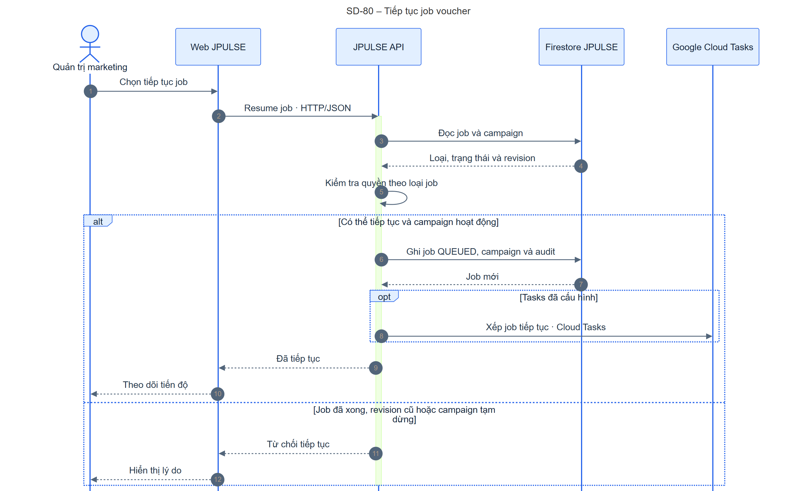

[Mermaid](./sequence/sd-80-voucher-job-resume.mmd) · [SVG](./sequence/sd-80-voucher-job-resume.svg) · [PNG](./sequence/sd-80-voucher-job-resume.png)

## Điều kiện vận hành, chênh lệch và điểm cần xác minh

| Điểm | Căn cứ và tác động |
| --- | --- |
| **Feature flag của Web và API phải cùng bật.** | [SRS mục 3.1.8](../../SRS-JPULSE.docx) và [API gate](../../apps/be-wms/src/api/middlewares/marketingVoucherFeatureGate.ts#L7). Code có thể tồn tại nhưng trang/API không hoạt động khi flag chưa bật; cần xác nhận cấu hình triển khai từng môi trường. |
| **Cloud Tasks phụ thuộc cấu hình.** | [Dispatcher](../../apps/be-wms/src/services/marketingVoucherTaskDispatcher.ts#L31) có Cloud Tasks, worker cục bộ cho môi trường không production và scheduler fallback. Các SD dùng lifeline Tasks cho đường đã cấu hình; cần xác nhận queue, worker URL và scheduler ở production. |
| **Web đọc Firestore trực tiếp.** | [Hook](../../apps/fe-wms/src/hooks/useMarketingVoucherRealtime.ts#L48) theo dõi campaign/job/code/job item, [Rules](../../firestore.rules#L504) kiểm tra `marketing_vouchers.read` và chặn ghi từ client. API list tồn tại, nhưng UI trang này không gọi API list. |
| **Kết thúc trên UI là xóa mềm.** | [Action sheet](../../apps/fe-wms/src/components/marketing-vouchers/MarketingVoucherCampaignActionSheet.tsx#L108) gọi DELETE; [repository](../../apps/be-wms/src/repositories/marketingVoucherCampaignStatusRepository.ts#L182) ghi `ENDED`, `is_deleted=true`, hủy job; không xóa vật lý mã voucher. |
| **Thu hồi nhiều hơn 100 mã không nguyên tử toàn bộ.** | [Service](../../apps/be-wms/src/services/marketingVoucherCodeService.ts#L94) chia thành transaction từng lô; lô đầu có thể thành công trước khi lô sau thất bại. Cần quy trình vận hành để đối chiếu kết quả từng lô. |
| **Email được gửi qua SMTP Brevo.** | [Service](../../apps/be-wms/src/services/brevoEmailService.ts#L30) dùng `smtp-relay.brevo.com:587`; [email worker](../../apps/be-wms/src/services/marketingVoucherEmailService.ts#L92) xử lý theo item song song. Trạng thái voucher không tự biến thành `DISTRIBUTED` khi email gửi thành công; worker ghi `emailed_at`, `emailed_to`. |
| **Nút retry email dùng danh sách item lỗi đang hiển thị.** | [Results sheet](../../apps/fe-wms/src/components/marketing-vouchers/MarketingVoucherEmailResultsSheet.tsx#L43) gửi toàn bộ ID lỗi trong snapshot; [hook](../../apps/fe-wms/src/hooks/useMarketingVoucherRealtime.ts#L148) giới hạn 400 item. Với job lớn hơn giới hạn này, cần xác minh UX/khả năng retry các item lỗi nằm ngoài snapshot. |
| **Xuất chỉ dành cho chiến dịch in ấn.** | [Export repository](../../apps/be-wms/src/repositories/marketingVoucherExportJobRepository.ts#L31) yêu cầu `purpose=PRINT`, `ACTIVE`, có mã; [worker](../../apps/be-wms/src/repositories/marketingVoucherExportWorkerRepository.ts#L77) chọn XLSX một phần hoặc ZIP nhiều phần. |
| **JPOS đổi voucher là luồng khác.** | [Kế hoạch tích hợp JPOS](../jpos-voucher-redemption-plan.md) mô tả dùng mã tại POS và các điểm UAT/chính sách hoàn. Trang `/admin/vouchers` không trực tiếp gọi JPOS trong các chức năng quản trị được khảo sát; vì vậy không đặt JPOS vào các lifeline ở đây. |
| **Trạng thái vận hành cần xác nhận.** | SRS mô tả đã có frontend/backend nhưng flag mặc định tắt nếu thiếu cấu hình. Cần xác nhận dữ liệu và job production, cấu hình Storage/Brevo, cùng chính sách khi email/Cloud Tasks thất bại sau khi ghi job. |

## Đối chiếu với Container Diagram

Các SD chỉ dùng những participant thực sự tham gia: Quản trị marketing, Web JPULSE, JPULSE API, Firestore JPULSE, Storage JPULSE, Google Cloud Tasks và Brevo. Firebase Authentication là tiền điều kiện của phiên Web và `requireAuth` cho API; các SD nghiệp vụ không lặp lại SD đăng nhập. Quyền/flag và idempotency được API kiểm tra trước mutation; Firestore Rules kiểm soát luồng đọc trực tiếp của Web. Các tác vụ nền vẫn chạy qua endpoint nội bộ của JPULSE API, nên chiều Tasks → API được giữ rõ.
