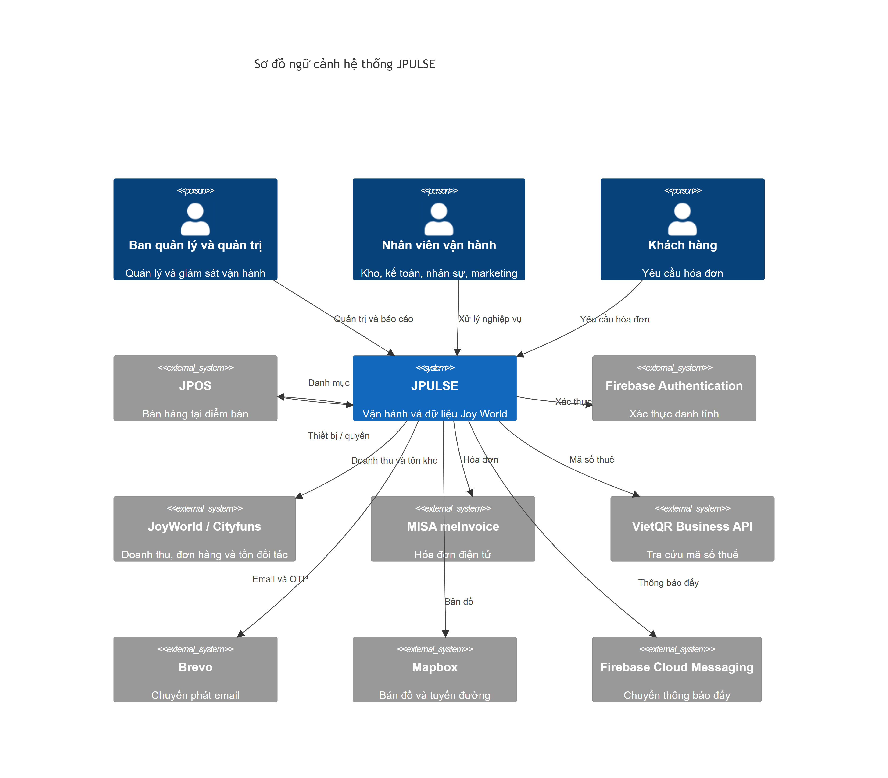
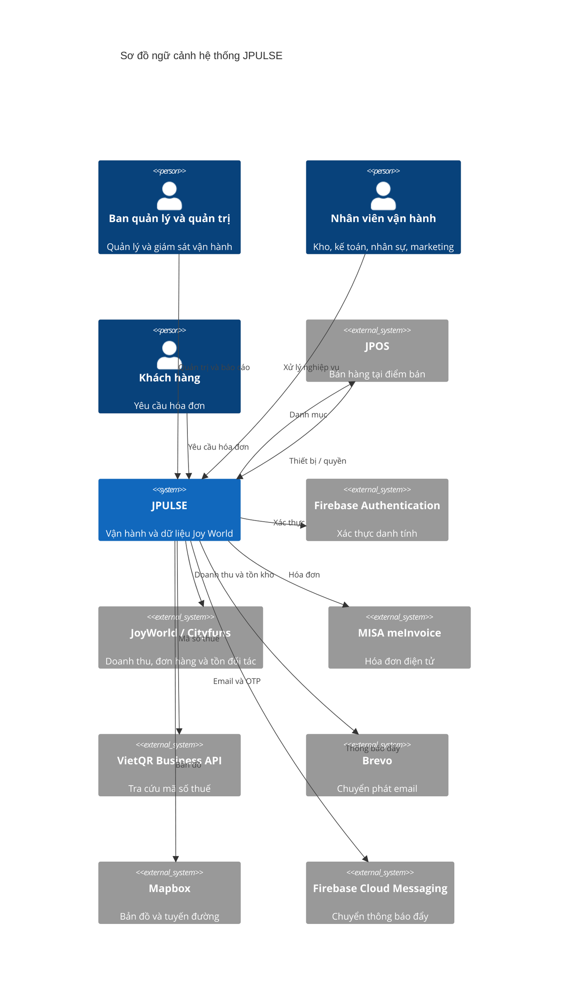

# Sơ đồ ngữ cảnh hệ thống JPULSE theo C4 Level 1

## Ranh giới và nguồn

**Hệ thống trọng tâm là JPULSE.** Repository `bduck-system` khai báo monorepo cho HR/WMS trong `package.json:5`; Web và API trong `apps/fe-wms` và `apps/be-wms` cùng phục vụ nghiệp vụ này. `SRS-JPULSE.docx`, mục 2.4, mô tả JPULSE là nền tảng quản trị và dữ liệu trung tâm, gồm các kênh người dùng, backend, xử lý nền và dữ liệu của dự án. Vì vậy C4 Level 1 gộp những phần này vào **một Software System JPULSE**. Người dùng và dịch vụ độc lập do bên khác vận hành nằm ngoài ranh giới. Mũi tên chỉ **bên khởi tạo** tương tác; phản hồi đi cùng quan hệ.

Tệp `C:\Users\machh\OneDrive\SRS_HEPZA-SDMS .docx` mô tả **HEPZA-SDMS**, một sản phẩm quản lý dữ liệu môi trường và cộng sinh công nghiệp, với các tác nhân HEPZA, Ban quản lý khu và doanh nghiệp (mục 1.3, 2.1–2.2). Không có mô đun HEPZA trong repository này. Tài liệu đó được đọc để kiểm tra phạm vi, **không được dùng để suy ra chức năng hoặc tích hợp cho JPULSE**.

Firestore, Storage, Cloud Tasks, Cloud Run, Web, API, controller và mô hình dữ liệu thuộc nội bộ kiến trúc JPULSE hoặc mức triển khai; chúng không được vẽ thành hệ thống độc lập ở Level 1. Firebase Authentication và Firebase Cloud Messaging được thể hiện vì JPULSE gọi tới dịch vụ do Google vận hành qua ranh giới hệ thống. ERP cũ và cơ quan quản lý nhà nước chưa có tương tác kỹ thuật trực tiếp được kiểm chứng trong mã nên không có mũi tên trên hình.

## Sơ đồ

Nguồn chỉnh sửa: [Mermaid C4Context](./jpulse-system-context.mmd) · Ảnh: [SVG](./jpulse-system-context.svg) · [PNG](./jpulse-system-context.png).

## Đối tượng

| Đối tượng | Loại C4 | Vai trò | Bằng chứng |
| --- | --- | --- | --- |
| JPULSE | Software System | Nền tảng quản lý vận hành, tài khoản, quyền, kho, nhân sự, doanh thu và hóa đơn. | `SRS-JPULSE.docx`, mục 2.4, đoạn “Bối cảnh và ranh giới hệ thống”; `package.json:5`; `apps/be-wms/src/index.ts:85–113`. |
| Ban quản lý và quản trị | Person | Xem báo cáo, phê duyệt, quản lý tài khoản và cấu hình. | `SRS-JPULSE.docx`, mục 2.4.2, bảng “Tác nhân và hệ thống bên ngoài”, các hàng Ban Giám đốc/Quản lý Vận hành và Quản trị hệ thống. |
| Nhân viên vận hành | Person | Tạo và xử lý nghiệp vụ kho, kế toán, nhân sự, marketing tại cơ sở. | Cùng bảng SRS, các hàng Kho/Kế toán/Nhân sự/Marketing và Quản lý cơ sở/nhân viên; `apps/be-wms/src/index.ts:85–113`. |
| Khách hàng | Person | Nhập thông tin yêu cầu xuất hóa đơn trên trang công khai. | `SRS-JPULSE.docx`, mục 2.4.2, hàng Khách hàng; `apps/fe-wms/src/app/invoice-request/[token]/page.tsx:2`; `apps/fe-wms/src/components/invoices/public/CustomerInvoiceRequestForm.tsx:187–203`. |
| JPOS | Software System bên ngoài | Bán hàng tại điểm bán, dùng cấu hình thiết bị và dữ liệu tài khoản/quyền liên quan JPULSE. | `docs/pos-management-rollout.md:27–33`; `D:\Github\POS\src\lib\services\deviceEnrollmentService.ts:122–248`; `D:\Github\POS\functions\src\services\posAuthService.ts:245–274`. |
| Firebase Authentication | Software System bên ngoài | Xác thực credential và token/phiên; JPULSE giữ quyền nghiệp vụ. | `apps/fe-wms/src/hooks/useAuth.ts:70–81`; `apps/be-wms/src/api/middlewares/authMiddleware.ts:33–40`. |
| JoyWorld / Cityfuns | Software System bên ngoài | Nguồn doanh thu, đơn hàng và tồn kho đối tác. | `apps/be-wms/src/services/joyworldService.ts:117–161`; `apps/be-wms/src/services/joyWorldInventoryClient.ts:163–241`; `apps/be-wms/src/services/openApiService.ts:65`. |
| MISA meInvoice | Software System bên ngoài | Xem trước, phát hành và tra cứu hóa đơn điện tử. | `apps/be-wms/src/services/meInvoiceClient.ts:279–312,385–422,473`; `SRS-JPULSE.docx`, Chương 6, INT-03. |
| VietQR Business API | Software System bên ngoài | Tra cứu thông tin doanh nghiệp theo mã số thuế. | `apps/be-wms/src/services/vietQrTaxLookupService.ts:32–70`; SRS Chương 6, INT-08. |
| Brevo | Software System bên ngoài | Chuyển phát email giao dịch và OTP. | `apps/be-wms/src/services/brevoEmailService.ts:29–73`; SRS Chương 6, INT-02. |
| Mapbox | Software System bên ngoài | Cung cấp bản đồ và tuyến đường cho giao diện. | `apps/fe-wms/src/components/features/transfers/TransferRouteMap.tsx:82–95,235–236`; SRS Chương 6, INT-09. |
| Firebase Cloud Messaging | Software System bên ngoài | Chuyển thông báo đẩy tới thiết bị. | `apps/be-wms/src/services/pushNotificationService.ts:76–107`; SRS Chương 6, INT-01. |

## Quan hệ và chiều trao đổi

| Quan hệ | Ý nghĩa | Bằng chứng |
| --- | --- | --- |
| Ban quản lý/quản trị → JPULSE | Đặt cấu hình, phê duyệt và xem số liệu; JPULSE trả trạng thái, báo cáo. | SRS mục 2.4.2, bảng tác nhân; `apps/be-wms/src/index.ts:91–109`. |
| Nhân viên vận hành → JPULSE | Nhập, kiểm tra và xử lý chứng từ/nghiệp vụ; JPULSE phản hồi kết quả theo quyền. | SRS mục 2.4.2, bảng tác nhân; `apps/be-wms/src/index.ts:97–113`. |
| Khách hàng → JPULSE | Gửi yêu cầu hóa đơn qua trang công khai; nhận trạng thái yêu cầu. | `apps/fe-wms/src/components/invoices/public/CustomerInvoiceRequestForm.tsx:93–99,187–213`. |
| JPULSE → JPOS | Gửi yêu cầu đồng bộ sản phẩm/danh mục tới dịch vụ JPOS. | `apps/be-wms/src/services/jposProductSyncClient.ts:54–85`; `docs/pos-management-rollout.md:27–29`. |
| JPOS → JPULSE | Gọi API JPULSE để kích hoạt/heartbeat/lấy cấu hình thiết bị; JPOS Functions còn đọc collection tài khoản/quyền dùng chung. | `D:\Github\POS\src\lib\services\deviceEnrollmentService.ts:122–248`; `D:\Github\POS\functions\src\services\posAuthService.ts:177–274`. **Đọc quyền không đi qua JPULSE API.** |
| JPULSE → Firebase Authentication | Web xác thực email/mật khẩu; API xác minh token hoặc session. | `apps/fe-wms/src/hooks/useAuth.ts:70–81`; `apps/be-wms/src/api/middlewares/authMiddleware.ts:33–40`. |
| JPULSE → JoyWorld / Cityfuns | Đọc doanh thu, đơn, tồn; thao tác ghi tồn chỉ khi được cấu hình bật. | `apps/be-wms/src/services/joyworldService.ts:117–161`; `apps/be-wms/src/services/joyWorldInventoryClient.ts:36–65,163–241`. |
| JPULSE → MISA meInvoice | Gửi yêu cầu xem trước/phát hành/tra cứu và nhận kết quả hóa đơn. | `apps/be-wms/src/services/meInvoiceClient.ts:385–422,461–509`. Phát hành thật phụ thuộc cờ cấu hình. |
| JPULSE → VietQR | Tra cứu mã số thuế và nhận dữ liệu tham khảo của doanh nghiệp. | `apps/be-wms/src/services/vietQrTaxLookupService.ts:38–70`. Phụ thuộc base URL cấu hình. |
| JPULSE → Brevo | Gửi email/OTP qua SMTP và nhận kết quả gửi. | `apps/be-wms/src/services/brevoEmailService.ts:29–73`. Phụ thuộc credential. |
| JPULSE → Mapbox | Trình duyệt tải bản đồ và hỏi tuyến đường. | `apps/fe-wms/src/components/features/transfers/TransferRouteMap.tsx:82–95,235–236`. Tùy chọn theo token/WebGL. |
| JPULSE → Firebase Cloud Messaging | Backend gửi thông báo đẩy tới token thiết bị. | `apps/be-wms/src/services/pushNotificationService.ts:76–107`. |

## Điểm chưa chắc chắn và khác biệt tài liệu–mã

1. **SRS khác dự án:** `SRS_HEPZA-SDMS .docx` thuộc HEPZA-SDMS, không phải JPULSE. Bản này ưu tiên repository `bduck-system` và `SRS-JPULSE.docx`; nếu mục tiêu là HEPZA-SDMS thì cần repository mã HEPZA để đối chiếu hiện trạng.
2. **Xác thực JPOS:** SRS/Container Diagram cũ diễn đạt JPOS gọi JPULSE để xác thực. Mã JPOS hiện dùng Firebase Authentication và JPOS Functions đọc các collection quyền dùng chung (`D:\Github\POS\src\lib\contexts\AuthContext.tsx:275–277`, `D:\Github\POS\functions\src\services\posAuthService.ts:245–274`). JPOS vẫn gọi API JPULSE cho thiết bị/cấu hình. Sơ đồ ngữ cảnh chỉ ghi quan hệ thực tế, không gán quyền kiểm tra mật khẩu cho JPULSE API.
3. **ERP cũ:** SRS nêu ERP là bên liên quan, nhưng chưa tìm được client/endpoint trao đổi trực tiếp với ERP trong mã hiện tại. Không vẽ ERP như tích hợp đang chạy.
4. **Trạng thái vận hành:** MISA phát hành, VietQR, Brevo, Mapbox, JoyWorld ghi tồn và push phụ thuộc flag, token hoặc credential theo môi trường. Quan hệ trên hình xác nhận đường tích hợp đã được cài đặt trong mã, không khẳng định mọi kết nối đã bật ở production.
