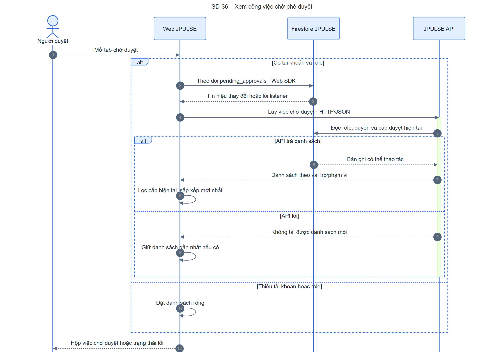
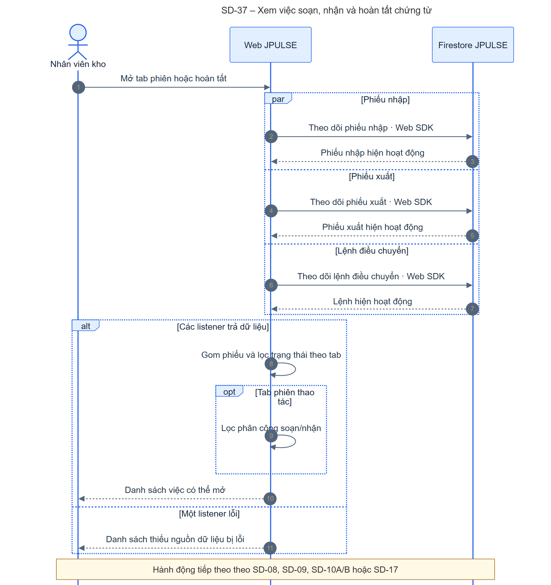
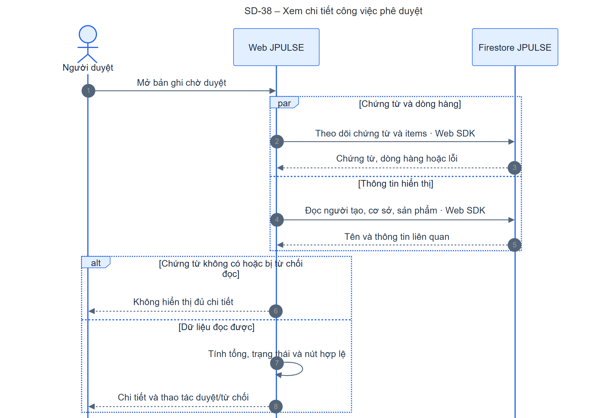
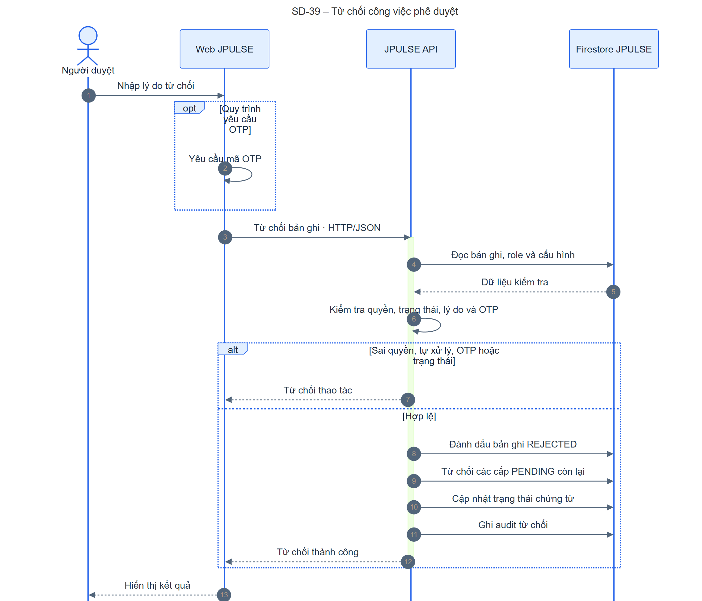
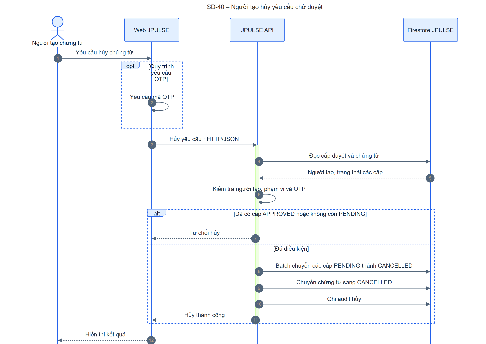
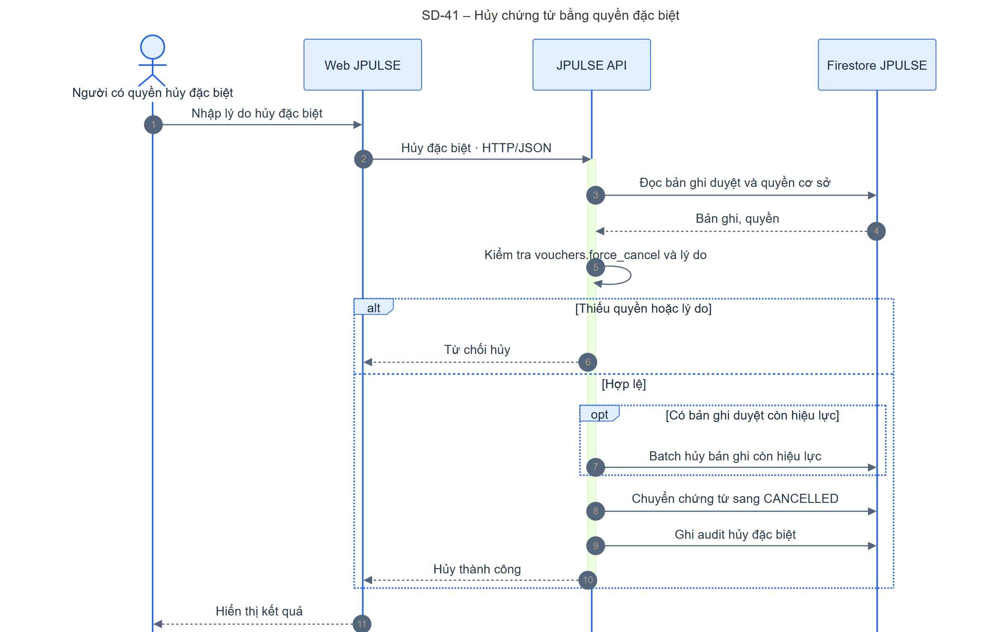
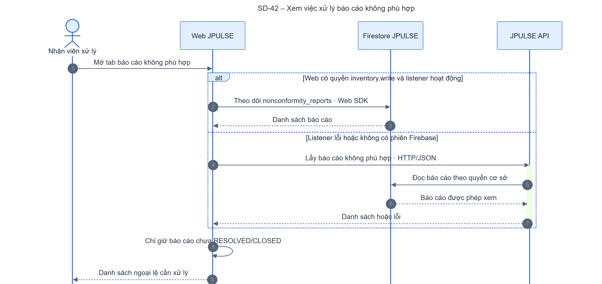
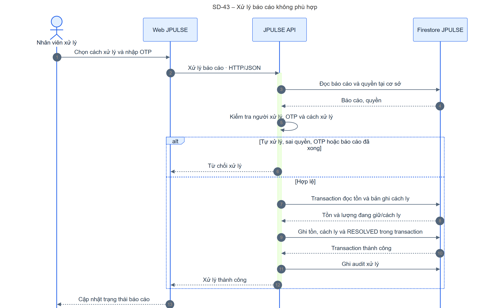
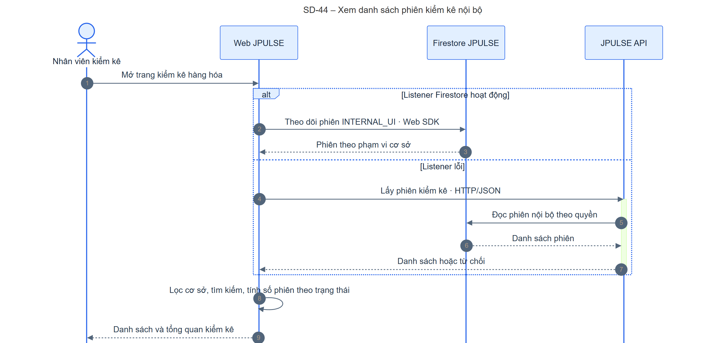
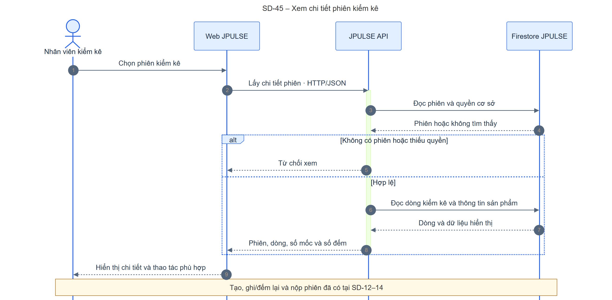

# UML Sequence Diagrams – công việc và kiểm kê hàng hóa JPULSE

Tài liệu tiếp nối [bộ SD JPULSE](./jpulse-sequence-diagrams.md), [SD kho](./jpulse-warehouse-sequence-diagrams.md) và [SD cấu trúc cơ sở](./jpulse-facility-sequence-diagrams.md). [SRS-JPULSE](../../SRS-JPULSE.docx) mô tả phê duyệt theo vai trò/phạm vi, ghi nhận soạn/nhận hàng, kiểm kê theo phiên và xử lý báo cáo không phù hợp. Thứ tự thông điệp dưới đây được đối chiếu với mã Web, API, service và Firestore Rules hiện tại.

`/tasks` là **bàn công việc tổng hợp**, không phải một kho dữ liệu “task” độc lập: nó ghép bản ghi `pending_approvals`, chứng từ nhập/xuất, lệnh điều chuyển và báo cáo không phù hợp ([TaskWorkspace](../../apps/fe-wms/src/components/tasks/TaskWorkspace.tsx#L94)). `/stock-counts` ở Web hiển thị **phiên kiểm kê nội bộ** `source=INTERNAL_UI`; API `/api/stock-counts` thuộc [internalStockCountRoutes](../../apps/be-wms/src/api/routes/internalStockCountRoutes.ts#L1). API [stockCountRoutes](../../apps/be-wms/src/api/routes/stockCountRoutes.ts#L1) là luồng kiểm đếm từ nguồn bên ngoài, không phải màn hình này.

**Quy ước:** mũi tên liền là lời gọi, mũi tên đứt là phản hồi. `par` chỉ các hook/listener độc lập; `alt` là nhánh loại trừ; `opt` là bước có điều kiện. Mọi lời gọi API ở đây yêu cầu phiên xác thực; API quyết định quyền và phạm vi từ JPULSE, còn Firebase Authentication xác minh phiên theo [authMiddleware](../../apps/be-wms/src/api/middlewares/authMiddleware.ts#L28). Web đọc một số collection bằng Firestore Web SDK theo [Rules](../../firestore.rules#L523). Tên lifeline khớp [Container Diagram](./jpulse-container-diagram.md).

## Danh mục chức năng

| SD | Điểm bắt đầu → kết quả thành công | Nhánh ngoại lệ quan trọng | Nguồn mã |
| --- | --- | --- | --- |
| 36 – Hộp chờ duyệt | Người duyệt mở tab → danh sách cấp duyệt có thể thao tác. | Thiếu tài khoản/role; listener/API lỗi. | [useApprovalTasks](../../apps/fe-wms/src/hooks/useApprovalTasks.ts#L112), [scopedApprovalService](../../apps/be-wms/src/services/scopedApprovalService.ts#L75). |
| 37 – Việc soạn/nhận/hoàn tất | Nhân viên mở tab → chứng từ hợp trạng thái và phân công. | Listener lỗi có thể làm danh sách thiếu dữ liệu; thao tác tiếp theo có kiểm tra API riêng. | [useUnifiedVouchers](../../apps/fe-wms/src/hooks/useUnifiedVouchers.ts#L14), [bộ lọc trạng thái](../../apps/fe-wms/src/components/tasks/taskVoucherActionUtils.ts#L27), [TaskVoucherActionTab](../../apps/fe-wms/src/components/tasks/TaskVoucherActionTab.tsx#L1). |
| 38 – Chi tiết chờ duyệt | Mở bản ghi → chứng từ, dòng hàng và thông tin hiển thị. | Chứng từ bị xóa hoặc Firestore từ chối đọc; không có API dự phòng ở hook này. | [useTaskDetailData](../../apps/fe-wms/src/hooks/useTaskDetailData.ts#L66), [TaskDetailDrawer](../../apps/fe-wms/src/components/tasks/TaskDetailDrawer.tsx#L137). |
| 39 – Từ chối duyệt | Nhập lý do/OTP nếu yêu cầu → bản ghi và các cấp còn lại bị từ chối. | Sai role, tự từ chối, thiếu lý do, OTP sai hoặc đã xử lý. | [route](../../apps/be-wms/src/api/routes/approvalRoutes.ts#L36), [scoped service](../../apps/be-wms/src/services/scopedApprovalService.ts#L171), [rejectApproval](../../apps/be-wms/src/services/approvalService.ts#L381). |
| 40 – Người tạo hủy chờ duyệt | Người tạo hủy → các cấp PENDING và chứng từ `CANCELLED`. | Đã có cấp APPROVED, không còn PENDING, sai người tạo/OTP. | [TaskDetailDrawer](../../apps/fe-wms/src/components/tasks/TaskDetailDrawer.tsx#L269), [cancelByCreator](../../apps/be-wms/src/services/approvalService.ts#L697). |
| 41 – Hủy đặc biệt | Người có quyền nhập lý do → bản ghi duyệt còn hiệu lực (nếu có) và chứng từ `CANCELLED`. | Thiếu `vouchers.force_cancel`, lý do hoặc callback lỗi. | [scoped service](../../apps/be-wms/src/services/scopedApprovalService.ts#L212), [forceCancel](../../apps/be-wms/src/services/approvalService.ts#L872). |
| 42 – Danh sách ngoại lệ | Mở tab → báo cáo chưa `RESOLVED/CLOSED`. | Thiếu quyền hoặc listener lỗi → API dự phòng. | [useNonconformities](../../apps/fe-wms/src/hooks/useNonconformities.ts#L71), [NonconformityTaskTab](../../apps/fe-wms/src/components/tasks/NonconformityTaskTab.tsx#L78). |
| 43 – Xử lý ngoại lệ | Chọn cách xử lý và OTP → cập nhật tồn/cách ly, báo cáo `RESOLVED`. | Tự xử lý, sai quyền, OTP, cách xử lý hoặc báo cáo đã xong. | [UI](../../apps/fe-wms/src/components/tasks/NonconformityResolveDrawer.tsx#L148), [resolveNonconformity](../../apps/be-wms/src/services/nonconformityService.ts#L245). |
| 44 – Danh sách phiên kiểm kê | Mở `/stock-counts` → phiên nội bộ và tổng quan theo trạng thái. | Listener lỗi → API dự phòng; thiếu quyền → không tải được. | [useStockCounts](../../apps/fe-wms/src/hooks/useStockCounts.ts#L99), [StockCountPage](../../apps/fe-wms/src/components/features/stock-counts/StockCountPage.tsx#L93), [route](../../apps/be-wms/src/api/routes/internalStockCountRoutes.ts#L34). |
| 45 – Chi tiết phiên kiểm kê | Chọn phiên → phiên, dòng, mốc ATP và số đếm. | Phiên không tồn tại/không thuộc nguồn nội bộ hoặc thiếu quyền. | [stockCountApi](../../apps/fe-wms/src/api/stockCountApi.ts#L129), [scopedStockCountService](../../apps/be-wms/src/services/scopedStockCountService.ts#L87), [stockCountService](../../apps/be-wms/src/services/stockCountService.ts#L381). |

**Các SD đã có để nối tiếp:** [SD-07 duyệt chứng từ](./jpulse-warehouse-sequence-diagrams.md#sd-07--duyệt-phiếu-nhập-hoặc-xuất); [SD-08 soạn/chốt xuất, SD-09 hoàn tất xuất, SD-10A/B nhận phiếu nhập, SD-17 nhận điều chuyển](./jpulse-warehouse-sequence-diagrams.md); [SD-12 tạo phiên, SD-13 ghi/đếm lại, SD-14 nộp kiểm kê](./jpulse-warehouse-sequence-diagrams.md#sd-12--tạo-phiên-kiểm-kê). Mỗi thao tác vẫn có hình riêng tại nguồn gốc đó.

## Hình đã render và mã Mermaid

### SD-36 – Xem công việc chờ phê duyệt

[Mermaid](./sequence/sd-36-task-approval-inbox.mmd) · [SVG](./sequence/sd-36-task-approval-inbox.svg) · [PNG](./sequence/sd-36-task-approval-inbox.png)

### SD-37 – Xem việc soạn, nhận và hoàn tất chứng từ

[Mermaid](./sequence/sd-37-task-operation-queue.mmd) · [SVG](./sequence/sd-37-task-operation-queue.svg) · [PNG](./sequence/sd-37-task-operation-queue.png)

### SD-38 – Xem chi tiết công việc phê duyệt

[Mermaid](./sequence/sd-38-task-approval-detail.mmd) · [SVG](./sequence/sd-38-task-approval-detail.svg) · [PNG](./sequence/sd-38-task-approval-detail.png)

### SD-39 – Từ chối công việc phê duyệt

[Mermaid](./sequence/sd-39-task-reject.mmd) · [SVG](./sequence/sd-39-task-reject.svg) · [PNG](./sequence/sd-39-task-reject.png)

### SD-40 – Người tạo hủy yêu cầu chờ duyệt

[Mermaid](./sequence/sd-40-task-creator-cancel.mmd) · [SVG](./sequence/sd-40-task-creator-cancel.svg) · [PNG](./sequence/sd-40-task-creator-cancel.png)

### SD-41 – Hủy chứng từ bằng quyền đặc biệt

[Mermaid](./sequence/sd-41-task-force-cancel.mmd) · [SVG](./sequence/sd-41-task-force-cancel.svg) · [PNG](./sequence/sd-41-task-force-cancel.png)

### SD-42 – Xem việc xử lý báo cáo không phù hợp

[Mermaid](./sequence/sd-42-task-nonconformity-list.mmd) · [SVG](./sequence/sd-42-task-nonconformity-list.svg) · [PNG](./sequence/sd-42-task-nonconformity-list.png)

### SD-43 – Xử lý báo cáo không phù hợp

[Mermaid](./sequence/sd-43-task-nonconformity-resolve.mmd) · [SVG](./sequence/sd-43-task-nonconformity-resolve.svg) · [PNG](./sequence/sd-43-task-nonconformity-resolve.png)

### SD-44 – Xem danh sách phiên kiểm kê nội bộ

[Mermaid](./sequence/sd-44-stock-count-list.mmd) · [SVG](./sequence/sd-44-stock-count-list.svg) · [PNG](./sequence/sd-44-stock-count-list.png)

### SD-45 – Xem chi tiết phiên kiểm kê

[Mermaid](./sequence/sd-45-stock-count-detail.mmd) · [SVG](./sequence/sd-45-stock-count-detail.svg) · [PNG](./sequence/sd-45-stock-count-detail.png)

## Chênh lệch và điểm cần xác minh

| Điểm | Mã hiện tại / tác động |
| --- | --- |
| **Hủy phiên kiểm kê chưa có thao tác Web.** | [API client](../../apps/fe-wms/src/api/stockCountApi.ts#L144) khai báo `cancel`, [route](../../apps/be-wms/src/api/routes/internalStockCountRoutes.ts#L68) và [service](../../apps/be-wms/src/services/stockCountService.ts#L702) xử lý `CANCELLED`, nhưng [useStockCounts](../../apps/fe-wms/src/hooks/useStockCounts.ts#L205) và `StockCountPage` không gọi. Chưa vẽ người dùng Web hủy phiên; cần xác nhận có đưa thao tác này lên UI. |
| **OTP của hủy đặc biệt.** | [TaskDetailDrawer](../../apps/fe-wms/src/components/tasks/TaskDetailDrawer.tsx#L309) có thể mở modal OTP theo cấu hình, nhưng [forceCancelHandler](../../apps/be-wms/src/api/controllers/approvalController.ts#L157) chỉ parse lý do; [forceCancel](../../apps/be-wms/src/services/approvalService.ts#L872) không nhận/kiểm OTP. SD-41 phản ánh kiểm soát server hiện có. Cần quyết định yêu cầu OTP server-side. |
| **Từ chối duyệt có nhiều bước ghi.** | [rejectApproval](../../apps/be-wms/src/services/approvalService.ts#L381) cập nhật bản ghi, cascade, callback chứng từ và audit riêng; callback [ghi log rồi bỏ qua lỗi](../../apps/be-wms/src/services/approvalService.ts#L676). Có thể bản ghi duyệt `REJECTED` nhưng chứng từ chưa đổi trạng thái. Cần cơ chế phát hiện/khôi phục. |
| **Hủy và xử lý ngoại lệ có audit sau ghi chính.** | [cancelByCreator](../../apps/be-wms/src/services/approvalService.ts#L697) batch approval rồi callback/audit; [resolveNonconformity](../../apps/be-wms/src/services/nonconformityService.ts#L245) transaction tồn/báo cáo rồi audit. Lỗi audit có thể xảy ra sau khi nghiệp vụ đã commit. |
| **Đọc Tasks qua hai đường khác nhau.** | [useApprovalTasks](../../apps/fe-wms/src/hooks/useApprovalTasks.ts#L147) dùng Firestore làm tín hiệu rồi lấy danh sách có thể thao tác từ API; [useTaskDetailData](../../apps/fe-wms/src/hooks/useTaskDetailData.ts#L66) đọc chứng từ/items trực tiếp; các hook chứng từ cũng đọc trực tiếp và hiện không có API dự phòng khi listener lỗi. Cần kiểm thử khi Security Rules và phân quyền API lệch nhau. |
| **Điều kiện mở tab ngoại lệ.** | [TaskWorkspace](../../apps/fe-wms/src/components/tasks/TaskWorkspace.tsx#L107) kiểm `inventory.write` ở Web; API và [nonconformityService](../../apps/be-wms/src/services/nonconformityService.ts#L245) kiểm theo cơ sở. Cần đối chiếu trường hợp có quyền chỉ tại một cơ sở. |
| **Vai trò và quyền chờ duyệt.** | [useApprovalTasks](../../apps/fe-wms/src/hooks/useApprovalTasks.ts#L119) trả danh sách rỗng nếu `userRoleIds.length === 0`, trước cả khi gọi API. Cần xác nhận admin/role kế thừa Office Scope luôn có `roleIds` ở client. |

## Kiểm tra theo Container Diagram

Participant trong các hình là người dùng, Web JPULSE, JPULSE API và Firestore JPULSE. `/tasks` không được vẽ thành container vì chỉ là trang tổng hợp. Web đọc Firestore trực tiếp cho danh sách chứng từ, phiên và báo cáo; các quyết định duyệt/từ chối/hủy, xử lý ngoại lệ và lấy chi tiết kiểm kê đi qua API. Firestore lưu tài khoản, role, quyền và dữ liệu nghiệp vụ JPULSE; Firebase Authentication chỉ xác minh danh tính ở tiền điều kiện chung. Không có hệ thống ngoài tham gia trực tiếp các luồng này.
