# UML Sequence Diagrams – nghiệp vụ kho JPULSE

Tài liệu này bổ sung cho [bộ SD JPULSE](./jpulse-sequence-diagrams.md). Phạm vi gồm phiếu nhập, phiếu xuất, tồn kho, kiểm kê nội bộ và điều chuyển. Nguồn nghiệp vụ là [SRS-JPULSE](../../SRS-JPULSE.docx), nhất là các bảng use case **Tạo chứng từ tồn kho**, **Ra quyết định duyệt** và **Xử lý phiên kiểm kê**; hành vi triển khai được đối chiếu với Web, API và Firestore Rules. [Container Diagram](./jpulse-container-diagram.md) là nguồn tên lifeline. Mọi API trong nhóm này dùng `requireAuth`: Firebase Authentication xác minh phiên, còn JPULSE nạp tài khoản, quyền và phạm vi từ Firestore ([authMiddleware](../../apps/be-wms/src/api/middlewares/authMiddleware.ts#L28)). Để mỗi hình đọc được trên trang Word ngang, bước tiền kiểm này chỉ vẽ đầy đủ ở SD-06A; các SD còn lại bắt đầu khi Web gửi yêu cầu và vẫn bao hàm kiểm tra phiên/quyền tại API.

Mũi tên liền biểu diễn lời gọi; mũi tên đứt biểu diễn phản hồi. Lời gọi Web → API là HTTP/JSON theo các hook và route hiện có. Web → Firestore dùng Web SDK và chịu Firestore Security Rules; API → Firestore dùng Firebase Admin SDK. Web → Storage dùng Storage SDK; quy tắc Storage production chưa có trong repository.

## Danh mục chức năng và điểm nối

| SD | Bắt đầu → kết quả thành công | Nhánh ngoại lệ chính | SRS và mã nguồn |
| --- | --- | --- | --- |
| [SD-03A–C](./jpulse-sequence-diagrams.md#4-sd-03--tạo-phiếu-nhập-kho) – Tạo phiếu nhập | Nhân viên gửi phiếu → phiếu và bước duyệt được ghi. | Tệp, OTP, quyền, vị trí hoặc batch lỗi. | SRS bảng **Tạo chứng từ tồn kho**; [import creation](../../apps/be-wms/src/services/importVoucherCreationService.ts). |
| **SD-06A/B** – Tạo phiếu xuất | Nhân viên gửi phiếu → phiếu chờ duyệt hoặc được tự duyệt theo cấu hình. | Tải tệp, quyền, vị trí, chứng từ, OTP, ATP hoặc ghi lỗi. | SRS **Tạo phiếu xuất**; [Web](../../apps/fe-wms/src/components/features/export-vouchers/CreateExportTab.tsx#L464), [API](../../apps/be-wms/src/services/exportVoucherCreationService.ts#L27). |
| **SD-07** – Duyệt phiếu nhập/xuất | Người duyệt chấp thuận → cấp tiếp theo hoặc phiếu `APPROVED`. | Tự duyệt, quyền/OTP sai, ATP phiếu xuất thiếu. | SRS bảng **Ra quyết định duyệt**; [approvalService](../../apps/be-wms/src/services/approvalService.ts#L168), [export state](../../apps/be-wms/src/services/exportVoucherStateService.ts#L16). |
| **SD-08** – Soạn và chốt soạn phiếu xuất | Nhân viên lưu lượng soạn → trừ ATP, phiếu `SHIPPED`. | Sai phân công, chưa soạn, ATP thiếu. | SRS **Ghi nhận soạn hàng**, **Cập nhật tồn kho**; [Web](../../apps/fe-wms/src/components/tasks/PickingSessionDrawer.tsx#L111), [picking](../../apps/be-wms/src/services/pickingSessionService.ts#L95), [ATP](../../apps/be-wms/src/services/actions/deductInventoryATP.ts#L44). |
| **SD-09** – Hoàn tất phiếu xuất | Nhân viên xác nhận → phiếu `COMPLETED`. | Phiên/quyền sai, không có phiếu, ghi lỗi. | SRS **Hoàn tất xuất hàng**; [Web](../../apps/fe-wms/src/components/features/export-vouchers/ExportInProgressTab.tsx#L152), [state](../../apps/be-wms/src/services/exportVoucherStateService.ts#L207). |
| **SD-10A/B** – Nhận hàng phiếu nhập | Nhân viên lưu thực nhận → tăng ATP, xử lý ngoại lệ, phiếu `COMPLETED`. | Sai phân công, số thực nhập không hợp lệ, transaction/ngoại lệ lỗi. | SRS **Ghi nhận thực nhập**, **Cập nhật tồn kho**; [Web](../../apps/fe-wms/src/components/tasks/ReceivingSessionDrawer.tsx#L98), [state](../../apps/be-wms/src/services/importVoucherStateService.ts#L117). |
| **SD-11** – Xem tồn kho | Nhân viên mở màn hình → tồn theo kho cập nhật realtime. | Snapshot bị từ chối/lỗi → gọi API dự phòng. | SRS **Xem tồn kho theo vị trí**, **Xem dashboard tồn kho**; [useInventory](../../apps/fe-wms/src/hooks/useInventory.ts#L31), [Rules](../../firestore.rules#L460). |
| **SD-12** – Tạo phiên kiểm kê | Nhân viên chọn phạm vi → phiên `IN_PROGRESS` và mốc ATP từng dòng. | Phạm vi sai hoặc không có tồn phù hợp. | SRS **Tạo phiên kiểm kê**, **Chụp số tồn làm mốc**; [stockCountService](../../apps/be-wms/src/services/stockCountService.ts#L399). |
| **SD-13** – Ghi/đếm lại dòng kiểm kê | Nhân viên nhập số đếm → lưu chênh lệch, tình trạng, bằng chứng. | Ảnh lỗi, sai quyền, phiên đã khóa. | SRS **Nhập kết quả**, **Đính kèm bằng chứng**, **Kiểm đếm lại**; [Web](../../apps/fe-wms/src/components/features/stock-counts/StockCountWorkPanel.tsx#L454), [service](../../apps/be-wms/src/services/stockCountService.ts#L510). |
| **SD-14** – Nộp phiên kiểm kê | Nhân viên nộp → `VERIFIED` hoặc `DISCREPANCY_FOUND`, tạo báo cáo ngoại lệ nếu cần. | Chưa đếm hết, thiếu ảnh, transaction lỗi. | SRS **Gửi kết quả**, **Tính chênh lệch**, **Tạo báo cáo không phù hợp**; [stockCountService](../../apps/be-wms/src/services/stockCountService.ts#L600). |
| **SD-15** – Tạo lệnh điều chuyển | Nhân viên chọn kho/vị trí → lệnh chờ duyệt hoặc điều chuyển nội kho tự duyệt. | Kho nguồn/đích sai, vị trí sai, OTP/chứng từ thiếu. | SRS **Tạo lệnh điều chuyển**; [Web](../../apps/fe-wms/src/components/features/transfers/CreateTransferTab.tsx#L538), [service](../../apps/be-wms/src/services/transferOrderCreationService.ts#L37). |
| **SD-16** – Tạo phiếu xuất liên kết thủ công | Nhân viên tạo từ lệnh đã duyệt → phiếu xuất và liên kết lệnh. | Lệnh chưa duyệt hoặc đã có phiếu xuất. | SRS **Tạo phiếu xuất**; [transfer export](../../apps/be-wms/src/services/transferOrderExportService.ts#L28). |
| **SD-17** – Nhận hàng điều chuyển | Kho đích bắt đầu nhận, kiểm đếm → giảm hàng đang chuyển ở nguồn, tăng ATP đích. | Sai trạng thái/quyền, vị trí sai, lượng đang chuyển thiếu. | SRS **Nhận hàng điều chuyển**; [receiving](../../apps/be-wms/src/services/transferOrderReceivingService.ts#L14), [transaction](../../apps/be-wms/src/services/transferOrderReceivingTransaction.ts#L16). |

## Các hình đã render

### SD-06A/B – Tạo phiếu xuất

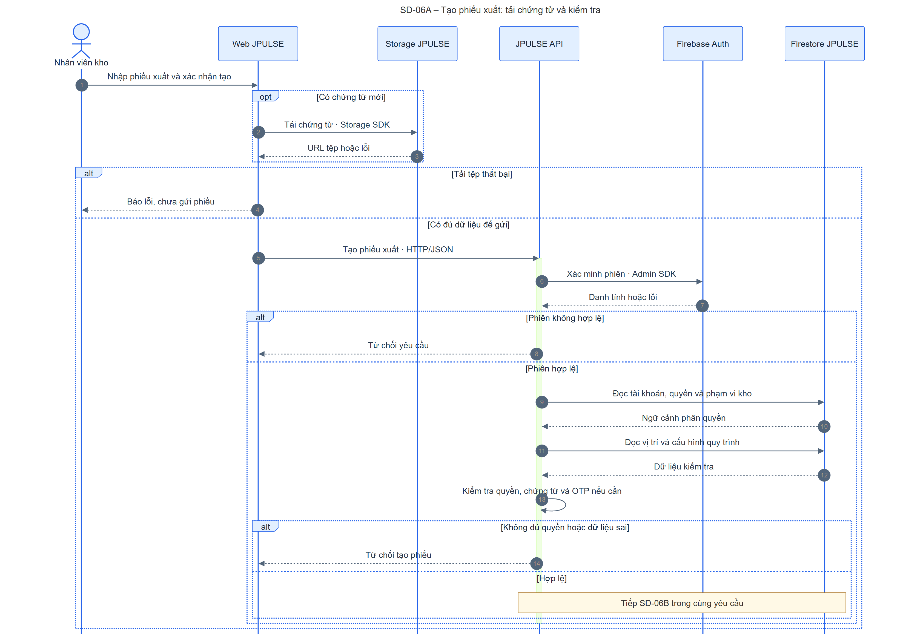

[Mermaid 06A](./sequence/sd-06a-export-validate.mmd) · [SVG 06A](./sequence/sd-06a-export-validate.svg) · [PNG 06A](./sequence/sd-06a-export-validate.png)

Web tải chứng từ trực tiếp lên Storage khi có tệp mới rồi gửi phiếu qua API. API xác minh phiên, lấy quyền JPULSE, kiểm tra vị trí, cấu hình, chứng từ và OTP. Nếu hợp lệ, cùng yêu cầu tiếp tục SD-06B.

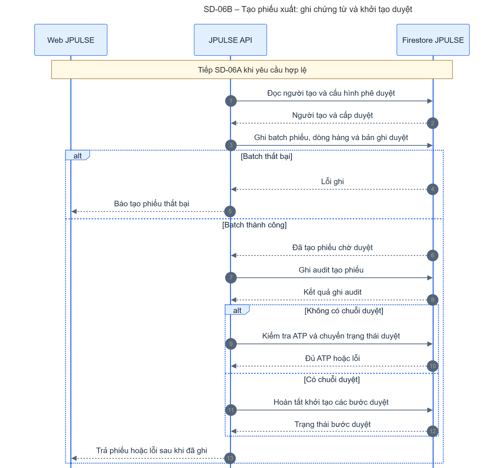

[Mermaid 06B](./sequence/sd-06b-export-persist.mmd) · [SVG 06B](./sequence/sd-06b-export-persist.svg) · [PNG 06B](./sequence/sd-06b-export-persist.png)

API ghi phiếu, dòng hàng và bản ghi duyệt trong một batch; audit và bước hoàn tất khởi tạo duyệt nằm sau batch. Nhánh không có chuỗi duyệt gọi kiểm tra ATP rồi tự duyệt. Lỗi sau batch có thể để lại phiếu đã tạo dù Web nhận lỗi.

### SD-07 – Duyệt phiếu nhập hoặc xuất

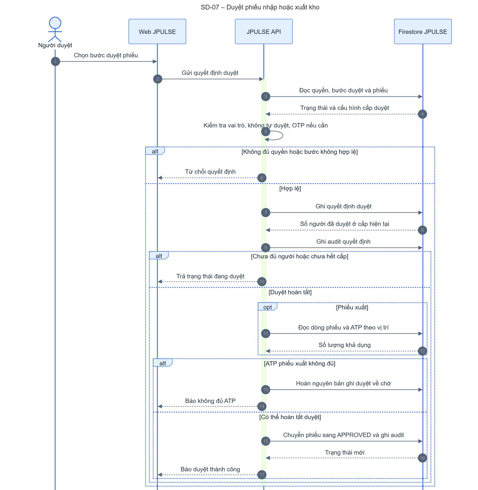

[Mermaid](./sequence/sd-07-voucher-approval.mmd) · [SVG](./sequence/sd-07-voucher-approval.svg) · [PNG](./sequence/sd-07-voucher-approval.png)

API kiểm tra người duyệt, cấp duyệt, quy tắc không tự duyệt và OTP nếu cấu hình yêu cầu. Nếu phiếu xuất hoàn tất chuỗi duyệt, API kiểm tra ATP trước khi chuyển `APPROVED`; thiếu ATP thì bản ghi duyệt được đưa về `PENDING`. SD này mô tả nhánh **chấp thuận**; từ chối/hủy quy trình có route và service riêng, chưa nằm trong hình này.

### SD-08 – Soạn và chốt soạn phiếu xuất

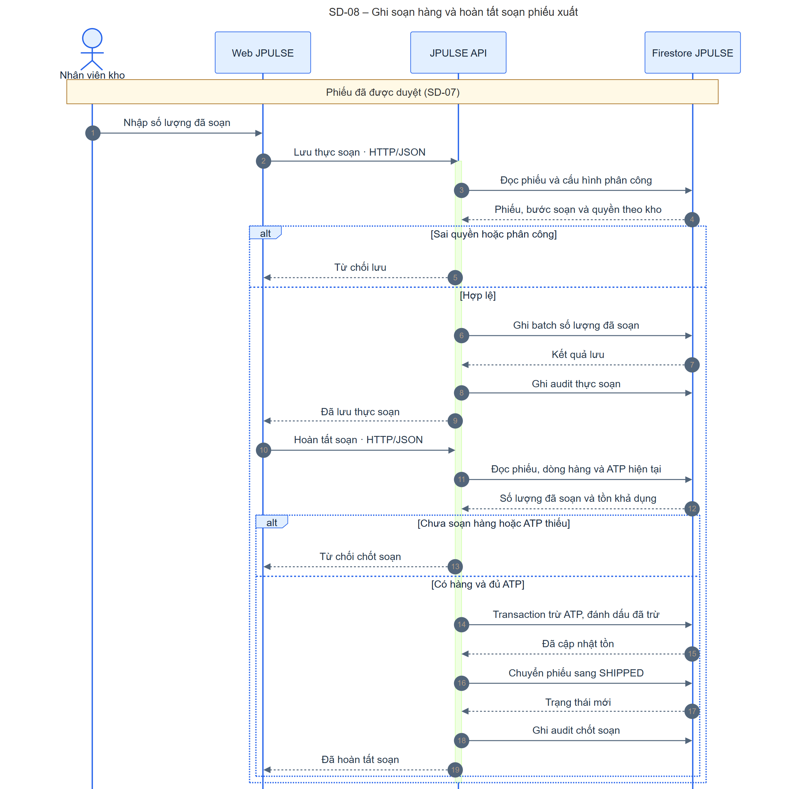

[Mermaid](./sequence/sd-08-export-picking.mmd) · [SVG](./sequence/sd-08-export-picking.svg) · [PNG](./sequence/sd-08-export-picking.png)

Web gửi thực soạn, API kiểm tra phân công bước `picking` và lưu dòng hàng. Khi chốt, transaction trừ ATP theo `picked_quantity` và đánh dấu đã trừ, rồi service chuyển phiếu sang `SHIPPED`. Nếu phiếu liên kết điều chuyển, lượng trừ được chuyển vào `in_transit_quantity` và trạng thái lệnh được đồng bộ.

### SD-09 – Hoàn tất phiếu xuất

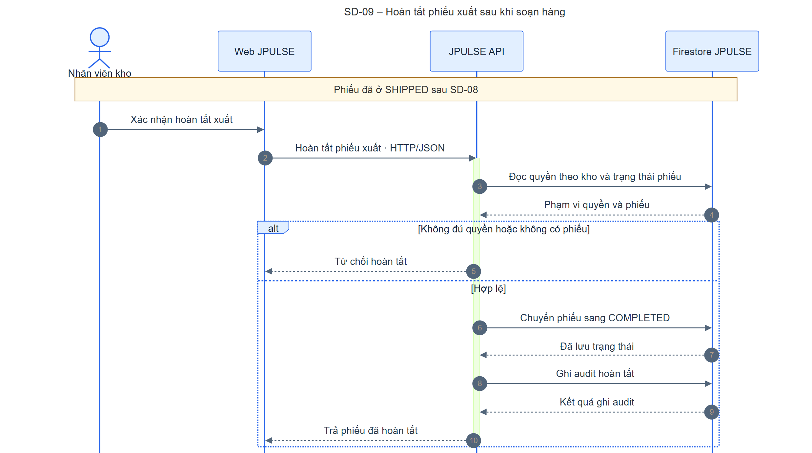

[Mermaid](./sequence/sd-09-export-complete.mmd) · [SVG](./sequence/sd-09-export-complete.svg) · [PNG](./sequence/sd-09-export-complete.png)

Web gọi API chuyển phiếu sang `COMPLETED` và ghi audit. API hiện tại kiểm tra phiếu tồn tại và quyền `vouchers.write` theo kho; **không thấy kiểm tra cứng trạng thái `SHIPPED`** trong `completeExport`. Ghi chú đầu hình là trình tự vận hành dự kiến từ UI, không phải ràng buộc được service bảo đảm.

### SD-10A/B – Lưu thực nhập và hoàn tất nhận hàng

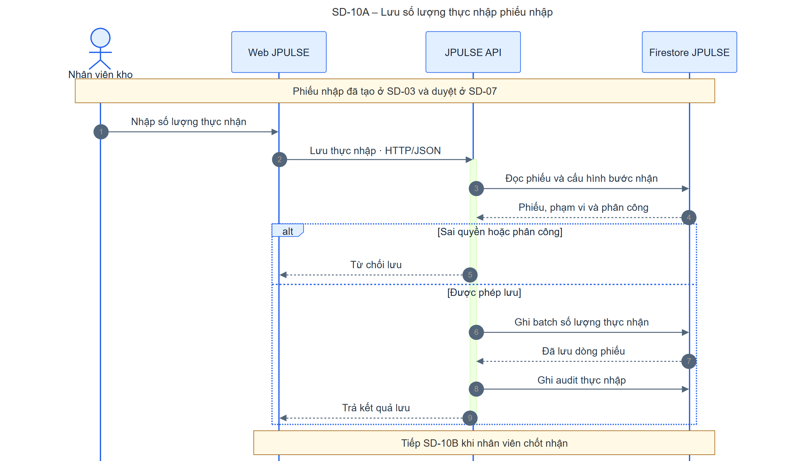

[Mermaid 10A](./sequence/sd-10a-import-actuals.mmd) · [SVG 10A](./sequence/sd-10a-import-actuals.svg) · [PNG 10A](./sequence/sd-10a-import-actuals.png)

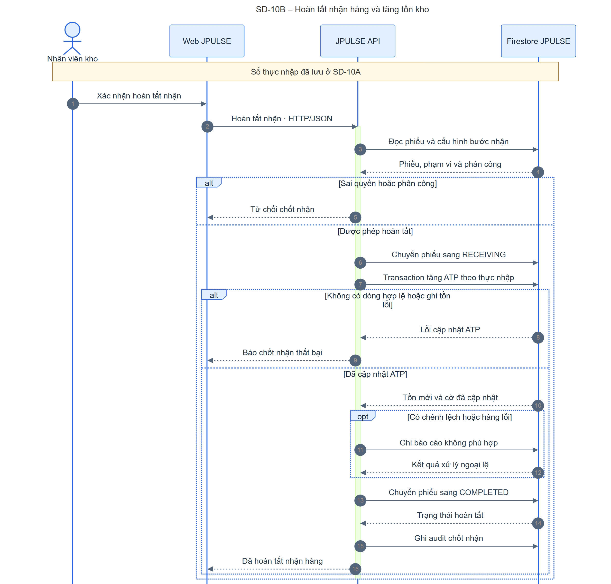

[Mermaid 10B](./sequence/sd-10b-import-complete.mmd) · [SVG 10B](./sequence/sd-10b-import-complete.svg) · [PNG 10B](./sequence/sd-10b-import-complete.png)

Web thực hiện hai yêu cầu kế tiếp: lưu `actual_quantity` ở SD-10A, rồi chốt nhận ở SD-10B. API kiểm tra phân công `receiving`, chuyển sang `RECEIVING`, tăng ATP bằng transaction, tạo báo cáo không phù hợp nếu có, sau đó chuyển phiếu sang `COMPLETED`. Dòng thực nhập bằng 0 hoặc thiếu vị trí bị bỏ qua trong thao tác tăng ATP; nếu mọi dòng đều bị bỏ qua thì API báo lỗi.

### SD-11 – Xem tồn kho

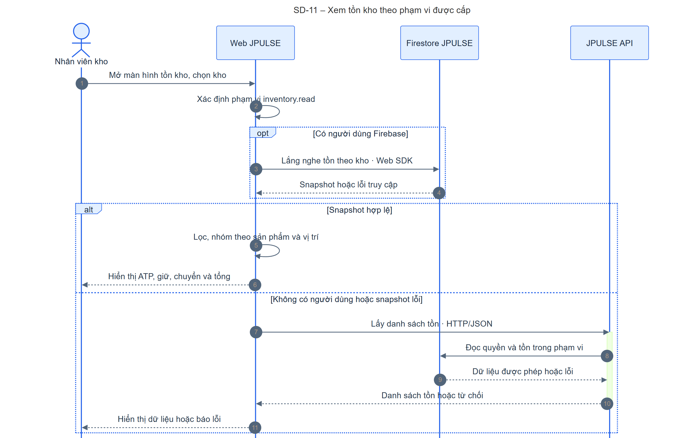

[Mermaid](./sequence/sd-11-inventory-view.mmd) · [SVG](./sequence/sd-11-inventory-view.svg) · [PNG](./sequence/sd-11-inventory-view.png)

Web lắng nghe collection `inventory` trực tiếp bằng Firestore Web SDK, giới hạn theo kho/quyền; [Rules](../../firestore.rules#L460) chỉ cho client đọc, cấm ghi. Khi không có người dùng Firebase hoặc snapshot lỗi, hook gọi `GET /api/inventory` để lấy dữ liệu dự phòng. API tiếp tục lọc theo quyền JPULSE. Firestore Security Rules và quyền API đều dựa trên dữ liệu JPULSE, nhưng hai đường đọc cần được đối chiếu nếu quyền thay đổi giữa phiên.

### SD-12 – Tạo phiên kiểm kê

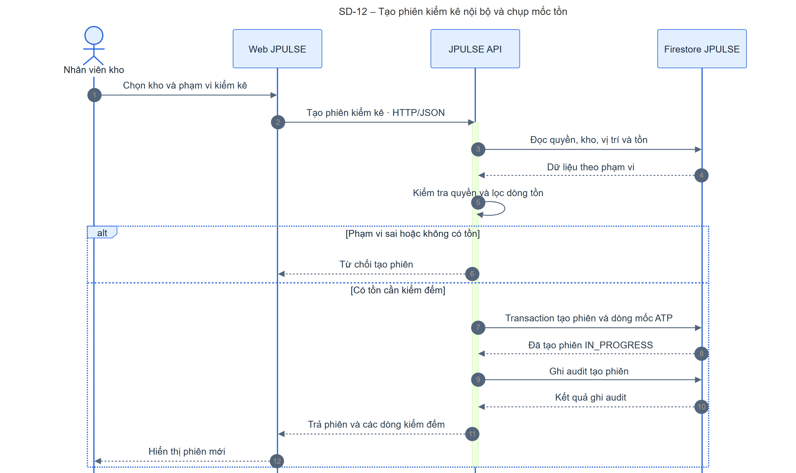

[Mermaid](./sequence/sd-12-stock-count-create.mmd) · [SVG](./sequence/sd-12-stock-count-create.svg) · [PNG](./sequence/sd-12-stock-count-create.png)

API lọc tồn theo kho, vị trí, sản phẩm hoặc danh mục, lấy `atp_quantity` làm mốc cho từng dòng và tạo phiên `IN_PROGRESS`. Nếu không có bản ghi tồn phù hợp, API không tạo phiên. Đọc mốc tồn diễn ra trước transaction ghi phiên.

### SD-13 – Ghi kết quả kiểm đếm

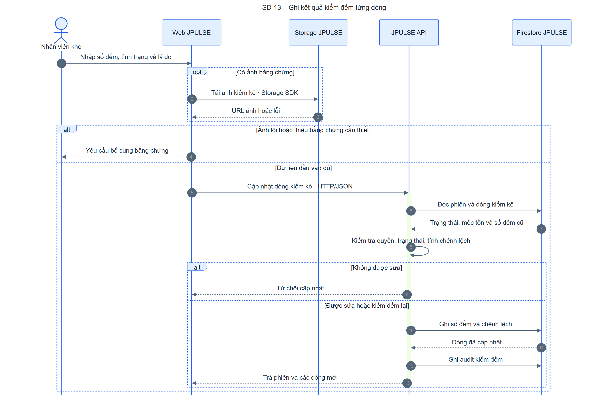

[Mermaid](./sequence/sd-13-stock-count-item.mmd) · [SVG](./sequence/sd-13-stock-count-item.svg) · [PNG](./sequence/sd-13-stock-count-item.png)

Web tải ảnh bằng chứng trực tiếp lên Storage, sau đó gửi URL và số đếm qua API. API chỉ nhận cập nhật khi phiên còn `IN_PROGRESS` hoặc `DRAFT`, tính chênh lệch với mốc và tăng số lần đếm lại nếu dòng đã từng được đếm. Web yêu cầu lý do và ảnh cho ngoại lệ; API kiểm tra ảnh một lần nữa lúc nộp phiên ở SD-14.

### SD-14 – Nộp phiên kiểm kê

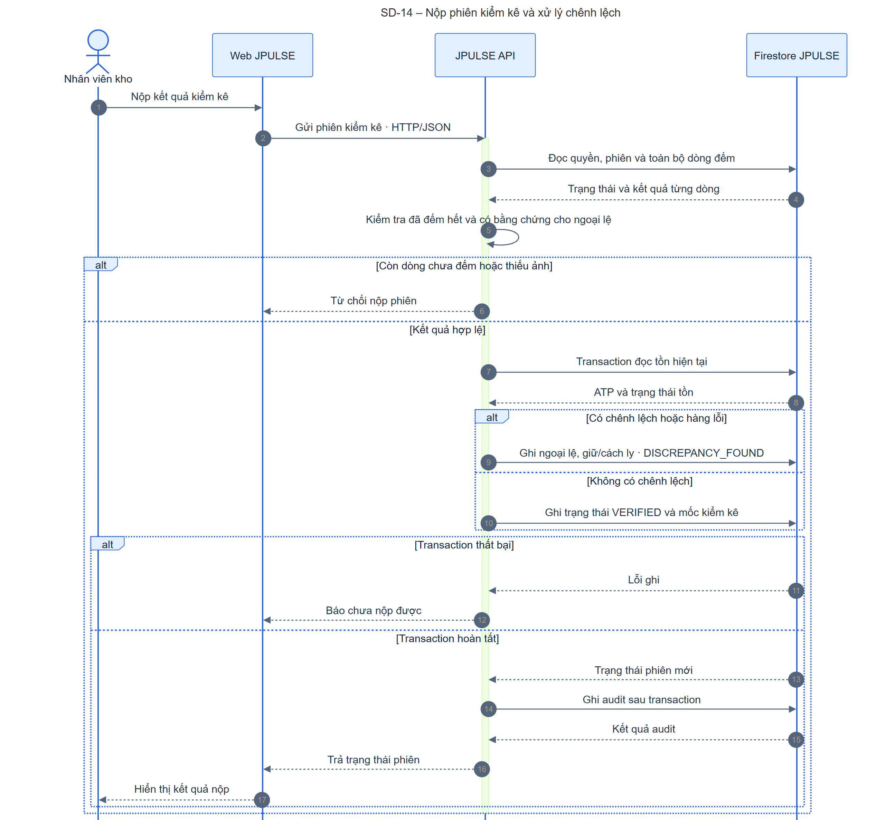

[Mermaid](./sequence/sd-14-stock-count-submit.mmd) · [SVG](./sequence/sd-14-stock-count-submit.svg) · [PNG](./sequence/sd-14-stock-count-submit.png)

API chặn nộp khi còn dòng chưa đếm hoặc ngoại lệ thiếu ảnh. Transaction cập nhật trạng thái phiên, `last_count_at`, các bucket tồn liên quan và báo cáo không phù hợp. Không có ngoại lệ thì `VERIFIED`; có ngoại lệ thì `DISCREPANCY_FOUND`. Audit được ghi sau transaction.

### SD-15 – Tạo lệnh điều chuyển

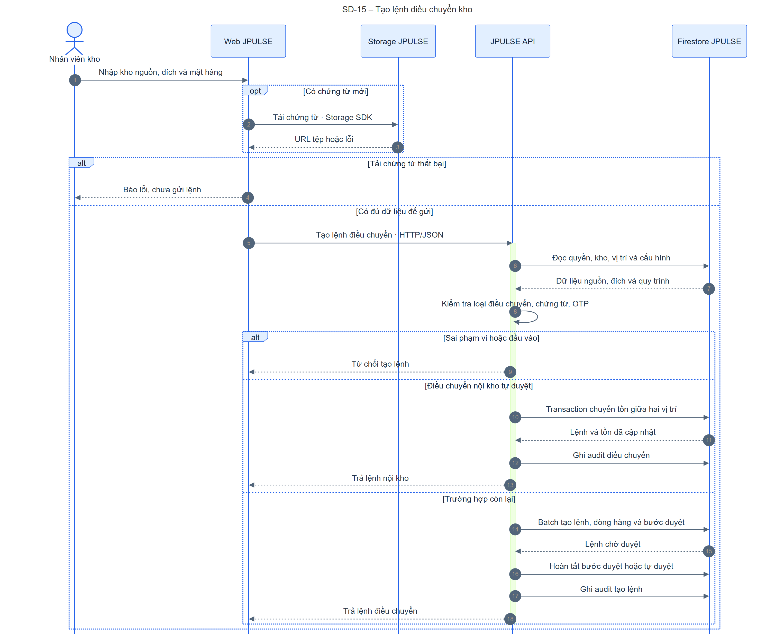

[Mermaid](./sequence/sd-15-transfer-create.mmd) · [SVG](./sequence/sd-15-transfer-create.svg) · [PNG](./sequence/sd-15-transfer-create.png)

API kiểm tra kho/vị trí nguồn đích, loại nội kho/liên kho, cấu hình chứng từ và OTP. Nội kho tự duyệt dùng transaction chuyển tồn giữa vị trí; các trường hợp khác ghi lệnh và quy trình duyệt. Chứng từ đính kèm, nếu có, do Web tải trực tiếp lên Storage.

### SD-16 – Tạo phiếu xuất liên kết điều chuyển

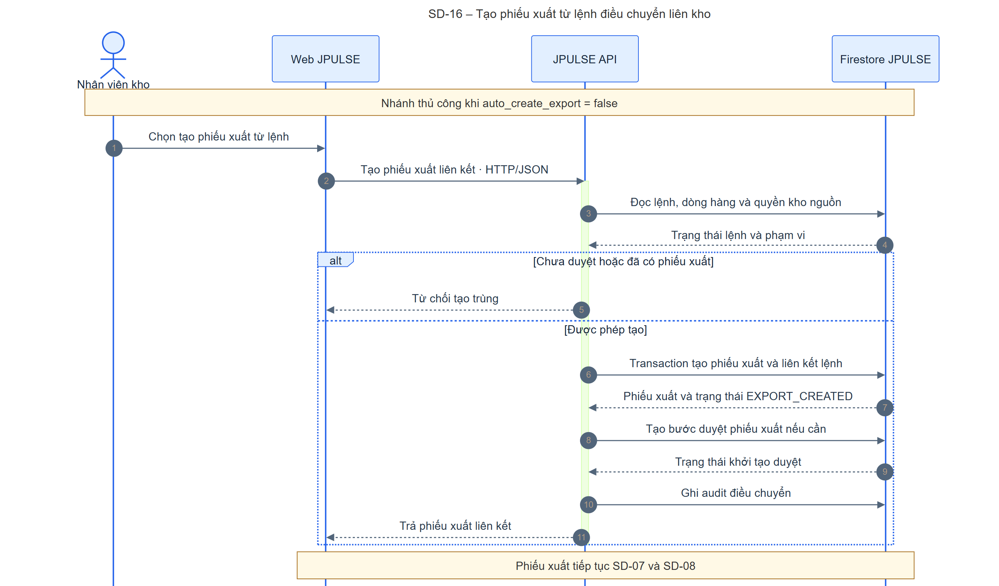

[Mermaid](./sequence/sd-16-transfer-export.mmd) · [SVG](./sequence/sd-16-transfer-export.svg) · [PNG](./sequence/sd-16-transfer-export.png)

Hình thể hiện nhánh **tạo thủ công** khi `auto_create_export=false`. Nếu cấu hình bật tự tạo, callback khi duyệt lệnh tạo phiếu xuất cùng logic nội bộ mà không có lời gọi Web này ([transfer state](../../apps/be-wms/src/services/transferOrderStateService.ts#L8)). Transaction liên kết phiếu xuất với lệnh để tránh tạo trùng; việc tạo bước duyệt phiếu xuất xảy ra sau transaction.

### SD-17 – Nhận hàng điều chuyển

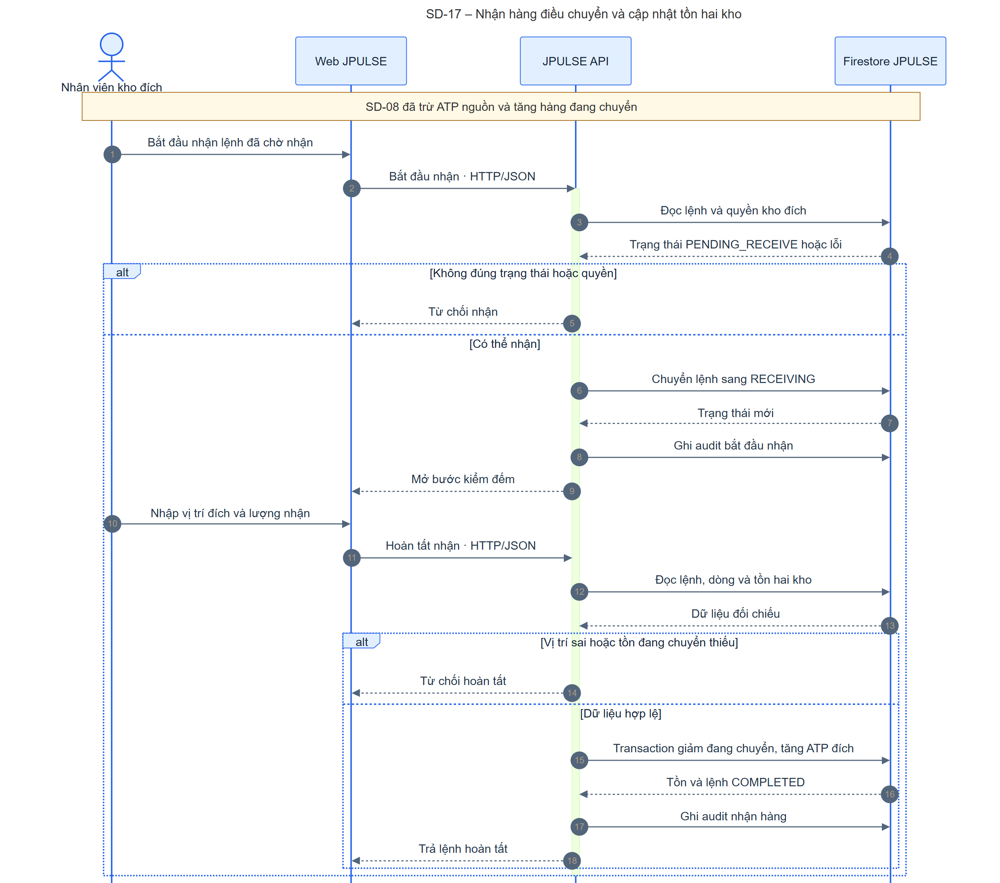

[Mermaid](./sequence/sd-17-transfer-receiving.mmd) · [SVG](./sequence/sd-17-transfer-receiving.svg) · [PNG](./sequence/sd-17-transfer-receiving.png)

Sau khi phiếu xuất liên kết được soạn và trừ ATP ở SD-08, lệnh chuyển sang `PENDING_RECEIVE`. Kho đích mở bước nhận và nhập lượng thực tế cùng vị trí đích. Transaction giảm `in_transit_quantity` ở nguồn, tăng ATP đích, ghi lượng nhận/chênh lệch từng dòng và chốt lệnh. Chênh lệch nhận không tự tạo báo cáo không phù hợp trong transaction này.

## Giới hạn và điểm cần xác minh

| Vấn đề | Căn cứ / hệ quả |
| --- | --- |
| **Các bước trạng thái xuất/nhập chưa được chặn đầy đủ tại service.** | [export state](../../apps/be-wms/src/services/exportVoucherStateService.ts#L143) và [import state](../../apps/be-wms/src/services/importVoucherStateService.ts#L98) cập nhật trạng thái nhưng không kiểm tra trạng thái trước đó ở mọi hàm. SD-08–10 thể hiện trình tự UI đang dùng; cần quyết định bổ sung guard/idempotency cho lời gọi lặp hoặc sai thứ tự. |
| **Cập nhật tồn và trạng thái/audit không luôn cùng transaction.** | [deductInventoryATP](../../apps/be-wms/src/services/actions/deductInventoryATP.ts#L44) và [completePicking](../../apps/be-wms/src/services/exportVoucherStateService.ts#L169) là các bước tách; [completeReceiving](../../apps/be-wms/src/services/importVoucherStateService.ts#L117) cũng nối nhiều bước. Có thể tồn đã đổi mà phiếu chưa chốt nếu bước sau lỗi. Cần xác định cách khôi phục. |
| **Mốc kiểm kê không được chụp cùng transaction ghi phiên.** | [stockCountService](../../apps/be-wms/src/services/stockCountService.ts#L399) đọc inventory trước rồi mới transaction ghi session/items. Cần xác nhận cách đối soát phát sinh tồn giữa hai thời điểm. |
| **Duyệt phiếu xuất kiểm tra ATP, chưa giữ hàng.** | [export ATP](../../apps/be-wms/src/services/exportVoucherAtpService.ts) chỉ đọc ATP khi duyệt; trừ ATP ở SD-08. Có thể ATP đổi trong khoảng này và chốt soạn bị từ chối. |
| **Storage Rules production chưa có trong repository.** | Web tải chứng từ/ảnh trực tiếp; [firebase.json](../../firebase.json) chỉ khai báo Firestore Rules. Cần xác minh kiểm soát upload và dọn tệp khi tạo phiếu/phiên thất bại. |
| **Nhánh tự tạo phiếu xuất điều chuyển có thể lỗi sau khi lệnh đã được ghi.** | [transfer export](../../apps/be-wms/src/services/transferOrderExportService.ts#L77) bắt lỗi tạo approvals sau transaction rồi ghi log; cần xác định cách phát hiện phiếu xuất thiếu bước duyệt. |
| **Phạm vi phần tiếp theo.** | SRS còn quản lý vị trí, danh mục sản phẩm, chính sách tồn, hủy/đếm lại phiên, từ chối duyệt, xử lý báo cáo không phù hợp, tích hợp quét ngoài. Các chức năng này có route/service riêng; chưa được trộn vào SD-06–17 để giữ mỗi hình theo một chức năng. |

## Đối chiếu Container Diagram

Các SD kho chỉ dùng Nhân viên/Người duyệt, Web JPULSE, JPULSE API, Firestore JPULSE, Storage JPULSE và Firebase Authentication (riêng SD-06A). Không có JPOS, ERP hay dịch vụ ngoài khác trong những lời gọi kho này. Web đọc tồn và tải chứng từ/ảnh trực tiếp; mọi lệnh tạo/sửa/chốt đi qua API. Firebase Authentication xác minh danh tính; API quyết định quyền từ dữ liệu JPULSE trong Firestore. Đây là cùng cách phân ranh giới với [Container Diagram](./jpulse-container-diagram.md), ngoại trừ các điểm triển khai chưa được đảm bảo nêu trong bảng trên.
