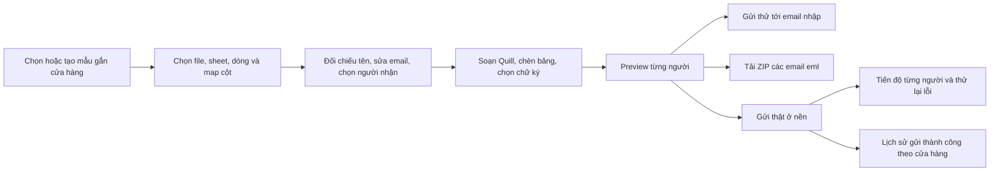

# Kế hoạch triển khai email bảng công và lương

Ngày: 09/10/2026, Asia/Saigon.

Trạng thái: đã triển khai mã P0–P7 và P8 kiểm thử không gửi email thật (57 test PASS). P8 rollout chưa thực hiện. Xem [kết quả và giới hạn](./payroll-email-test-results.md).
Nguồn nghiệp vụ: [payroll-email-requirements.md](./payroll-email-requirements.md).
Người dùng yêu cầu bỏ qua skill `brainstorming` cho tác vụ này. Không sửa quy tắc chung của dự án.

## 1. Kết quả cần đạt

Tại `/notification`, thêm lựa chọn `Bảng công & lương`. Người soạn chọn mẫu gắn cửa hàng, đọc nhiều nguồn Excel, đối chiếu theo họ tên, soạn bằng Quill, chèn các bảng cố định, preview từng nhân viên, gửi thử, tải ZIP `.eml` hoặc gửi thật theo từng đợt ở nền.

Mẫu và chữ ký dùng chung toàn hệ thống nhưng không chứa dữ liệu lương thật. Bản nháp chứa dữ liệu đã đọc được mã hóa. Lịch sử chỉ có email gửi thật thành công, giới hạn theo cửa hàng được gắn vào mẫu.

Giữ vận chuyển email là `EMAIL`; tạo mô hình nghiệp vụ riêng cho bảng công/lương. Không đưa nội dung lương vào collection lịch sử thông báo thông thường đang có quyền đọc rộng hơn.

## 2. Luồng sử dụng

- Tab `Bảng công & lương` có vùng soạn, danh sách bản nháp, quản lý mẫu và lịch sử. Quản lý chữ ký có quyền riêng.
- Tạo mẫu: tên mẫu, cửa hàng, tiêu đề, Quill Delta, cấu hình bảng/trường, cấu hình map và chữ ký. Được lưu nhiều mẫu.
- Tất cả mẫu dùng chung; thao tác soạn/gửi/tải dữ liệu chỉ thực hiện khi có quyền tại cửa hàng của mẫu.
- Mỗi nhóm dữ liệu chọn độc lập file đã đọc hoặc file mới, sheet, dòng bắt đầu và cột. Mẫu lưu cấu hình map để tái sử dụng, không giữ file hoặc dữ liệu tháng trước trong mẫu.
- Desktop dùng vùng dữ liệu và preview song song; mobile chia bước, dùng drawer cấu hình, nút di chuyển lên/xuống bên cạnh kéo thả để dùng được bằng bàn phím và cảm ứng.
- Quill/ExcelJS chỉ tải khi mở chức năng; skeleton theo khối. Dùng Tailwind và design tokens hiện có, giao diện sáng, i18n vi/zh, goey-toast promise và khóa submit khi xử lý.

## 3. Quy tắc đọc dữ liệu

### 3.1. Cấu trúc mẫu

| Nguồn | Dạng dữ liệu | Nội dung cần đọc |
|---|---|---|
| Bảng kê lương | Một dòng cho mỗi người | Họ tên, email, chức vụ, tài khoản/ngân hàng, tổng thanh toán, thuế, thực nhận |
| Bảng lương Parttime AMTP | Một dòng cho mỗi người | Ngày làm, số ca 7h/8h/ngày lễ, tiền để đối chiếu, trường tùy chọn được map |
| Bảng công | Khối theo nhân viên, tiêu đề lặp | Tên nhân viên ở tiêu đề khối và toàn bộ các dòng công theo ngày |
| Phiếu lương | Mẫu hiển thị | Làm cơ sở thiết kế một mẫu cố định; không lấy dữ liệu nhân viên mẫu hay bảng phụ |
| Tổng kết | Không sử dụng | Không đưa vào mô hình gửi |

- Không hard-code tên sheet hoặc số dòng: người dùng chọn nguồn; nhận diện cấu trúc khối bảng công theo tiêu đề, dòng header và dòng tổng trong mẫu.
- Bỏ dòng tổng, tiêu đề lặp, vùng phụ trợ ngoài bảng dữ liệu. Lưu vị trí nguồn cho từng trường và dòng công.
- Phân biệt trống và số 0; giữ số tài khoản dạng chuỗi, không làm mất số 0 đầu hoặc chuyển sang ký hiệu khoa học.
- Đọc kết quả đã lưu của ô công thức; không tự chạy hoặc tính lại công thức. Nếu thiếu kết quả, báo rõ ô và yêu cầu mở/lưu lại file bằng Excel trước khi import.
- Chỉ nhận `.xlsx` cho phạm vi mẫu này; kiểm tra cấu trúc file và giới hạn 10 MB/file theo rules.md. Không đặt giới hạn cố định số nhân viên. Không lưu file Excel gốc.
- Xử lý dữ liệu theo phần và theo người, có thể dùng Web Worker cho parser nặng; không đưa toàn bộ file lớn vào một request hoặc một Firestore document.

### 3.2. Ghép và đối chiếu

- Chuẩn hóa Unicode, khoảng trắng và chữ hoa/thường; giữ dấu tiếng Việt để tránh ghép sai người khác tên.
- Ghép tự động chỉ khi kết quả duy nhất. Khi trùng hoặc không khớp, hiển thị các dòng nguồn để người dùng xác nhận ghép; không sửa số liệu lương trên màn hình.
- Người nhận không cần hồ sơ nhân viên hệ thống. Không tự ghi dữ liệu import vào hồ sơ nhân viên hoặc dữ liệu chấm công của hệ thống.
- Bảng kê lương là nguồn tiền ưu tiên. Nếu lệch, cảnh báo từng người, trường, hai giá trị và nguồn sẽ dùng; không tự tính thực nhận từ tổng thanh toán và thuế.
- Được sửa email và bỏ chọn người lỗi; lưu email gốc, email sửa và vị trí nguồn trong dữ liệu mã hóa phục vụ đối chiếu.
- Email trùng không tự gộp bản ghi: yêu cầu đối chiếu hoặc bỏ chọn bản ghi mơ hồ để tránh trộn phiếu lương của hai người.

## 4. Quill, bảng và cảnh báo ẩn dữ liệu

- Lưu nội dung bằng Quill Delta có phiên bản. Dùng custom embed cho ba khối `employee-info`, `attendance`, `payslip`; block chỉ giữ loại/ID và cấu hình, không lưu HTML chứa lương vào mẫu dùng chung.
- Khối bảng không cho sửa ô bằng gõ, paste hoặc chỉnh HTML. Người dùng có thể chèn tại con trỏ, chuyển vị trí hoặc bỏ khối qua thao tác có kiểm soát.
- Có một mẫu phiếu lương với nhãn số ca đúng nghĩa. Các trường ngày công quy chuẩn, tăng ca, BHXH và tạm ứng được map từ nguồn riêng hoặc ẩn. Không suy diễn giá trị thiếu thành 0.
- Bật/tắt trường áp dụng toàn đợt gửi. Nếu trường/bảng có dữ liệu trong tập đã đọc, liệt kê người bị ảnh hưởng và yêu cầu xác nhận trước khi ẩn; số 0 vẫn là dữ liệu, khác với trống.
- Chặn cả thao tác xóa block bằng bàn phím/cut nếu cần xác nhận, không chỉ nút xóa. Hủy xác nhận khôi phục đúng block, vị trí và cấu hình.
- Undo/redo, đổi mẫu hoặc áp dụng cấu hình mẫu làm ẩn dữ liệu cũng phải đi qua cùng chính sách. Khi import thêm dữ liệu, xác nhận cũ không được che cảnh báo mới.

Theo [hướng dẫn Parchment của Quill](https://quilljs.com/docs/guides/cloning-medium-with-parchment), nội dung mở rộng được mô hình hóa qua blot/embed. Cần dùng API Delta, không thao tác trực tiếp `root.innerHTML` như editor hiện tại khi quản lý các khối cố định.

## 5. Render, biến, chữ ký và MIME

### 5.1. Nội dung thống nhất

- Một renderer dựng nội dung từ Delta, dữ liệu của đúng nhân viên, cấu hình hiển thị, mốc thời gian và chữ ký đã chọn.
- Preview, gửi thử, export `.eml` và gửi thật dùng cùng renderer/snapshot. Nếu dữ liệu, mẫu hoặc chữ ký thay đổi, cần dựng lại preview trước lần gửi tiếp theo.
- Khi tạo snapshot, cố định mốc thời gian Asia/Saigon, phiên bản mẫu, chữ ký, trường hiển thị và dữ liệu người nhận. Queue chạy qua ngày/tháng mới không tự thay nội dung.
- Template parser chỉ hiểu danh sách biến được hỗ trợ; không dùng `eval` để xử lý biểu thức. Thay biến cả trong tiêu đề và text node nội dung, kể cả token bị chia bởi định dạng Quill; không thay tùy ý trong URL/HTML attribute.
- Tháng/năm độc lập: tháng 01/2027, `@(tMonth-1)@/@tYear@` là `12/2027`, còn `@(tMonth-1)@/@(tYear-1)@` là `12/2026`.
- Biến không được hỗ trợ phải báo rõ vị trí/tên biến trước khi gửi. Escape tên và giá trị Excel; ngăn chèn HTML hoặc header email qua dữ liệu import.

### 5.2. Email HTML

- Dựng bảng thông tin và phiếu lương với thứ tự đọc rõ, nhấn thực nhận và số liệu có ý nghĩa. Bảng công chứa toàn bộ dòng của đúng nhân viên và chỉ những cột đã bật.
- Email dùng bảng HTML, có bố cục mobile thích hợp; nội dung tiền/số tài khoản không bị cắt, không phụ thuộc JavaScript trong email. Thiết kế fallback khi mail client không hỗ trợ media query; kiểm tra bảng công nhiều cột thực tế.
- UI của app dùng Tailwind. HTML email là artifact riêng, cần CSS email có inline styles an toàn và media query được renderer kiểm soát; không đưa ngoại lệ CSS này vào component giao diện app.
- Bộ lọc hiện tại loại bỏ `<style>` và dựa trên regex, cần thay/tách chính sách allowlist cho nội dung Quill/chữ ký. CSS responsive chỉ từ renderer tin cậy; chặn script, event handler, URL nguy hiểm và HTML không được hỗ trợ. Preview trong iframe sandbox với CSP phù hợp.
- Nếu hỗ trợ ảnh từ toolbar Quill hoặc chữ ký: thống nhất asset/CID cho preview, `.eml` và gửi thật; không để server tải URL tùy ý. Asset phải theo chính sách ảnh và giới hạn dung lượng của dự án.

### 5.3. Chữ ký

- Chữ ký mặc định là lựa chọn ảo lấy từ env, không copy secret hoặc cho sửa env qua UI.
- Chữ ký bổ sung: ID, tên, HTML đã lọc, text tương ứng, phiên bản, người tạo/cập nhật và soft delete. Lưu nhiều chữ ký dùng chung toàn hệ thống.
- Mẫu lưu `signature_id` hoặc mặc định. Chữ ký bị xóa mềm phải báo khi mở mẫu và hiển thị lựa chọn mặc định trước khi gửi; snapshot cũ giữ nguyên chữ ký đã dùng.
- Mở rộng `sendBrevoEmail` bằng lựa chọn chữ ký rõ ràng; giá trị mặc định giữ hành vi email tự động hiện tại. Nội dung đã render chữ ký không bị tự thêm env lần thứ hai.
- Dùng Nodemailer tạo MIME UTF-8, có HTML và plain text, subject/from/to và asset liên quan; ZIP có một `.eml` mỗi người được chọn. Gửi thử thay địa chỉ nhận, giữ nội dung người đang preview và không đánh dấu người đó đã gửi thật.
- Export dùng stream theo người để không giữ toàn bộ ZIP trong bộ nhớ; tên file được làm sạch, thêm ID để tránh trùng và không chứa số tài khoản/số tiền.

[Nodemailer stream transport](https://nodemailer.com/transports/stream) cung cấp MIME để xuất file `.eml`; dùng cùng cấu hình dựng thư cho export và SMTP.

## 6. Mô hình dữ liệu và quyền

Định nghĩa schema mới tại `packages/shared-types/src/`, export qua `index.ts`, validate request bằng Zod ở backend. Tách file theo module, giữ component/controller/service trong khoảng 200–300 dòng.

| Thực thể dự kiến | Vai trò và nội dung |
|---|---|
| `PayrollEmailTemplate` | Cấu hình dùng chung: tên, `facility_id`, Delta, map, trường, chữ ký, phiên bản |
| `EmailSignature` | Chữ ký HTML bổ sung có tên và phiên bản; mặc định env là lựa chọn ảo |
| `PayrollEmailDraft` | Chủ sở hữu, cửa hàng, template version, dữ liệu và cấu hình đã mã hóa |
| `PayrollImportSource` / `PayrollImportIssue` | Vị trí file/sheet/dòng/cột và lỗi/cảnh báo có cấu trúc |
| `PayrollRecipientData` | Thông tin nhân viên, tiền đã chốt, công theo ngày, map nguồn và email sửa |
| `PayrollEmailSnapshot` | Nội dung cuối theo người, mốc biến và chữ ký cố định, mã hóa |
| `PayrollEmailJob` / `PayrollEmailJobItem` | Tiến độ đợt và từng người, chunk, attempt, lease, request key, lỗi |
| `PayrollEmailSentRecord` | Một lần gửi thật thành công, snapshot, cửa hàng và message ID |

- Collection riêng `payroll_email_templates`, `email_signatures`, `payroll_email_drafts`, `payroll_email_jobs`, items và `payroll_email_sent_records`; financial payload là mã hóa hoặc con trỏ tới object đã mã hóa.
- Mẫu/chữ ký đọc dùng chung với người có quyền liên quan; không ghi dữ liệu nhân sự vào mẫu. Chỉnh mẫu phải có quyền quản lý tại cửa hàng gắn mẫu; khi đổi cửa hàng kiểm quyền cả phạm vi cũ và mới.
- Gửi/đọc draft/job/history dùng `facility_id` lưu trên bản ghi, không tin facility do client truyền thay thế. Template chỉnh cửa hàng không đổi quyền của job/history cũ.
- Quyền dự kiến: `notifications.payroll.compose`, `.download`, `.send`, `.history.read`, `.templates.manage`; thêm `notifications.email_signatures.manage` để quản lý chữ ký toàn hệ thống.
- Quyền `.send` áp dụng cả gửi thử và thử lại; `.download` kiểm cả export từ draft và tải nội dung từ lịch sử. Quyền lịch sử không tự cho tải ZIP.
- Bản nháp của người tạo; quyền soạn theo cửa hàng là điều kiện kèm theo. Quyền dùng mẫu chung không cho đọc nháp của người khác.
- UI và API đều kiểm quyền. Firestore rules/listener cho metadata đúng scope; ciphertext/detail giải mã chỉ qua API được xác thực. Không cho client ghi trực tiếp vào jobs/history.
- Metadata tiến độ realtime không chứa bảng lương plaintext. Đọc nội dung chi tiết theo phân trang, kiểm quyền tại mỗi request, không ghi cache service worker.

Theo [giới hạn Firestore](https://firebase.google.com/docs/firestore/quotas), không lưu cả đợt trong một document. Chia dữ liệu theo người/khối và byte size; payload lớn dùng object riêng mã hóa ở private Storage, không dùng public URL.

## 7. Mã hóa, bản nháp và audit

- Envelope AES-256-GCM với IV ngẫu nhiên, authentication tag, key version và AAD gắn loại bản ghi/ID/cửa hàng. Khóa chỉ ở backend/env hoặc secret provider; không chuyển khóa server cho frontend.
- Mã hóa dữ liệu người nhận, bảng công/lương, email hoàn chỉnh và email chỉnh sửa khi lưu. Financial payload trong Storage cũng mã hóa trước khi upload.
- Phân biệt template tái sử dụng với snapshot nhân viên; không vô tình lưu nội dung preview người đầu tiên vào template dùng chung.
- Audit ghi actor, action_time, sync_time, resource IDs và thay đổi metadata. Khi cần old/new financial data, chỉ lưu dạng mã hóa, không đưa bản rõ vào log/audit/error report.
- Bản nháp đồng bộ qua API, dữ liệu local-first lưu có mã hóa trong IndexedDB theo user, device và Firebase target; Web Crypto key riêng không phải server key. Không lưu lương vào localStorage/Zustand persist mặc định hoặc Firestore plaintext offline cache.
- Cho soạn/preview với dữ liệu nháp có sẵn khi offline, hiện trạng thái chờ lưu; gửi thử/gửi thật yêu cầu online và kiểm quyền lại. Không tự gửi một đợt chưa được người dùng bấm gửi khi có mạng trở lại.
- Xóa mềm các bản ghi quản lý; xác thực phiên bản draft để tránh ghi đè thay đổi từ tab khác. Đăng xuất hoặc mất quyền phải xóa cache dữ liệu/khóa local phù hợp.

## 8. Queue gửi nền và gửi lại

- Sau xác nhận gửi, API validate quyền, snapshot và danh sách hợp lệ; ghi durable job trước khi trả về. UI theo dõi trạng thái bằng listener, không chạy vòng gửi từ trình duyệt.
- Ghi items theo phần; chỉ chuyển job sang sẵn sàng khi số lượng và manifest hoàn tất. Dùng transactional outbox/recovery để job đã lưu không bị mất khi tạo Cloud Task thất bại.
- Tận dụng pattern dispatcher/OIDC Cloud Tasks của marketing voucher; tạo queue/worker payroll riêng, không phụ thuộc feature flag voucher.
- Mỗi đợt logic mặc định 25 người; concurrency SMTP nhỏ và cấu hình được, không gửi đồng thời 25 người bằng một promise lớn. Task bounded và checkpoint từng người; điều chỉnh tốc độ khi provider từ chối tạm thời.
- Mỗi thư chỉ có một người nhận; không gộp To/CC/BCC của các nhân viên khác.
- Transaction claim với lease/fencing, state và attempt key để nhiều worker không gửi cùng item. Request idempotency ngăn double click/API retry tạo job mới; gửi lại có xác nhận tạo attempt riêng.
- Trạng thái item: `QUEUED`, `PROCESSING`, `SENT`, `FAILED`, `UNKNOWN`; trạng thái job và counters tổng hợp theo item. `UNKNOWN` là kết quả không xác định, không tự coi thất bại để gửi lại mù.
- Retry tự động chỉ với lỗi xác định chưa được provider nhận; có giới hạn và backoff. SMTP đã nhận nhưng ghi DB thất bại phải retry ghi kết quả trước, không gửi lại thư.
- Worker crash ở khoảng SMTP gửi/ghi kết quả có thể không xác định kết quả. Hiển thị giải thích cụ thể và yêu cầu đối chiếu/xác nhận trước attempt mới; không cam kết SMTP exactly-once.
- Trong cùng phiên chức năng: theo dõi ID phiên, bản ghi người đã gửi và email dùng khi gửi. Nếu chọn gửi lại người `SENT`, server trả danh sách tên/email và confirmation token gắn phiên bản/danh sách; người dùng xác nhận mới gửi lại.
- Thoát chức năng kết thúc phạm vi cảnh báo trùng theo phiên; idempotency của job và retry worker vẫn có hiệu lực khi đóng browser. Không mở chức năng gửi lại kỳ cũ trong lịch sử.
- Khi bấm thử lại lỗi, chỉ queue các item lỗi được chọn; giữ snapshot đã gửi để mẫu/chữ ký sửa sau đó không đổi nội dung retry.
- Lịch sử tạo riêng từng attempt `SENT` với nội dung đã gửi, kể cả attempt gửi lại được xác nhận. Test/export/failed/unknown không vào lịch sử thành công.
- `SENT` nghĩa SMTP đã chấp nhận thư; không tuyên bố thư đã vào inbox hoặc đã được đọc. Chưa triển khai tracking deliver/open trong phạm vi này.
- Đóng browser hoặc backend restart không mất tiến độ; recovery quét job chưa hoàn tất. Local/dev có worker đọc durable records và recovery; production dùng Cloud Tasks thay cho fire-and-forget trong process Cloud Run.

[Cloud Tasks có thể thực thi lặp và không bảo đảm thứ tự](https://docs.cloud.google.com/tasks/docs/common-pitfalls), nên chia đợt cần dựa trên state/manifest, không dựa vào thứ tự task đến worker.

## 9. Hợp đồng API và thông báo

Router/controller/service/repository riêng dưới `/api/notifications/payroll`; chữ ký dùng nhóm API riêng nếu tái sử dụng cho email khác. Các action đều đi qua auth/RBAC, rate limiter và schema validation; internal worker dùng OIDC được kiểm issuer/audience/service identity và ràng buộc job đã được cấp phép.

Các nhóm action: CRUD mềm mẫu/chữ ký; đọc/lưu nháp và dữ liệu theo phần; chuẩn bị snapshot/preview; gửi thử; export; tạo job; tiến độ/retry; đọc lịch sử thành công. Không nhận plaintext HTML lương tùy ý từ client để worker gửi mà bỏ qua renderer và quyền.

Issue có `code`, severity, source locator, recipient ID, field, các giá trị đối chiếu, remedy và `messages.vi/zh`. UI dùng dữ liệu có cấu trúc để hiện bảng lỗi, highlight nguồn và confirmation dialog, không chỉ một toast dài.

| Tình huống | Nội dung cần hiện |
|---|---|
| Thiếu email | Thiếu email tại dòng 13, sheet Bảng kê lương, file đã chọn; nhập email hoặc bỏ chọn người |
| Không khớp tên | Tên và dòng ở nguồn A chưa có kết quả duy nhất trong nguồn B; chọn bản ghi đối chiếu |
| Tiền lệch | Tên, số tiền từng nguồn và vị trí; hệ thống dùng số tiền ở Bảng kê lương |
| Ẩn dữ liệu | Trường/bảng, số người có dữ liệu và danh sách; xác nhận ẩn hoặc giữ lại |
| Gửi lại | Danh sách họ tên – email đã gửi trong phiên; xác nhận gửi lại hoặc bỏ chọn |
| SMTP lỗi | Người nhận, phần đã gửi/phần chưa gửi, lý do dễ hiểu và hành động thử lại phù hợp |
| Kết quả chưa rõ | Provider có thể đã nhận thư nhưng chưa xác định được kết quả; yêu cầu đối chiếu trước khi gửi lại |
| Thiếu cấu hình | Nêu cụ thể queue/chữ ký/khóa mã hóa chưa cấu hình, không tiết lộ secret |

## 10. Task list theo thứ tự triển khai

- [x] Làm rõ yêu cầu và cấu trúc workbook mẫu.
- [x] Kiểm tra schema, Quill, SMTP/chữ ký, quyền cửa hàng và cơ chế Cloud Tasks hiện có.
- [x] Chốt scope cửa hàng gắn vào mẫu; người nhận không cần hồ sơ nhân viên.
- [x] Ghi đặc tả và kế hoạch triển khai.
- [x] **P0 — Chuẩn bị:** kiểm tra dependencies/lockfile và đọc Next guide tương ứng theo AGENTS.md trước khi viết mã FE. Xác định Firebase target test, test inbox, queue và key provider. Chỉ bổ sung package bằng pnpm với đúng filter khi thực sự cần.
- [x] **P1 — Nền tảng:** shared types/Zod, permission registry vi/zh, API auth/access policy, crypto, repository, Firestore rules/indexes, private artifact storage và audit không lộ dữ liệu.
- [x] **P2 — Import:** parser bảng kê/bảng lương/bảng công, source locator, normalization/matching, mapping nhiều nguồn, warning tiền lệch và file mẫu ẩn danh để download.
- [x] **P3 — Mẫu/chữ ký/nháp:** CRUD mềm, tên và store binding, phiên bản, nhiều chữ ký HTML, lưu/khôi phục draft đã mã hóa và cache local-first.
- [x] **P4 — Soạn/render:** custom Quill blocks, token parser, fixed tables, kiểm soát hide/remove, renderer HTML/text, responsive preview, sanitize và chữ ký thống nhất.
- [x] **P5 — Preview/export/test mail:** chọn người preview, sửa email/bỏ chọn người lỗi, send sample, MIME `.eml`, ZIP streaming và quyền export/send.
- [x] **P6 — Gửi nền:** snapshot/job manifest, chunk 25, worker/outbox/lease/recovery, idempotency, retry lỗi và xác nhận gửi lại cùng phiên.
- [x] **P7 — Lịch sử/realtime:** tạo history thành công theo người, giải mã qua API đúng scope, listener tiến độ, đối chiếu counters và hiển thị lỗi cụ thể.
- [ ] **P8 — Kiểm thử/rollout:** các ca bên dưới, typecheck/build phù hợp, kiểm quyền emulator, tài liệu env/queue/key và smoke test với inbox kiểm thử. Không gửi workbook nhân sự thật để test.
  - [x] Kiểm thử không gửi mail thật: 57 case tự động PASS; ghi phạm vi/giới hạn và sửa lỗi phát hiện.
  - [ ] Rollout và kiểm tra hạ tầng thật: chưa thực hiện; không gửi email thật theo yêu cầu người dùng.

P1 → P2/P3 → P4 → P5/P6 → P7 → P8. Cập nhật checkbox và giải thích ngắn luồng dữ liệu sau mỗi module quan trọng. Không tạo subagent hoặc task mới cho các phase nếu chưa được yêu cầu.

## 11. Kiểm thử và điều kiện nghiệm thu

1. **Parser:** bộ dữ liệu ẩn danh cùng cấu trúc mẫu gồm nhiều khối/tiêu đề/tổng; chỉ lấy đúng người và dòng công. File nguồn khác nhau, map đổi cột/dòng, công thức có/không có cache, tài khoản có số 0 đầu, blank khác zero, ô lỗi Excel.
2. **Ghép:** tên có dấu/khoảng trắng/Unicode, trùng tên, trùng email, thiếu nguồn, sửa email; không tự ghép trường hợp mơ hồ, không trộn dữ liệu hai người.
3. **Tiền:** cảnh báo khi lệch, luôn dùng Bảng kê lương; không tái tính thuế/net và không lấy số liệu nhân viên mẫu ở Phiếu lương.
4. **Ẩn:** trường có 0, trường có dữ liệu một người, bỏ cả bảng, paste/cut/delete/undo, áp dụng mẫu và import mới; confirmation không bị bypass, hủy khôi phục đúng trạng thái.
5. **Biến:** tiêu đề/nội dung, định dạng chia token, tháng 01/2027 đúng hai ví dụ, token không hỗ trợ, gửi queue qua tháng mới vẫn giữ snapshot.
6. **Chữ ký/MIME:** env default, chữ ký HTML có tên, template chọn/custom mềm xóa; đúng một chữ ký. MIME giải mã UTF-8 hiển thị đúng tiếng Việt, người nhận và bảng, không lẫn người khác. Gửi thử không thay trạng thái gửi thật.
7. **Quyền:** chỉ compose/download/send/history theo quyền cấp; đổi facility ID trong request không mở dữ liệu; template dùng chung không lộ nháp; template đổi store không đổi scope lịch sử cũ; không đọc financial payload qua lịch sử thông thường.
8. **Mã hóa:** DB/Storage/cache/log/audit không chứa financial plaintext; AAD sai, key version sai hoặc tag hỏng đều từ chối; cache không dùng chung user/target và không tồn tại sau sign-out phù hợp.
9. **Queue:** 100 người có 4 đợt logic 25; không vượt concurrency; double click, task lặp, worker song song, enqueue lỗi, browser đóng và process restart không mất item. Retry chỉ người lỗi; unknown không tự gửi lại.
10. **Lịch sử:** chỉ email gửi thật `SENT`; lỗi/gửi thử/export không xuất hiện. Counter đợt khớp items; mỗi attempt thành công chỉ có một history record, snapshot bất biến.
11. **UI/E2E:** import → matching → compose → hide confirmation → preview → test → ZIP → gửi nền → retry → history. Desktop/mobile, bàn phím/kéo thả, skeleton, realtime, vi/zh và các trạng thái mất mạng.
12. **Hồi quy:** in-app, email thông thường, email tự động dùng chữ ký env và voucher email tiếp tục hoạt động; thay đổi signature API có default tương thích.

Fixture dùng nhân sự tổng hợp. P8 đã chạy unit/API/emulator/rules/dispatcher/browser/E2E với SMTP mock, gồm 100 người. Không gửi email thật hoặc rollout. Next compile/static generation qua; standalone packaging bị Windows chặn symlink. Xem báo cáo để biết phần chưa kiểm tra.

## 12. Tài nguyên triển khai cần chuẩn bị

- Env mới cho crypto/key version, payroll queue/region/worker identity/base URL và throughput; chỉ ghi tên/cách cấu hình trong `.env.example`, không ghi secret.
- Queue/worker phải được cấu hình và kiểm tra trên môi trường test trước rollout. Cần monitor enqueue thất bại, job kẹt, UNKNOWN và counters, không ghi nội dung lương vào telemetry.
- Các đoạn UI/logic nằm đúng `components/`, `hooks/`, `utils/`; backend layered. Chỉ refactor helper dùng chung khi hai luồng có hợp đồng tương thích, tránh gắn payroll vào module marketing voucher.
- Đã xác định Next 15.5.18 từ dependency được resolve sau `pnpm install --frozen-lockfile`. Bản package này không có `dist/docs/`; trước khi viết mã FE đã đọc guide `use-client` và `lazy-loading` từ mã nguồn chính thức tag `v15.5.18`.
- Các reference được SKILL.md frontend-expert nhắc tới chưa có trong thư mục skill; dùng hướng dẫn chính đã đọc và quy tắc dự án cho phần plan này.
